# Inside the Training Loop

*Making a small language model tell the truth about itself.*

[](https://colab.research.google.com/github/rahulni/Indic_LLM/blob/10-training-loop/10_Training%20Loop/inside_the_training_loop.ipynb)

One notebook, [`inside_the_training_loop.ipynb`](inside_the_training_loop.ipynb), takes a real training loop apart and checks every piece with a measurement. It doubles as study notes: each section gives the intuition, the math, the code, and an `assert` that fails loudly if the claim is wrong.

Two models share one modern decoder class (RMSNorm, RoPE, SwiGLU, grouped-query attention, tied embeddings):

- **Model A**: 31.5M parameters, trained from scratch on TinyStories with SmolLM2's 49,152-token vocabulary. Used for every training experiment.
- **SmolLM2-135M**: the real pretrained weights, loaded into the same class. Used for the shape tour, a gradient check on trained weights, MFU at real width, and a short fine-tune.

Every number below comes from one full run on an **NVIDIA GeForce RTX 3070 Laptop GPU** (8.0 GiB, sm86), torch 2.11.0+cu128, finished on 2026-10-10 08:12, all on AC power in the laptop's Turbo mode. The run was interrupted once, when the laptop went to sleep. It was resumed, and experiments already stored were reused rather than re-run, which is why some notebook cells say "reusing the result stored earlier". All of the numbers are stored in [`assets/results.json`](assets/results.json).


## Results at a glance

| question | measured answer |
|---|---|
| What is the biggest tensor in a step? | the logits, B×T×V = 8×512×49152 (768 MiB in fp32), more than all of Model A's weights |
| Does `backward()` agree with nudging one weight? | yes: 20 entries, every parameter type, two models, float64; worst 7.7 matching digits |
| How wrong is the average-of-averages gradient? | median 2.5e-01 relative error vs 2.9e-05 for token-weighted accumulation |
| …and what does it do to training? | over 3 seeds the logged loss is off by -2.0 ± 0.0%, and the model is tilted towards short stories in 3 of 3 seeds; overall held-out loss +0.0195 ± 0.0178 vs correct |
| Did the gradient norm move before the loss? | in an instability created on purpose, against a fixed pre-ramp baseline: **yes, 20–44 steps earlier** in all 9 seed × threshold cases. The rolling-window rule fixed in advance flagged the norm first in only 0 of 3 seeds, so that detector missed it. A healthy run showed no event at all. |
| Does clipping help? | against a burst of noise batches it cut the worst damage in 3 of 3 seeds (+0.0087 ± 0.0010 → +0.0052 ± 0.0019 held-out loss) |
| MFU of the training loop | **20.7%** of the spec peak (8.9 TFLOP/s); 23.1% at the clock actually observed |
| 0.1 in fp32 / bf16 / fp8 E4M3 | `0x3DCCCCCD` / `0x3DCD` / `0x1D`, which store 0.1000000015 / 0.1000977 / 0.1015625 |
| Which format to train in? | bf16 autocast with fp32 master weights and fp32 AdamW state |

## 1. Every tensor in one step

| symbol | meaning | Model A | SmolLM2-135M |
|---|---|---|---|
| B | sequences in the micro-batch | 8 | 4 |
| T | positions per sequence | 512 | 512 |
| C | residual-stream width | 384 | 576 |
| H | query heads | 6 | 9 |
| H_kv | key/value heads (GQA) | 2 | 3 |
| D_h | width of one head, C/H | 64 | 64 |
| F | MLP hidden width | 1024 | 1536 |
| V | vocabulary size | 49,152 | 49,152 |

Model A, one micro-batch of B=8 × T=512, layer 0 in full (layers 1–7 repeat it exactly), recorded in fp32 (under bf16 autocast every matmul output becomes bfloat16). The shapes come from forward hooks on every module, plus `rec()` calls inside attention for the tensors that are not module outputs:

| tensor | shape | dtype | size | what the dimensions mean |
|---|---|---|---|---|
| input ids | 8×512 | int64 | 32 KiB | B×T integers: the token id at every position of every sequence |
| targets | 8×512 | int64 | 32 KiB | B×T integers: the same stream shifted left by one (the next token at each position) |
| embed_tokens | 8×512×384 | float32 | 6.0 MiB | one C-wide vector per token: a row lookup, no arithmetic |
| layers.0.input_layernorm | 8×512×384 | float32 | 6.0 MiB | same shape, each token rescaled to unit RMS |
| layers.0.self_attn.q_proj | 8×512×384 | float32 | 6.0 MiB | C → H·D_h query channels (heads not yet split) |
| layers.0.self_attn.k_proj | 8×512×128 | float32 | 2.0 MiB | C → H_kv·D_h key channels |
| layers.0.self_attn.v_proj | 8×512×128 | float32 | 2.0 MiB | C → H_kv·D_h value channels |
| layers.0.self_attn.q (heads split) | 8×6×512×64 | float32 | 6.0 MiB | C split into H heads of D_h: one query per head, per position |
| layers.0.self_attn.k (heads split) | 8×2×512×64 | float32 | 2.0 MiB | only H_kv key heads: GQA stores fewer keys |
| layers.0.self_attn.v (heads split) | 8×2×512×64 | float32 | 2.0 MiB | only H_kv value heads |
| layers.0.self_attn.k,v (shared to every query head) | 8×6×512×64 | float32 | 6.0 MiB | each K/V head copied to the H/H_kv query heads that share it |
| layers.0.self_attn.attention output | 8×6×512×64 | float32 | 6.0 MiB | per head, a weighted mix of the values |
| layers.0.self_attn.o_proj | 8×512×384 | float32 | 6.0 MiB | heads concatenated back to C, then mixed |
| layers.0.post_attention_layernorm | 8×512×384 | float32 | 6.0 MiB | residual stream rescaled again before the MLP |
| layers.0.mlp.gate_proj | 8×512×1024 | float32 | 16.0 MiB | expanded to the MLP width F |
| layers.0.mlp.up_proj | 8×512×1024 | float32 | 16.0 MiB | a second F-wide projection, the one that gets gated |
| layers.0.mlp.SiLU(gate)·up | 8×512×1024 | float32 | 16.0 MiB | the gate decides how much of each of the F channels passes |
| layers.0.mlp.down_proj | 8×512×384 | float32 | 6.0 MiB | contracted back to C, added to the residual stream |
| norm | 8×512×384 | float32 | 6.0 MiB | final RMSNorm of the residual stream |
| lm_head | 8×512×49152 | float32 | 768.0 MiB | a score for every vocabulary entry, at every position (= logits) |
| logits | 8×512×49152 | float32 | 768.0 MiB | B×T×V: the biggest tensor in the step |
| loss | () scalar | float32 | 4 B | a single number: the mean of B×T per-token losses |

**Parameters, layer by layer.** Every one is trainable (`requires_grad=True`):

| parameter | shape | numbers | trainable |
|---|---|---|---|
| embed_tokens.weight (also the output head) | 49152×384 | 18,874,368 | yes |
| layers.0.input_layernorm.weight | 384 | 384 | yes |
| layers.0.self_attn.q_proj.weight | 384×384 | 147,456 | yes |
| layers.0.self_attn.k_proj.weight | 128×384 | 49,152 | yes |
| layers.0.self_attn.v_proj.weight | 128×384 | 49,152 | yes |
| layers.0.self_attn.o_proj.weight | 384×384 | 147,456 | yes |
| layers.0.post_attention_layernorm.weight | 384 | 384 | yes |
| layers.0.mlp.gate_proj.weight | 1024×384 | 393,216 | yes |
| layers.0.mlp.up_proj.weight | 1024×384 | 393,216 | yes |
| layers.0.mlp.down_proj.weight | 384×1024 | 393,216 | yes |
| one whole layer (× 8 layers) |  | 1,573,632 (× 8 = 12,589,056) | yes |
| norm.weight (final) | 384 | 384 | yes |
| **total** |  | **31,463,808** |  |

Every gradient and both AdamW states have exactly their weight's shape: 31,463,808 weights → 31,463,808 gradients + 2 × 31,463,808 optimizer numbers. The tied output head is the embedding matrix, so it gets one gradient, accumulated from two uses. Freezing it (`requires_grad_(False)`) removes 18,874,368 weights from the gradient and the optimizer state, 216 MiB, while the layers keep training; the notebook checks this.

## 2. One gradient, checked by hand

Nudge one weight by ±ε, run the whole model each time, and compare the slope with `w.grad`. This is done for the largest-gradient entry of ten parameter types, in **float64**, eval mode, ε = 1e-5. Model A uses its trained weights, SmolLM2 its pretrained ones:

| parameter | Model A: autograd | Model A: nudge | Model A: matching digits | SmolLM2: matching digits |
|---|---|---|---|---|
| embed_tokens | -1.706330384675e-01 | -1.706330383878e-01 | 9.3 | 9.0 |
| q_proj | +1.351694040602e-02 | +1.351694041141e-02 | 9.4 | 9.7 |
| k_proj | -1.615755646390e-02 | -1.615755655937e-02 | 8.2 | 8.9 |
| v_proj | +2.577129396013e-02 | +2.577129398773e-02 | 9.0 | 9.1 |
| o_proj | +1.891225232469e-02 | +1.891225229755e-02 | 8.8 | 7.7 |
| gate_proj | +2.897869888850e-02 | +2.897869886276e-02 | 9.1 | 8.7 |
| up_proj | -9.939396777941e-03 | -9.939396727884e-03 | 8.3 | 9.3 |
| down_proj | -4.288595461092e-02 | -4.288595460976e-02 | 10.6 | 9.2 |
| input_layernorm | -6.802888086715e-03 | -6.802888075117e-03 | 8.8 | 8.2 |
| norm | -1.535237161853e-02 | -1.535237164053e-02 | 8.8 | 10.6 |

In fp32 the same check cannot do better than a relative error of 4.5e-04, whatever ε you pick. That is why the check runs in float64. When they **disagree** on purpose, each case points at a real bug class:

| setup | relative error | why |
|---|---|---|
| dropout left on (train mode) | 4.1e+04 | each forward pass drops a different random set of activations, so the three passes are three different functions |
| bf16 autocast, ε=1e-3 | 1.0e+00 | 16-bit matmuls round every activation, so a small nudge is buried under rounding noise |
| float64 but ε = 0.5 | 2.6e-02 | the nudge is so large that the loss curves within it: the f'''·ε²/6 truncation term |

## 3. Gradient accumulation, and the average-of-averages bug

The correct recipe counts the real tokens $N$ in the whole global batch first, then backpropagates each micro-batch's *summed* loss divided by $N$. The bug (in major frameworks until 2024) averages each micro-batch over its own tokens, then averages those averages. That gives a token in micro-batch $k$ the weight $1/(K n_k)$ instead of $1/N$. The worked example: micro-batches with 4, 4 and 2 tokens and mean losses 2.0, 2.0, 5.0 give **2.6** correctly and **3.0** by the shortcut, 15.4% apart.

**Gradients.** Stories were grouped by length into 4 micro-batches per global batch (median tokens per micro-batch: [1103, 1327, 1535, 2320]). Over 50 real global batches in fp32, against the one-big-batch gradient: token-weighted accumulation differs by a median **2.9e-05** (fp32 summation noise, cosine 1.0000000); the average of averages by **2.5e-01** (cosine 0.9690).

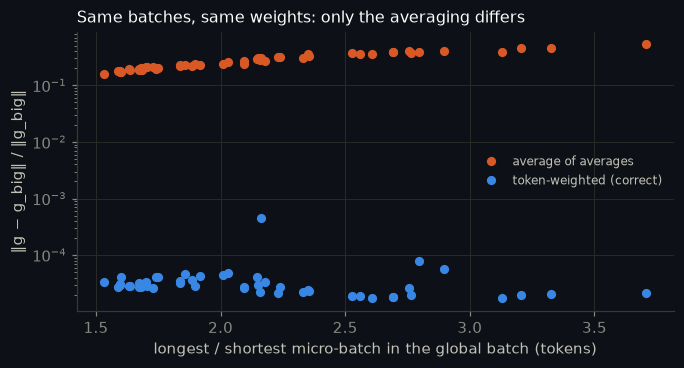

**Training.** Pairs of runs share an initialization and a batch order; one accumulates correctly, one averages averages. Each pair was repeated with 3 seeds:

| seed | buggy run: logged loss vs its true value (median) | final held-out: correct | final held-out: buggy | buggy − correct | buggy − correct by length quartile (short → long) |
|---|---|---|---|---|---|
| 0 | -2.06% | 2.5039 | 2.5348 | +0.0309 | -0.016, -0.012, -0.010, +0.024 |
| 1 | -2.00% | 2.5403 | 2.5393 | -0.0010 | -0.016, -0.009, +0.002, +0.037 |
| 2 | -2.03% | 2.5079 | 2.5364 | +0.0284 | -0.017, -0.003, +0.007, +0.041 |
| mean ± sd | -2.03 ± 0.03% | 2.5174 ± 0.0199 | 2.5368 ± 0.0023 | +0.0195 ± 0.0178 | -0.016, -0.008, -0.001, +0.034 |

The logged number is wrong every step, in every seed. In the model, the bug's fingerprint (better on the shortest stories, worse on the longest, as the $1/(Kn_k)$ weighting predicts) appears in 3 of 3 seeds. Compare the overall held-out difference with its seed-to-seed spread before reading much into it: it is small, and that smallness is how the bug survived.

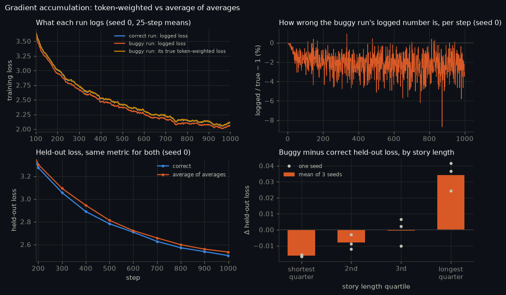

With packed batches (every micro-batch exactly B×T tokens) the two methods are identical to float64 precision, which is how the bug hid.

## 4. Does the gradient norm move before the loss?

The norm is logged at every step (before clipping). The detection rule was fixed in code before any run was looked at: a trace "moves" at step $t$ when $\log(\text{trace})$ sits more than 4 robust standard deviations above the median of the previous 50 steps, for 3 steps in a row. In the healthy baseline run the rule found no departure at all, in either trace: a healthy run has no step where the norm visibly moves first, so the lead is measured on an instability created on purpose.

**Logged at every step.** Here is the baseline training run, with the gradient norm (before clipping) next to the loss, tokens/s, MFU and the GPU clock, all logged every step:

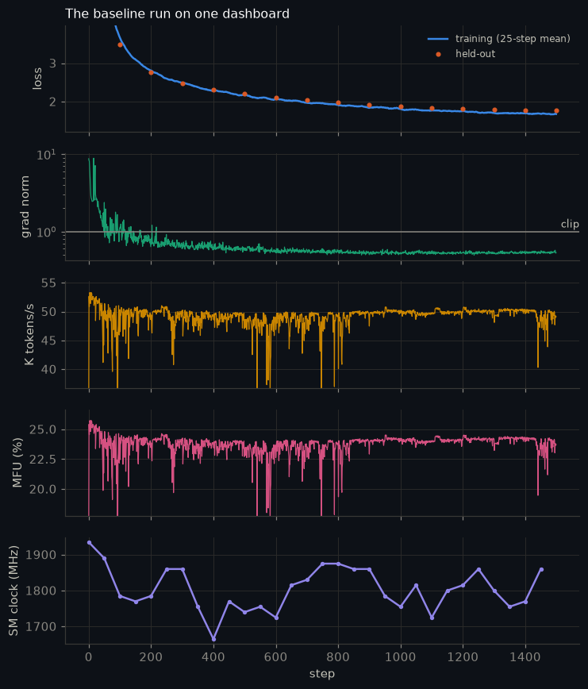

**Stress test.** Starting from the trained Model A, the learning rate was raised geometrically, with no clipping, until training broke. This was repeated over 3 seeds (batch orders):

| seed | pre-registered rule: norm departs at step | loss departs at step | lead (steps) |
|---|---|---|---|
| 0 | 319 | 319 | 0 |
| 1 | never | never | — |
| 2 | never | 375 | — |

Under the rule fixed in advance, the norm was flagged first in **0 of 3** seeds. That verdict stands as recorded: this detector does not show a lead.

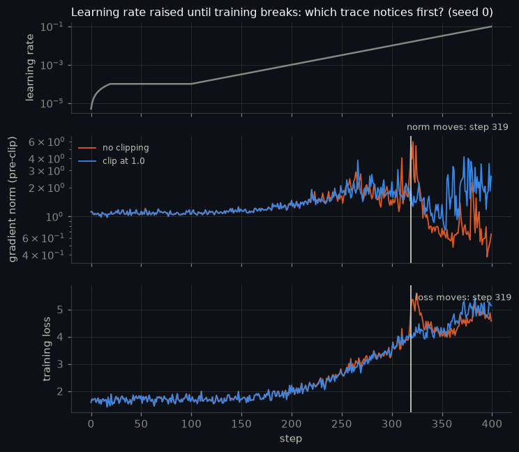

That rule compares each step with the 50 before it, so a slow drift keeps raising its own baseline: the loss creeps upward well before the rule fires, if it fires at all. A second view, **added after seeing the first result** (the first verdict stands as recorded), measures both traces against a fixed baseline taken before the ramp. Each cell gives the steps where the norm and the loss depart:

| seed | z > 3: norm / loss | z > 4 | z > 6 |
|---|---|---|---|
| 0 | 181 / 217 (lead 36) | 197 / 226 (lead 29) | 213 / 246 (lead 33) |
| 1 | 159 / 203 (lead 44) | 187 / 215 (lead 28) | 195 / 238 (lead 43) |
| 2 | 172 / 205 (lead 33) | 197 / 221 (lead 24) | 204 / 224 (lead 20) |

Across all seeds and thresholds the norm led by 20–44 steps (median 33).

**The step:** seed 0, step **197**. Here the gradient norm, at 1.23× its pre-ramp median, had moved more than 4 robust standard deviations out of its band, and stayed out for 3 steps. The loss, at 1.09× its own pre-ramp median, had not yet left its band. It crossed the same threshold only at step 226, 29 steps later.

Why: near a minimum $\mathcal{L} \approx \mathcal{L}^* + \tfrac12\lambda x^2$ while $\lVert g\rVert = \lambda|x|$. An instability multiplies the norm from its own small baseline, but the loss changes on top of a large constant $\mathcal{L}^*$. The per-step loss is also measured on different text every step, so it is the noisier trace, and a real change stands out later in it.

**Does clipping rescue a learning rate that is too high?** Every stress run was repeated with clipping at 1.0. The breaking point (the first step after the ramp starts where the loss exceeds 1.5× its pre-ramp median) was defined before any clipped run was looked at:

| seed | loss before the ramp | breaks at step: no clip | breaks at step: clip at 1.0 | mean loss, last 50 steps: no clip | clip at 1.0 |
|---|---|---|---|---|---|
| 0 | 1.713 | 241 | 241 | 4.544 | 4.796 |
| 1 | 1.702 | 241 | 249 | 4.780 | 4.816 |
| 2 | 1.704 | 245 | 245 | 5.082 | 4.821 |

Clipping moved the breaking point by +2.7 steps on average (per seed: [0, 8, 0]), so it does **not** rescue a learning rate that is too high. AdamW divides each update by a running estimate of the gradient's size, so scaling every gradient down by the same factor changes its step much less than the clip factor suggests.

**What clipping is for.** Three batches of random tokens were injected into a healthy run, with and without clipping at 1.0, for each seed:

| seed | grad norm on the noise | worst damage: clip at 1.0 | no clipping | held-out at end: clip at 1.0 | no clipping |
|---|---|---|---|---|---|
| 0 | 100.2 (typical 1.08) | +0.0074 | +0.0097 | 1.7919 | 1.7884 |
| 1 | 93.7 (typical 1.09) | +0.0039 | +0.0088 | 1.7979 | 1.7954 |
| 2 | 99.6 (typical 1.09) | +0.0042 | +0.0077 | 1.7950 | 1.7933 |
| mean ± sd |  | +0.0052 ± 0.0019 | +0.0087 ± 0.0010 | 1.7949 ± 0.0030 | 1.7924 ± 0.0036 |

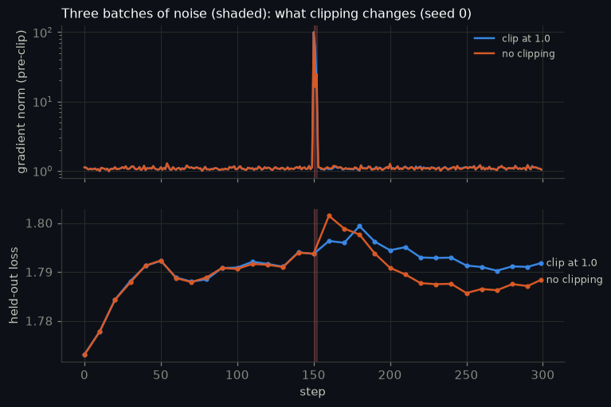

Clipping reduced the worst damage in 3 of 3 seeds. AdamW already limits how far one batch can move the weights, so the benefit is bounded here; it grows with how big and how frequent the spikes are, which is the case for having it on from step one. By the end, though, the unclipped run was slightly *lower* in 3 of 3 seeds (by 0.0025 on average). One untested explanation: the noise spike inflates AdamW's second-moment estimate, which shrinks the following steps like a brief learning-rate cut.

Baseline gradient norms after warmup: median 0.551, 99th percentile 1.059, max 1.419. A threshold should sit above ordinary steps and below spikes.

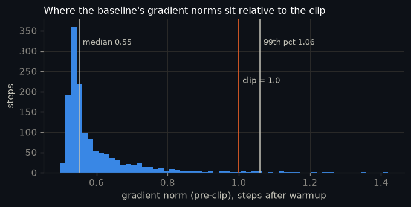

## 5. MFU, reported honestly

$\text{MFU} = \dfrac{(6N + 12LTC)\times\text{tokens/s}}{\text{peak FLOP/s}}$. Peak for this GPU: 40 SMs x 512 FLOP/clk x 2100 MHz = 43.0 TFLOP/s (dense bf16, fp32 accumulation). It was measured warm (sustained load first, until the clock settled), with every comparison interleaved A-B-B-A so thermal drift cancels, and the SM clock recorded beside every number.

| measured against | TFLOP/s | MFU |
|---|---|---|
| spec peak at full boost | 43.0 | 20.7% |
| spec peak at the observed clock (1882 MHz) | 38.6 | 23.1% |
| best measured: one 4096³ bf16 matmul | 30.7 | 29.0% |

Model A at micro-batch 8 × 512 trains at **42.9K tokens/s = 8.9 TFLOP/s** of model arithmetic.

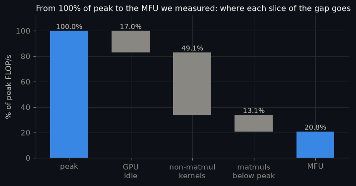

**What is costing the distance to 40%** (from `torch.profiler`, every GPU kernel classified):

- **49% of peak goes to kernels that are not matmuls.** The biggest: elementwise / other (34% of GPU time), softmax / loss (19% of GPU time), optimizer + clipping (4% of GPU time). These are the softmax and cross-entropy over a 49,152-word vocabulary, the fp32↔bf16 casts autocast inserts, and the residual adds, norms and RoPE. They move memory and do few FLOPs. A fused linear + cross-entropy kernel and `torch.compile` target exactly this slice.
- **17% of peak is lost to an idle GPU** between ~1191 kernel launches per step. At this model size the GPU queue stays full, so this slice is small.
- **13% of peak is lost inside the matmuls,** which reach 61% of peak. Width 384 makes them thin: the model's 4096×384 @ 384×384 matmul runs at 22.0 TFLOP/s vs 30.7 for a 4096³ one, and the width sweep takes MFU from 8.7% (d=256) to 27.1% (d=768).
- **The clock.** The laptop held 1882 MHz rather than its 2,100 MHz boost; at the observed clock MFU is 23.1%.

The fixes follow the ranking: fuse the non-matmul kernels (a fused linear + cross-entropy kernel that never materializes fp32 logits, fused norm/RoPE, `torch.compile`, which needs triton and was not available on this Windows setup); then cut launch and sync overhead (CUDA graphs, no per-step `.item()`); then give the matmuls more work per launch (a wider model, or a bigger micro-batch where memory allows). On Hopper or Blackwell, fp8 matmuls would add to all of it.

<details><summary>All the one-factor-at-a-time measurements</summary>

| factor | configuration | tokens/s | MFU |
|---|---|---|---|
| matmul precision | fp32 | 22.6K | 10.9% |
| matmul precision | tf32 | 27.5K | 13.3% |
| matmul precision | bf16 | 28.0K | 13.5% |
| attention kernel | manual softmax(QKᵀ)V | 37.2K | 18.0% |
| attention kernel | fused SDPA kernel | 43.0K | 20.8% |
| micro-batch | B=1 | 7.4K | 3.6% |
| micro-batch | B=2 | 14.8K | 7.2% |
| micro-batch | B=4 | 31.0K | 15.0% |
| micro-batch | B=8 | 43.2K | 20.9% |
| optimizer kernel | AdamW, foreach | 43.1K | 20.8% |
| optimizer kernel | AdamW, fused | 43.9K | 21.2% |
| host sync | .item() every step | 44.2K | 21.3% |
| host sync | no per-step sync | 49.8K | 24.1% |
| data loading | batch already on GPU | 43.0K | 20.8% |
| data loading | real loader each step | 44.9K | 21.7% |
| model width (4×512) | d=256 | 30.1K | 8.7% |
| model width (4×512) | d=384 | 29.7K | 14.4% |
| model width (4×512) | d=512 | 27.0K | 19.6% |
| model width (4×512) | d=768 | 20.6K | 27.1% |
| model width (4×512) | SmolLM2-135M (d=576, 30 layers) | 7.5K | 15.9% |

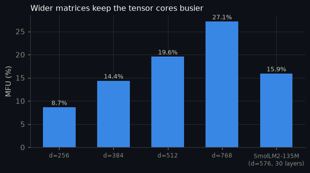
</details>

## 6. The number 0.1 in fp32, bf16 and fp8 E4M3, bit by bit

$0.1 = 1.6 \times 2^{-4}$, and $0.6$ in binary is $0.1001\,1001\,1001\ldots$ (the block 1001 repeats forever). Store the exponent as $-4 + \text{bias}$, keep $M$ mantissa bits, and round to nearest by looking at the bits that were cut:

| format | exponent field | rounding | sign exponent mantissa | hex | stored value | relative error |
|---|---|---|---|---|---|---|
| fp32 | −4 + 127 = 123 → 01111011 | round up | `0 01111011 10011001100110011001101` | `0x3DCCCCCD` | 0.10000000149 | 1.49e-08 |
| fp16 | −4 + 15 = 11 → 01011 | round down | `0 01011 1001100110` | `0x2E66` | 0.0999755859375 | 2.44e-04 |
| bf16 | −4 + 127 = 123 → 01111011 | round up | `0 01111011 1001101` | `0x3DCD` | 0.10009765625 | 9.77e-04 |
| fp8 E4M3 | −4 + 7 = 3 → 0011 | round up | `0 0011 101` | `0x1D` | 0.1015625 | 1.56e-02 |
| fp8 E5M2 | −4 + 15 = 11 → 01011 | round down | `0 01011 10` | `0x2E` | 0.09375 | 6.25e-02 |

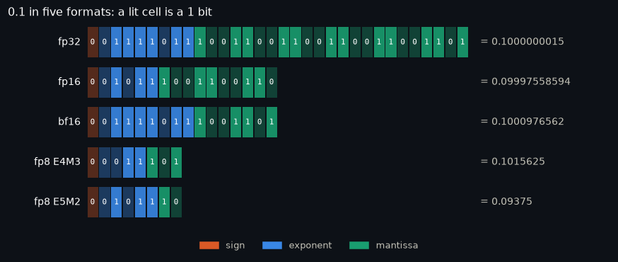

These bit patterns were computed with exact rational arithmetic, then checked against PyTorch's own conversions, which agree bit-for-bit. The same encoder matches PyTorch on 560,000 random values and every rounding tie.

**And 1.0**, which every format stores exactly (exponent field = bias, mantissa all zero), also checked against PyTorch:

| format | sign exponent mantissa | hex |
|---|---|---|
| fp32 | `0 01111111 00000000000000000000000` | `0x3F800000` |
| fp16 | `0 01111 0000000000` | `0x3C00` |
| bf16 | `0 01111111 0000000` | `0x3F80` |
| fp8 E4M3 | `0 0111 000` | `0x38` |
| fp8 E5M2 | `0 01111 00` | `0x3C` |

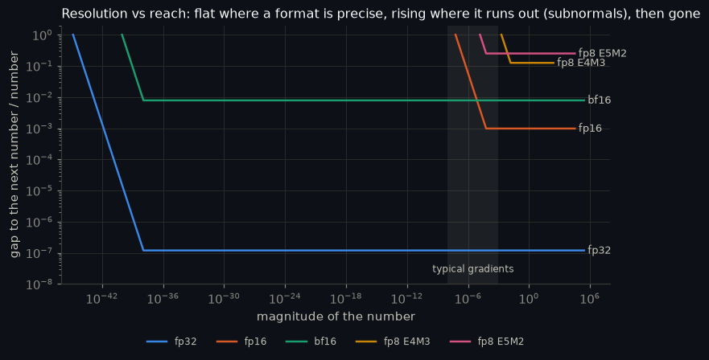

**Which would I train in? bf16 mixed precision**: bf16 matmuls and activations, with fp32 master weights, AdamW state and reductions.

- **Range like fp32.** fp16's 5-bit exponent flushes anything below ~3e-8 to zero. Measured on Model A's real gradients:

| gradient | median magnitude | fp16: becomes 0 | fp16: subnormal (digits lost) | fp16 ×1024: becomes 0 | bf16: becomes 0 |
|---|---|---|---|---|---|
| weights | 3.6e-08 | 49.515% | 21.0% | 0.1981% | 0.0000% |
| activations | 6.5e-06 | 0.806% | 98.7% | 0.0019% | 0.0000% |

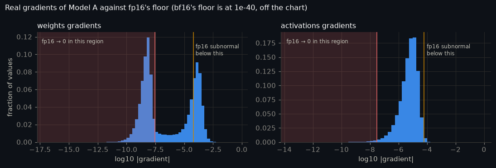

- **Speed and memory.** bf16 runs on the tensor cores at full rate, with half the bytes per activation. The same model and data in five precisions, three seeds each:

| precision | micro-batch × accumulation | final held-out loss, mean ± sd | per seed | tokens/s | peak memory |
|---|---|---|---|---|---|
| fp32 | 8×1 | 2.9253 ± 0.0039 | 2.9279, 2.9272, 2.9208 | 26.9K | 3.86 GiB |
| TF32 | 8×1 | 2.9204 ± 0.0165 | 2.9393, 2.9089, 2.9130 | 31.7K | 3.86 GiB |
| bf16 autocast | 8×1 | 2.9418 ± 0.0170 | 2.9520, 2.9222, 2.9513 | 42.0K | 3.60 GiB |
| fp16 + loss scaling | 8×1 | 2.9454 ± 0.0279 | 2.9635, 2.9132, 2.9594 | 41.5K | 3.60 GiB |
| fp16, no scaling | 8×1 | 3.0850 ± 0.0454 | 3.0522, 3.0661, 3.1368 | 41.9K | 3.60 GiB |

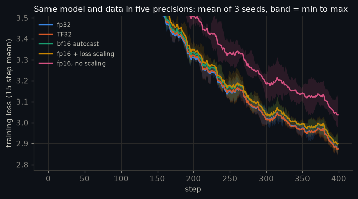

fp16 without loss scaling was the worst precision in 3 of 3 seeds. The other four are within each other's seed-to-seed spread, and bf16 moved 1.6× as many tokens per second as fp32.

- **Master weights must stay fp32.** Near 1.0, bf16 numbers are 0.0078 apart, so an update of 0.001 rounds away completely: a weight of 1.0 plus a hundred such updates stays exactly 1.0 in bf16 (and reaches 1.1 in fp32).
- **fp8 E4M3** stores 0.1 with a 1.6% error. It needs a per-tensor or per-block scale (unscaled, a gradient-sized tensor is flushed to zero entirely) and hardware with fp8 tensor cores (Hopper or Blackwell, not this Ampere GPU). It is the right choice for the big matmuls there, not for everything.

## Also measured: what a step costs in memory

Training holds 16 bytes per weight before any activation: weight, gradient, fp32 master copy and AdamW's two running averages. Measured on Model A's first step against that prediction:

| phase | measured | predicted |
|---|---|---|
| weights on the GPU (fp32) | 120 MiB | 120 MiB |
| + activations saved by the forward pass | 1,640 MiB | — |
| after backward: + gradients, activations freed | 244 MiB | 240 MiB |
| after the first optimizer step: + AdamW m and v | 486 MiB | 480 MiB |
| after zero_grad(set_to_none=True): gradients freed | 363 MiB | 360 MiB |

| model, micro-batch | configuration | peak memory | step time |
|---|---|---|---|
| Model A, 8×512 | plain | 3.60 GiB | 98 ms |
| Model A, 8×512 | activation checkpointing | 2.96 GiB | 109 ms |
| Model A, 8×512 | chunked cross-entropy | 2.52 GiB | 114 ms |
| Model A, 8×512 | both | 1.88 GiB | 128 ms |
| SmolLM2-135M, 8×512 | plain | out of memory | — |
| SmolLM2-135M, 8×512 | both | 3.32 GiB | 445 ms |

## Running it

| `MODE` | What runs | Time |
|---|---|---|
| `learn` | Cheap demos live; every training run replayed from `assets/results.json` (fetched from GitHub if missing) | minutes, on a CPU |
| `quick` | Everything on a tiny model and a 5 MB slice; writes `assets/quick/`, never the results above | ~10 min on a GPU |
| `full` | The runs behind this README | 62 min of experiments on the GPU above, plus downloads; a Colab T4 is estimated (not measured) at 1–1.5 h |

Set `MODE` in the first code cell, or run headless:

```
TL_MODE=full python -m nbconvert --to notebook --execute --inplace inside_the_training_loop.ipynb --ExecutePreprocessor.timeout=-1
```

On first run the notebook downloads TinyStories (first 100 MB of the train file, all of the validation file) and SmolLM2-135M (270 MB) into `data/`, resuming interrupted downloads with HTTP range requests.

| File | What it is |
|---|---|
| [`inside_the_training_loop.ipynb`](inside_the_training_loop.ipynb) | the notebook, executed, outputs included |
| `nb_source.py` | its source as a plain script (runs top to bottom with `python nb_source.py`) |
| `build_notebook.py` | turns `nb_source.py` into the notebook |
| `make_readme.py` | writes this README from `assets/results.json` |
| [`CHEATSHEET.md`](CHEATSHEET.md) | one-page refresher |
| `assets/` | figures and `results.json` from the full run |

