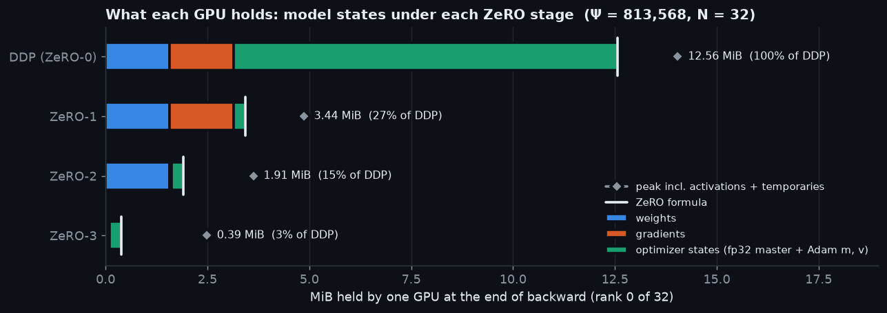
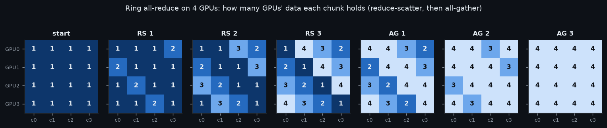
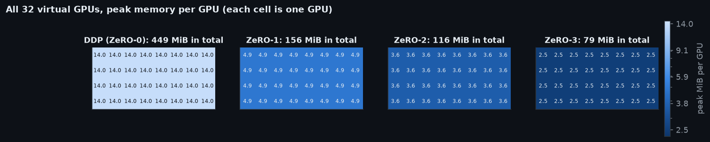
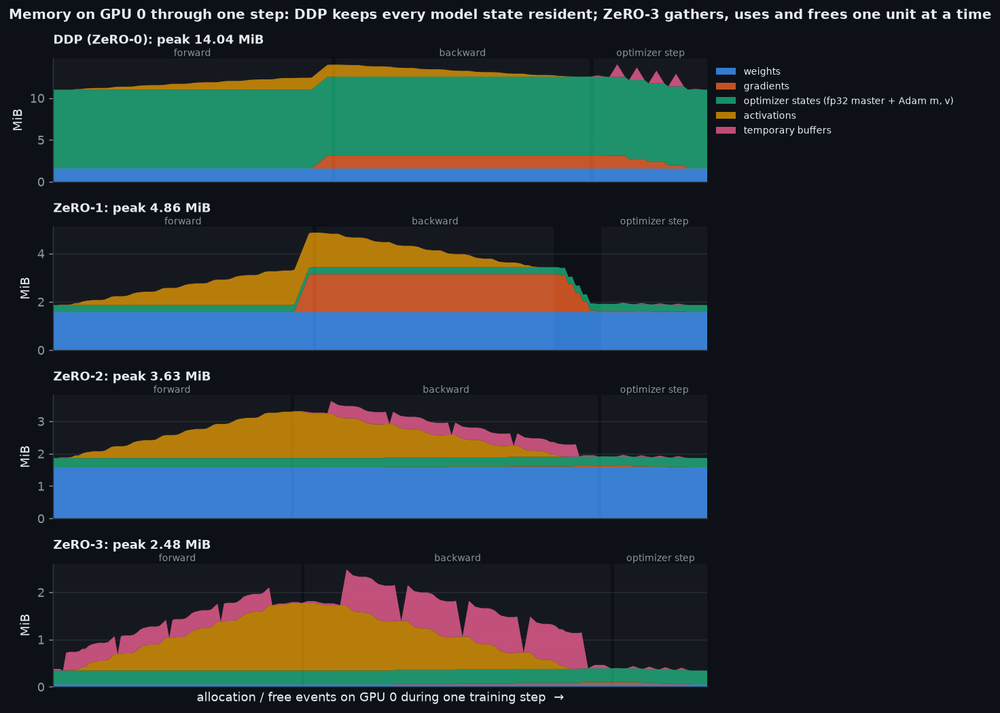
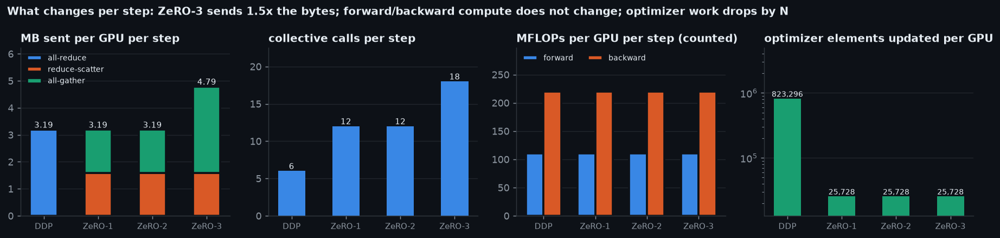
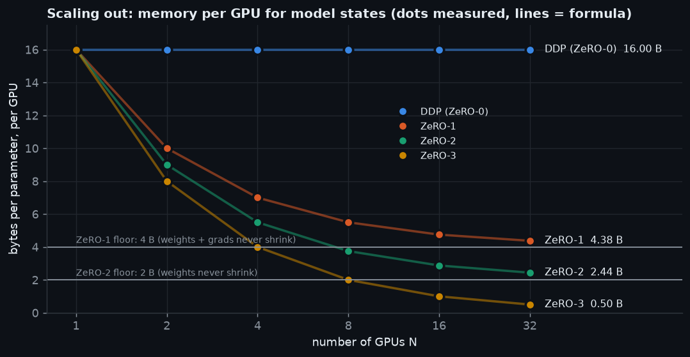
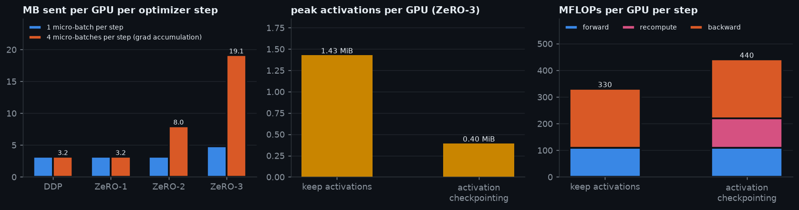
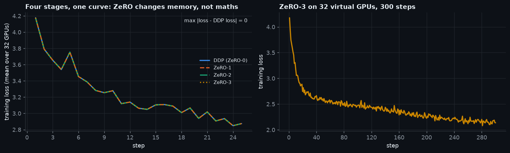
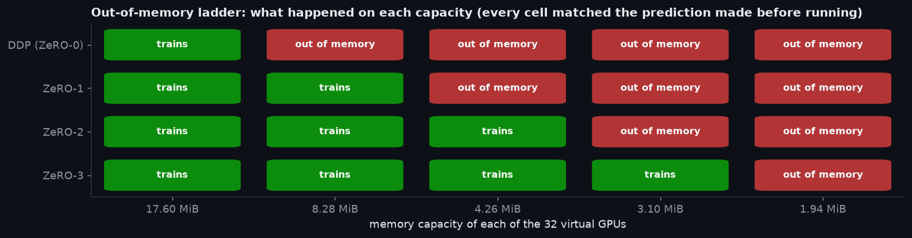
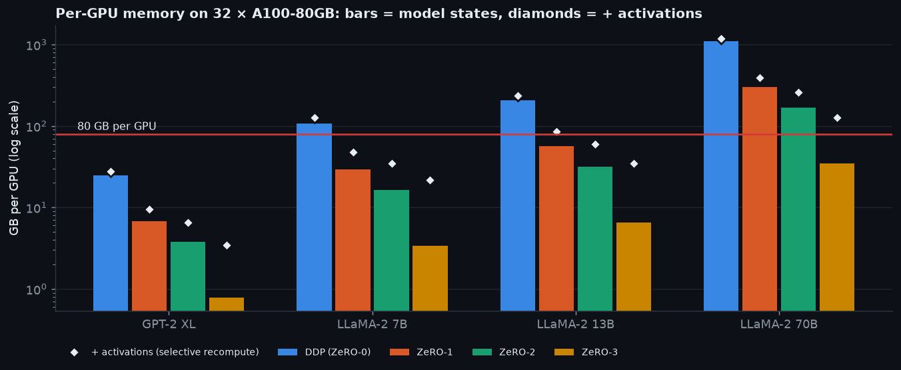

<!-- Generated by tools/build_readme.py from assets/results.json (RUN STAMP 2026-09-20 00:26:06). Do not edit by hand: edit the builder and re-run it. -->

<h1 align="center">ZeRO on 32 Virtual GPUs</h1>

<p align="center"><i>One small GPT trained four ways (DDP, ZeRO-1, ZeRO-2, ZeRO-3) on 32 virtual GPUs,<br>
with every byte each GPU holds, sends and computes measured and checked against the ZeRO paper.</i></p>

<p align="center">
  <a href="https://colab.research.google.com/github/rahulni/Indic_LLM/blob/main/12_Distributed_ZeRO/zero_32_virtual_gpus.ipynb"></a>
  <a href="https://nbviewer.org/github/rahulni/Indic_LLM/blob/main/12_Distributed_ZeRO/zero_32_virtual_gpus.ipynb"></a>
  <a href="https://github.com/rahulni/Indic_LLM/tree/main/12_Distributed_ZeRO"></a>
  
  
</p>

## Open it

**[Open in Colab](https://colab.research.google.com/github/rahulni/Indic_LLM/blob/main/12_Distributed_ZeRO/zero_32_virtual_gpus.ipynb) · [Render in nbviewer](https://nbviewer.org/github/rahulni/Indic_LLM/blob/main/12_Distributed_ZeRO/zero_32_virtual_gpus.ipynb) · [View on GitHub](https://github.com/rahulni/Indic_LLM/tree/main/12_Distributed_ZeRO)**

The notebook [`zero_32_virtual_gpus.ipynb`](zero_32_virtual_gpus.ipynb) is committed with all its outputs and figures, so
nbviewer and GitHub show the complete run without executing anything. This README is
generated from that run: [`tools/build_readme.py`](tools/build_readme.py) reads
`assets/results.json` and refuses to build unless the notebook's printed run stamp
(`RUN STAMP 2026-09-20 00:26:06`) matches it. On Colab the notebook fetches its three engine
modules from this folder and starts in quick mode (a smaller model, a few minutes on 2 vCPUs);
set `QUICK_RUN = False` to reproduce the numbers below.

---

## TL;DR

- **Same training, bit for bit.** 32 virtual GPUs (threads in one process) train an 813,568-parameter GPT for 25 steps under DDP, ZeRO-1, ZeRO-2 and ZeRO-3. With one micro-batch per optimizer step (G = 1), losses and final weights are bit-identical across all four (`torch.equal`, not `allclose`).
- **Memory follows the paper to the byte.** Model states per GPU: 12.56 → 3.44 → 1.91 → 0.39 MiB (3.7×, 6.6× and 32.0× smaller than DDP). Each equals its formula (16Ψ′, 4Ψ′ + 12Ψ′/N, 2Ψ′ + 14Ψ′/N, 16Ψ′/N) exactly, on every one of the 32 GPUs.
- **The price is communication, not compute.** Each GPU sends 3.19 MB per step under DDP, ZeRO-1 and ZeRO-2 alike, and 4.79 MB (1.5×) under ZeRO-3. Forward and backward FLOPs are identical in all four stages; optimizer work per GPU falls from 823,296 to 25,728 elements.
- **Predictions hold under stress.** 20 of 20 out-of-memory outcomes were predicted correctly before running; the ledger matched the real CUDA allocator on all 32 ranks within its 512-byte rounding; the unchanged ZeRO-1 engine on real `torch.distributed` (gloo, 2 processes) matched the simulator bit for bit.
- **At scale.** On 32 × A100-80GB, LLaMA-2 70B needs 168 GB per GPU of model states under ZeRO-2 and 34.5 GB under ZeRO-3. Only ZeRO-3 fits, and only with full activation recomputation. Communication can hide behind compute above about 3,328 tokens per GPU per step (4,992 for ZeRO-3) with one 25 GB/s NIC per GPU, whatever the model size.

---

## ZeRO in one picture

Adam in mixed precision holds **16 bytes per parameter** before a single activation is
stored. Data parallelism (DDP) keeps all 16 on *every* GPU, so adding GPUs adds throughput
but never room. ZeRO (the Zero Redundancy Optimizer) removes that replication one model
state at a time:

```text
                    GPU0     GPU1     GPU2     GPU3        (■ = holds that quarter, · = does not)
DDP (ZeRO-0)  W    ■■■■     ■■■■     ■■■■     ■■■■     everything replicated 4×
              G    ■■■■     ■■■■     ■■■■     ■■■■
              OS   ■■■■     ■■■■     ■■■■     ■■■■
ZeRO-1        W    ■■■■     ■■■■     ■■■■     ■■■■
              G    ■■■■     ■■■■     ■■■■     ■■■■
              OS   ■···     ·■··     ··■·     ···■     ← optimizer states split
ZeRO-2        W    ■■■■     ■■■■     ■■■■     ■■■■
              G    ■···     ·■··     ··■·     ···■     ← + gradients split
              OS   ■···     ·■··     ··■·     ···■
ZeRO-3        W    ■···     ·■··     ··■·     ···■     ← + weights split
              G    ■···     ·■··     ··■·     ···■       (gathered just in time,
              OS   ■···     ·■··     ··■·     ···■        freed right after use)
W = weights (2Ψ)   G = gradients (2Ψ)   OS = optimizer states: fp32 master + Adam m + v (12Ψ)
```

How much each GPU holds (N = 4, one block ≈ 0.5Ψ bytes):

```text
             weights 2Ψ   grads 2Ψ   optimizer states 12Ψ           per GPU
DDP          ████         ▓▓▓▓       ░░░░░░░░░░░░░░░░░░░░░░░░        16.0 Ψ
ZeRO-1       ████         ▓▓▓▓       ░░░░░░                           7.0 Ψ   = 4Ψ + 12Ψ/N
ZeRO-2       ████         ▓          ░░░░░░                           5.5 Ψ   = 2Ψ + 14Ψ/N
ZeRO-3       █            ▓          ░░░░░░                           4.0 Ψ   = 16Ψ/N
```

The same picture, **measured** on GPU 0 of the 32 in this run at the end of backward (the
moment the formulas describe), was identical on all 32 GPUs:

<p align="center"></p>

**What to look for:** the bars shrink stage by stage and end exactly on the white formula
ticks: 12.562 → 3.435 → 1.914 → 0.393 MiB. The optimizer states
(green) are 12 of the 16 bytes, which is why sharding them first (ZeRO-1) already gives
3.7×. The diamonds are the *peak*, which also counts activations and
temporary buffers. ZeRO shards neither, and at this toy size they dominate ZeRO-3's peak.

> **An analogy for revision.** 32 students prepare for one exam. Under DDP every student
> photocopies the whole textbook, notes and answer key. Under ZeRO-1 each keeps 1/32 of the
> answer key, the biggest pile. Under ZeRO-2 each also keeps 1/32 of the notes. Under ZeRO-3
> each keeps 1/32 of the textbook too: before reading chapter k, everyone briefly borrows the
> rest of it, then hands it back. The price is passing pages around (communication), not
> extra thinking (compute).

<details>
<summary><b>Notation used below</b></summary>

| Symbol | Meaning | In this run |
|---|---|---:|
| Ψ | number of model parameters | 813,568 |
| Ψ′ | Ψ with each unit padded to a multiple of N·64 elements (what the buffers really hold) | 823,296 |
| N | data-parallel degree (GPUs) | 32 |
| K | optimizer bytes per parameter (fp32 master + Adam m + v) | 12 |
| G | gradient-accumulation steps (micro-batches per optimizer step) | 1 (and 4 in one experiment) |
| unit | the granularity ZeRO shards and gathers at (FSDP: a wrapped module) | 6 units |
| AR, RS, AG | all-reduce, reduce-scatter, all-gather | |
| MiB / MB / GB | 2²⁰ bytes / 10⁶ bytes / 10⁹ bytes | |

The paper counts communication in **elements**: "2Ψ" means 2Ψ elements per GPU per step,
which in bf16 is 4Ψ bytes. The measured byte counts below are exact ring bytes,
2 · (N−1)/N · 2Ψ′ for DDP.

</details>

---

## The memory bill: 16 bytes per parameter

| What | dtype | Bytes per parameter | Sharded from |
|---|---|---:|---|
| weights (used by forward and backward) | bf16 | 2 | ZeRO-3 |
| gradients | bf16 | 2 | ZeRO-2 |
| master weights (what the optimizer updates) | fp32 | 4 | ZeRO-1 |
| Adam first moment m | fp32 | 4 | ZeRO-1 |
| Adam second moment v | fp32 | 4 | ZeRO-1 |
| **total** | | **16** | |

With b<sub>w</sub>, b<sub>g</sub> bytes per weight and gradient element and K bytes of
optimizer state per parameter, each GPU holds:

| Stage | Weights | Gradients | Optimizer | Per GPU | bf16 + Adam (b<sub>w</sub> = b<sub>g</sub> = 2, K = 12) |
|---|---|---|---|---|---|
| DDP (ZeRO-0) | b<sub>w</sub>Ψ | b<sub>g</sub>Ψ | KΨ | (b<sub>w</sub> + b<sub>g</sub> + K)Ψ | 16Ψ |
| ZeRO-1 | b<sub>w</sub>Ψ | b<sub>g</sub>Ψ | KΨ/N | (b<sub>w</sub> + b<sub>g</sub>)Ψ + KΨ/N | 4Ψ + 12Ψ/N |
| ZeRO-2 | b<sub>w</sub>Ψ | b<sub>g</sub>Ψ/N | KΨ/N | b<sub>w</sub>Ψ + (b<sub>g</sub> + K)Ψ/N | 2Ψ + 14Ψ/N |
| ZeRO-3 | b<sub>w</sub>Ψ/N | b<sub>g</sub>Ψ/N | KΨ/N | (b<sub>w</sub> + b<sub>g</sub> + K)Ψ/N | 16Ψ/N |

The rule behind the whole table: stage ≥ 1 divides the optimizer by N, stage ≥ 2 the
gradients, stage ≥ 3 the weights. As N grows, ZeRO-1 approaches a floor of 4Ψ and ZeRO-2 a
floor of 2Ψ (the parts that are never sharded); only ZeRO-3 keeps falling as 1/N.

**Checked against the paper.** For its Figure 1 (Ψ = 7.5B, N = 64, K = 12) the ZeRO paper prints 120 / 31.4 / 16.6 / 1.9 GB per GPU. The formulas above give 120 / 31.406 / 16.641 / 1.875 GB, and the notebook asserts that they round to the paper's figures. A 7.5B model that needs 120 GB per GPU under DDP needs under 2 GB under ZeRO-3.

<details>
<summary><b>Why an fp32 master copy exists (and why it is the biggest item)</b></summary>

bf16 keeps 8 significant bits (7 stored, plus the implicit leading 1). Near 1.0 the gap between neighbouring bf16 numbers is
2⁻⁷ ≈ 0.0078, so any update smaller than half of that (≈ 0.0039) rounds away:
**1.0 + 0.001 = 1.0 in bf16.** Adam's step is roughly the learning rate per element (the
update m̂/√v̂ is of order 1), and learning rates are 10⁻⁴ to 10⁻³, so applied directly to bf16
weights most updates would vanish and training would stall.

So the optimizer updates an **fp32 master copy** (24 significant bits, gap ≈ 1.2 × 10⁻⁷ near 1.0),
and the bf16 weights used by forward and backward are re-derived from it after every step by
rounding. Adam's m and v stay in fp32 for the same reason: they are running averages whose
per-step increments, such as (1 − β₂)·g², are tiny next to the running value.

Mixed precision therefore saves memory on weights, gradients and activations, and gains matmul
throughput. It does not save optimizer memory, which stays at 12 of the 16 bytes. That is why
ZeRO-1 shards the optimizer states first. In this engine the step is literally:

```python
class DDP(Engine):
    def step(self, lr):
        for u in self.units:
            p32 = u.master if self.mixed else u.flat_w
            self._adamw(u, p32, u.flat_g, lr)                # Ψ elements updated per GPU
            if self.mixed:
                u.flat_w.copy_(u.master)
            self._drop_full_grads(u)
```

(fp32 training has no master copy: 4 + 4 + 8 = 16 bytes per parameter again. Keeping fp32
gradient buffers, as DeepSpeed's bf16 path and Megatron-LM do, makes b<sub>g</sub> = 4 and DDP 18Ψ.)

</details>

---

## How 32 virtual GPUs are built

```text
┌──────────────────────────── one Python process ─────────────────────────────┐
│  VirtualCluster(world=32).run(train_step)        ≈  torchrun --nproc 32     │
│                                                                             │
│    thread 0            thread 1                          thread 31          │
│   ┌────────────┐      ┌────────────┐                   ┌────────────┐       │
│   │ vGPU 0     │      │ vGPU 1     │        ...        │ vGPU 31    │       │
│   │ • ledger   │      │ • ledger   │                   │ • ledger   │       │
│   │ • capacity │      │ • capacity │                   │ • capacity │       │
│   │ • shard 0  │      │ • shard 1  │                   │ • shard 31 │       │
│   │ • data 0   │      │ • data 1   │                   │ • data 31  │       │
│   └─────┬──────┘      └─────┬──────┘                   └─────┬──────┘       │
│         └───────────────────┴──────────────┬─────────────────┘              │
│                    ThreadComm  (barriers + shared slots)                    │
│        all_reduce · reduce_scatter · all_gather · broadcast · barrier       │
│      charges each GPU's bytes with the ring model: 2(N−1)/N · S, etc.       │
└─────────────────────────────────────────────────────────────────────────────┘
 Tensors live on:  CPU (default, reproducible anywhere)  or  the real GPU (GPU mode)
```

**Why threads, not processes.** 32 processes would each load their own copy of PyTorch
before holding a single weight, which does not fit on a laptop or a free Colab runtime. In this run each gloo worker process (one PyTorch each) peaked at 585 MB, so 32 of them would need about 18.7 GB before training started.
Threads share one copy of PyTorch, and PyTorch releases Python's global interpreter lock
inside its kernels, so 32 threads really do run 32 forward and backward passes. Each run pins
PyTorch to one intra-op thread per virtual GPU and restores the setting afterwards.

Three pieces of [`zero_sim.py`](zero_sim.py) make a cluster:

- **`VirtualGPU`: a memory ledger.** Every buffer the algorithm holds is booked by name
  and category (`weights`, `grads`, `master`, `adam_m`, `adam_v`, `activations`, `temp`).
  The ledger tracks the current total, the peak, the category mix at the peak, named
  snapshots (`end_of_backward`) and an optional event timeline. It is charged *before* a
  tensor is created, so with a capacity set an allocation that would not fit raises
  `VirtualOOMError` and never allocates. Activations are booked automatically: a
  `saved_tensors_hooks` pair charges every tensor autograd saves for backward (once per
  storage, skipping weight storages already on the books) and releases it when autograd drops it.
- **`ThreadComm`: collectives.** Every GPU calls the same collective with its own tensor
  (SPMD, like `torch.distributed`). Inputs are published in shared slots, and a barrier
  waits for every GPU. Each GPU then reads what it needs, and a second barrier keeps anyone
  from reusing a buffer early. Reductions sum in rank order in fp32, then divide by N.
  `all_reduce` is implemented as reduce-scatter + all-gather, so all four stages sum
  gradients through one code path. Bytes are charged per GPU with the ring cost model.
- **`VirtualCluster`: the launcher.** It runs `fn(rank, gpu, comm)` on N daemon threads. If
  any GPU raises (an OOM, say), every barrier is aborted so nobody hangs, and the
  lowest-rank error is re-raised, so failures are deterministic.

**The storage-resize trick (how ZeRO-3 frees weights).** Each unit's parameters are
`nn.Parameter` *views* into one flat buffer. To free the weights, the buffer's storage is
shrunk in place, `flat_w.untyped_storage().resize_(0)`; the tensor objects, and the
references autograd saved for backward, stay alive but point at zero bytes. To use the unit
again, the storage is regrown and refilled by an all-gather, and every view sees the right
numbers. This is what PyTorch FSDP does. Reading a freed weight would crash the process rather
than raise, so a forward pre-hook on every unit raises a readable error first.

**CPU mode and GPU mode.** By default every virtual GPU's tensors live in ordinary CPU memory,
which is reproducible anywhere. In GPU mode all 32 virtual GPUs put their tensors on the one real
GPU, so the ledger can be audited against PyTorch's CUDA allocator (see
[Stress tests](#stress-tests)).

**"Hello, collectives."** Every GPU contributes a tensor filled with its own rank. After an
all-reduce every GPU must hold 0 + 1 + … + 31 = 496; after a
reduce-scatter each GPU must hold only its slice of that sum; after an all-gather every GPU
must hold every rank's slice in rank order. All three are asserted, and the bytes GPU 0 was
charged for a message of S = 131,072 bytes (128 KiB) are exactly the ring formulas:

| Collective | Bytes sent by GPU 0 | Ring formula | Formula value |  |
| --- | ---: | --- | ---: | :---: |
| `all_reduce` | 253,952 | 2(N−1)/N · S | 253,952 | ✓ |
| `reduce_scatter` | 126,976 | (N−1)/N · S | 126,976 | ✓ |
| `all_gather` | 126,976 | (N−1)/N · S | 126,976 | ✓ |

A capacity turns the ledger into a real limit. On a 1 MiB virtual GPU holding 0.75 MiB, a
0.5 MiB gradient allocation fails *before* the tensor is created, with a CUDA-style message:

```text
vGPU 7 out of memory: tried to allocate 0.50 MiB for 'grads:block0' (grads). Capacity 1.00 MiB; 0.75 MiB already held (weights 0.75); 0.25 MiB free.
```

<details>
<summary><b>Why four different algorithms can produce bit-identical results</b></summary>

Floating-point addition is not associative, so "the same maths" is not enough for bitwise
equality. The engine removes every source of divergence:

- **One reduction path.** Every gradient sum goes through `reduce_scatter`: slices are added
  in rank order, in fp32, divided by N, then cast to bf16. DDP's `all_reduce` is literally
  `reduce_scatter` followed by `all_gather`.
- **An elementwise optimizer.** AdamW is written with plain `mul_`, `add_`, `div_` and `sqrt_`,
  never a fused kernel whose vectorized tail might round differently. Updating a 1/N slice
  therefore produces exactly the same numbers as updating the whole vector.
- **One flat layout everywhere.** Units are padded to multiples of N·64 elements, the same in
  every stage, so shard boundaries fall on SIMD-aligned offsets.
- **Gradients written in place.** Each `p.grad` is pre-set to a view into the unit's flat
  gradient buffer, and after backward the engine asserts that autograd did not replace it.
- **No randomness in the step.** No dropout; data batches are a pure function of (seed, step).
- **One micro-batch per step.** With G = 1 every stage adds the same numbers in the same order.
  Under gradient accumulation the order differs: ZeRO-2/3 reduce-scatter every micro-batch and add
  the reduced slices, while DDP and ZeRO-1 add the micro-batches locally and reduce once. Addition
  is not associative, so the last bits differ, though the maths is the same.

</details>

---

## Collectives, and why the ring costs 2(N−1)/N

ZeRO is built from three collectives (4 GPUs, each starting with a vector of 4 chunks):

```text
 REDUCE-SCATTER                     ALL-GATHER                       ALL-REDUCE  =  RS then AG
 in   r0 [a0 a1 a2 a3]              in   r0 [x0]                     in   r0 [a0 a1 a2 a3]
      r1 [b0 b1 b2 b3]                   r1 [x1]                          r1 [b0 b1 b2 b3]
      r2 [c0 c1 c2 c3]                   r2 [x2]                          r2 [c0 c1 c2 c3]
      r3 [d0 d1 d2 d3]                   r3 [x3]                          r3 [d0 d1 d2 d3]
 out  r0 [Σ0] r1 [Σ1]               out  every rank                  out  every rank
      r2 [Σ2] r3 [Σ3]                    [x0 x1 x2 x3]                    [Σ0 Σ1 Σ2 Σ3]
 Σk = ak+bk+ck+dk
 bytes sent per GPU (ring):  (N−1)/N · S        (N−1)/N · S                 2(N−1)/N · S
```

| Collective | Each GPU ends with | Bytes sent per GPU (ring) | Used by |
|---|---|---:|---|
| all-reduce | the full sum | 2(N−1)/N · S | DDP gradient sync |
| reduce-scatter | its 1/N slice of the sum | (N−1)/N · S | ZeRO-1/2/3 gradient sync |
| all-gather | every GPU's slice, concatenated | (N−1)/N · S | ZeRO-1/2 weights after the step; ZeRO-3 weights before each use |

**The key fact.** A reduce-scatter followed by an all-gather moves exactly the bytes of one
all-reduce, because that is how the bandwidth-optimal ring *implements* all-reduce. ZeRO-1
and ZeRO-2 do the same two halves as DDP: the reduce-scatter on gradients, then the
all-gather on updated weights instead of on gradients. They therefore cost DDP's
communication. Only ZeRO-3, which must also gather weights before they are used, pays more.

<p align="center"></p>

**What to look for** (N = 4; each cell counts how many GPUs' data that chunk holds): the
reduce-scatter steps (RS 1–3) grow one chunk per GPU to 4. GPU r ends up owning the finished
chunk (r + 1) mod N, a shifted diagonal. Which chunk lands where is a convention of this schedule;
any mapping that gives each GPU exactly one chunk works. The all-gather steps (AG 1–3) copy the
finished chunks around the ring until every cell is 4.

**Evidence.** The hand-written ring (`ring_all_reduce`, neighbour-to-neighbour messages only) run at N = 32 on S = 32,768 bytes: every GPU sent 63,488 bytes, and 2(N−1)/N · S = 63,488 ✓. Its result equals the library all-reduce on every GPU.

<details>
<summary><b>Derivation: why a ring all-reduce sends 2(N−1)/N · S bytes per GPU</b></summary>

Put the N GPUs in a ring: GPU r sends only to r + 1 and receives only from r − 1. Cut the
S-byte buffer into N chunks of S/N bytes.

1. **Reduce-scatter, N − 1 steps.** In step k, GPU r sends chunk (r − k) mod N to its right
   neighbour, and adds the chunk (r − k − 1) mod N arriving from its left into its own copy.
   A partial sum travels around the ring, picking up one contribution per hop. After
   N − 1 hops, GPU r holds the complete sum of chunk (r + 1) mod N (the (r + 1) is just this
   schedule's convention). Each GPU has sent N − 1
   chunks: **(N − 1)/N · S bytes.**
2. **All-gather, N − 1 steps.** Each finished chunk travels around the ring once more,
   overwriting stale copies: another **(N − 1)/N · S bytes.**

Total per GPU: **2(N − 1)/N · S.** With α the latency per message and β the bandwidth per
link, the time is 2(N − 1)·α + 2(N − 1)/N · S/β. The bandwidth term tends to 2S/β as N
grows, so adding GPUs does not make each GPU send more. Patarasuk & Yuan (2009) prove this
volume is a lower bound for all-reduce, so the ring is bandwidth-optimal. Its weakness is the
latency term, which grows linearly with N; tree and hierarchical algorithms trade some
bandwidth for fewer hops.

**In ZeRO's units.** The paper counts elements and drops the (N − 1)/N factor. DDP's
all-reduce of Ψ gradient elements is "2Ψ", ZeRO-1/2's reduce-scatter plus all-gather is
Ψ + Ψ = "2Ψ", and ZeRO-3's two weight gathers plus one reduce-scatter are "3Ψ". In bytes, with
2-byte bf16 elements, DDP sends 2 · (N − 1)/N · 2Ψ′, exactly what the counters below report.

</details>

---

## The model, cut into units

A nanoGPT-style decoder trained on tiny Shakespeare, one character per token:
d = 128, 4 layers, 4 heads, context 64,
vocabulary 65, untied input and output embeddings, bf16 weights with an fp32
master copy. Attention is written as explicit matrix multiplies: PyTorch's fused CPU attention
kernel is invisible to `FlopCounterMode` and would silently count as 0 FLOPs.

ZeRO shards at the granularity of **units** (FSDP calls them wrapped modules). Each unit's
parameters are flattened into one buffer, padded to a multiple of N·64 elements, and split
into N equal contiguous slices; GPU r owns slice r.

| Unit | Parameters | Padded (multiple of 32·64) | Slice per GPU |
| --- | ---: | ---: | ---: |
| `embed` | 16,512 | 18,432 | 576 |
| `block0` | 197,120 | 198,656 | 6,208 |
| `block1` | 197,120 | 198,656 | 6,208 |
| `block2` | 197,120 | 198,656 | 6,208 |
| `block3` | 197,120 | 198,656 | 6,208 |
| `head` | 8,576 | 10,240 | 320 |
| **total** | **Ψ = 813,568** | **Ψ′ = 823,296** | **25,728** |

Padding costs 1.2%. The padded size Ψ′ is what the buffers, and therefore the exact formulas,
contain.

```text
 block0 weights ──flatten──► [■■■■■■■■■■■■■■■■■■■■■■■■■■■■■■■■■■■■■■■■·pad·]   one flat buffer
                              │ GPU0 │ GPU1 │ GPU2 │  ...          │ GPU31 │   one contiguous slice each

 data: global batch = 32 sequences × 64 characters ──► GPU r trains on sequence r
       (data parallel: same model, different data, gradients averaged over the 32 GPUs)
```

A shard is a **contiguous slice of a flat buffer**, not a set of whole tensors. That is
what makes reduce-scatter and all-gather map one-to-one onto it, and what makes
consolidating a checkpoint a concatenation.

---

## The four stages

**One executor runs all four.** Forward runs unit by unit; each unit's input is detached, so
each unit's backward can run on its own, in reverse. That leaves room to act *between* units,
which is where ZeRO lives. The stages differ only in what they do in a handful of hooks:
`setup`, `before_forward`, `after_forward`, `begin_backward`, `before_backward`,
`after_backward`, `end_of_backward` and `step`.

```text
DDP    forward   [E][B0][B1][B2][B3][H]
       backward  [H][B3][B2][B1][B0][E]
                  AR AR  AR  AR  AR  AR   all-reduce each unit's gradient as soon as it exists
       step      AdamW on all Ψ′ elements; bf16 weights ← fp32 master

ZeRO-1 forward   [E][B0][B1][B2][B3][H]
       backward  [H][B3][B2][B1][B0][E]
                 RS × 6 after backward ends (full gradients kept until then)
       step      AdamW on this GPU's Ψ′/N slice → its bf16 slice → AG × 6 (weights)

ZeRO-2 forward   [E][B0][B1][B2][B3][H]
       backward  [H][B3][B2][B1][B0][E]
                  RS RS  RS  RS  RS  RS   reduce-scatter each unit's gradient at once, then free it
       step      AdamW on this GPU's Ψ′/N slice → its bf16 slice → AG × 6 (weights)

ZeRO-3 forward    AG AG  AG  AG  AG  AG   all-gather each unit just before it runs
                 [E][B0][B1][B2][B3][H]   release it right after (storage resized to 0)
       backward   AG AG  AG  AG  AG  AG   gather it again,
                 [H][B3][B2][B1][B0][E]
                  RS RS  RS  RS  RS  RS   reduce-scatter its gradient; free weights and full gradient
       step      AdamW on this GPU's Ψ′/N slice → w_shard. No all-gather: weights stay sharded
E = embed, B0 = block0, B1 = block1, B2 = block2, B3 = block3, H = head
AR = all-reduce   RS = reduce-scatter   AG = all-gather
collective calls per step: 6 · 12 · 12 · 18
```

<details>
<summary><b>The executor all four stages share</b></summary>

```python
class Engine:
    def _forward_backward(self, x, y, G, first, last) -> float:
        acts = self.gpu.saved_tensor_hooks(self._booked_elsewhere)
        saved = []
        h = x
        for u in self.units:                                     # ---- forward
            self.gpu.phase = f"fwd:{u.name}"
            self.before_forward(u)
            x_in = h.detach().requires_grad_(True) if h.is_floating_point() else h
            if self.checkpoint and x_in.is_floating_point():    # the one tensor a checkpointed
                st = x_in.untyped_storage()                     # unit keeps: its input
                self.gpu.alloc(f"ckpt:{u.name}", st.nbytes(), "activations")
                self._ckpt_ptrs.add(st.data_ptr())
            grad_ctx = torch.no_grad() if self.checkpoint else nullcontext()
            with acts, grad_ctx, self._counting("forward"):
                out = self._run_unit(u, x_in, y, G)
            saved.append((x_in, out))
            self.after_forward(u)
            h = out
        loss_val = float(h.detach())
        self._probe("end_of_forward")
        if first:
            self.begin_backward()
        grad = None
        for k in reversed(range(len(self.units))):             # ---- backward
            u = self.units[k]
            x_in, out = saved[k]
            saved[k] = None
            self.gpu.phase = f"bwd:{u.name}"
            self.before_backward(u)
            if self.checkpoint:                                 # recompute the unit's forward
                with acts, self._counting("recompute"):
                    out = self._run_unit(u, x_in, y, G)
            with self._counting("backward"):
                torch.autograd.backward(out, grad)
            self._check_grads(u)
            grad = x_in.grad if x_in.is_floating_point() else None
            if self.checkpoint and x_in.is_floating_point():
                self._ckpt_ptrs.discard(x_in.untyped_storage().data_ptr())
                self.gpu.free(f"ckpt:{u.name}")
            del out, x_in
            self.after_backward(u, last)
        return loss_val
```
<sub>`Engine._forward_backward`, copied verbatim from [`zero_sim.py`, lines 897–938](zero_sim.py#L897-L938) when this README was built.</sub>

</details>

### DDP (ZeRO-0): everyone holds everything

**Sharded:** nothing. Every GPU holds all weights, all gradients and the whole optimizer.

```text
       forward   [E][B0][B1][B2][B3][H]
       backward  [H][B3][B2][B1][B0][E]
                  AR AR  AR  AR  AR  AR   all-reduce each unit's gradient as soon as it exists
       step      AdamW on all Ψ′ elements; bf16 weights ← fp32 master
```

As backward finishes each unit, that unit's gradient is all-reduced (averaged over the 32
GPUs) before backward moves on. This is the per-bucket schedule PyTorch DDP uses to overlap
communication with the rest of backward; here the collective blocks, so nothing overlaps.
Every GPU then runs the identical AdamW update on all Ψ′ elements, which is N-fold redundant
work, and rounds its fp32 master into its bf16 weights. The run asserts that the 32 replicas never
drift apart. (`setup` allocates the full weights and the full optimizer; `begin_backward`
allocates the full gradient buffer.)

```python
class DDP(Engine):
    def after_backward(self, u, last_micro):
        if last_micro:
            self.comm.all_reduce(u.flat_g, tag="grad_sync")  # 2Ψ of traffic in total

    def step(self, lr):
        for u in self.units:
            p32 = u.master if self.mixed else u.flat_w
            self._adamw(u, p32, u.flat_g, lr)                # Ψ elements updated per GPU
            if self.mixed:
                u.flat_w.copy_(u.master)
            self._drop_full_grads(u)
```
<sub>`DDP.after_backward`, `step`, copied verbatim from [`zero_sim.py`, lines 983–993](zero_sim.py#L983-L993) when this README was built.</sub>

- **Memory:** 16Ψ′ = 13,172,736 B; the ledger holds 13,172,736 B (12.562 MiB) ✓.
- **Communication:** 3,190,272 B per GPU per step (AR 3,190,272) in 6 collective calls, both equal to the formula ✓. That is one all-reduce per unit, 2 · (N−1)/N · 2Ψ′ bytes in total.

### ZeRO-1: shard the optimizer states

**Sharded:** optimizer states (fp32 master, Adam m and v): each GPU keeps 12Ψ′/N. Weights and,
during backward, gradients stay whole.

```text
       forward   [E][B0][B1][B2][B3][H]
       backward  [H][B3][B2][B1][B0][E]
                 RS × 6 after backward ends (full gradients kept until then)
       step      AdamW on this GPU's Ψ′/N slice → its bf16 slice → AG × 6 (weights)
```

`setup` is DDP's with `sharded=True` for the optimizer. After backward, each unit's gradient
is **reduce-scattered**, so GPU r receives the averaged gradient of only its slice
`[lo, hi)`. It runs AdamW on its slice of the master copy and Adam states, writes the
result into its slice of the bf16 weights, and an **all-gather** puts the updated weights
back on every GPU. This is DDP's all-reduce split in half, with the optimizer step in between.

```python
class ZeRO1(Engine):
    def end_of_backward(self):
        for u in self.units:
            self._reduce_scatter_grads(u)                    # Ψ of traffic
            self._drop_full_grads(u)

    def step(self, lr):
        for u in self.units:
            my_w = u.flat_w[u.lo:u.hi]
            p32 = u.master if self.mixed else my_w
            self._adamw(u, p32, u.g_shard, lr)               # Ψ/N elements updated per GPU
            if self.mixed:
                my_w.copy_(u.master)
            u.g_shard = None
            self.gpu.free(f"g_shard:{u.name}")
            self.comm.all_gather(my_w, u.flat_w, tag="param_gather")   # Ψ of traffic
```
<sub>`ZeRO1.end_of_backward`, `step`, copied verbatim from [`zero_sim.py`, lines 1012–1026](zero_sim.py#L1012-L1026) when this README was built.</sub>

- **Memory:** 4Ψ′ + 12Ψ′/N = 3,601,920 B; the ledger holds 3,601,920 B (3.435 MiB) ✓.
- **Communication:** 3,190,272 B per GPU per step (RS 1,595,136 + AG 1,595,136) in 12 collective calls, both equal to the formula ✓. These are the same bytes as DDP.
- ZeRO-1 keeping full gradients until the end of backward matches DeepSpeed stage 1 and
  Megatron-LM's distributed optimizer.

<details>
<summary><b>The reduce-scatter helper that ZeRO-1, 2 and 3 share</b></summary>

```python
class Engine:
    def _reduce_scatter_grads(self, u: _Unit):
        """Sum the unit's gradient over all GPUs; keep only my 1/N slice (averaged)."""
        n = u.hi - u.lo
        if u.g_shard is None:
            u.g_shard = self.gpu.tensor(f"g_shard:{u.name}", n, self.w_dtype, "grads")
            self.comm.reduce_scatter(u.flat_g, u.g_shard, tag="grad_sync")
        else:                                   # gradient accumulation: add this micro-batch
            tmp = self.gpu.tensor(f"tmp:rs:{u.name}", n, self.w_dtype, "temp", zero=False)
            self.comm.reduce_scatter(u.flat_g, tmp, tag="grad_sync")
            u.g_shard.add_(tmp)
            self.gpu.free(f"tmp:rs:{u.name}")
```
<sub>`Engine._reduce_scatter_grads`, copied verbatim from [`zero_sim.py`, lines 794–804](zero_sim.py#L794-L804) when this README was built.</sub>

</details>

### ZeRO-2: also shard the gradients

**Sharded:** optimizer states and gradients. Each GPU keeps (2 + 12)Ψ′/N of them, plus the full
bf16 weights.

```text
       forward   [E][B0][B1][B2][B3][H]
       backward  [H][B3][B2][B1][B0][E]
                  RS RS  RS  RS  RS  RS   reduce-scatter each unit's gradient at once, then free it
       step      AdamW on this GPU's Ψ′/N slice → its bf16 slice → AG × 6 (weights)
```

The only change from ZeRO-1 is **when** the reduce-scatter happens: immediately after each
unit's backward, after which that unit's full-size gradient is freed. A GPU never holds more
than one unit's full gradient at a time (booked as `temp`), plus its own gradient slices.
The step is inherited from ZeRO-1 unchanged.

```python
class ZeRO2(ZeRO1):
    def begin_backward(self):
        pass                                                 # no full-size gradients up front

    def before_backward(self, u):
        self._new_full_grads(u, "temp")                      # one unit, briefly

    def after_backward(self, u, last_micro):
        self._reduce_scatter_grads(u)                        # every micro-batch
        self._drop_full_grads(u)

    def end_of_backward(self):
        pass
```
<sub>`ZeRO2.begin_backward`, `before_backward`, `after_backward`, `end_of_backward`, copied verbatim from [`zero_sim.py`, lines 1035–1046](zero_sim.py#L1035-L1046) when this README was built.</sub>

- **Memory:** 2Ψ′ + 14Ψ′/N = 2,006,784 B; the ledger holds 2,006,784 B (1.914 MiB) ✓.
- **Communication:** 3,190,272 B per GPU per step (RS 1,595,136 + AG 1,595,136) in 12 collective calls, both equal to the formula ✓. These are ZeRO-1's collectives, issued earlier. The catch
  comes with gradient accumulation (below): with no full gradient buffer to add into, ZeRO-2
  must reduce-scatter on every micro-batch.

### ZeRO-3: also shard the weights

**Sharded:** everything. Each GPU permanently holds only its 1/N slice of the bf16 weights
(`w_shard`), of the gradients and of the optimizer: 16Ψ′/N.

```text
       forward    AG AG  AG  AG  AG  AG   all-gather each unit just before it runs
                 [E][B0][B1][B2][B3][H]   release it right after (storage resized to 0)
       backward   AG AG  AG  AG  AG  AG   gather it again,
                 [H][B3][B2][B1][B0][E]
                  RS RS  RS  RS  RS  RS   reduce-scatter its gradient; free weights and full gradient
       step      AdamW on this GPU's Ψ′/N slice → w_shard. No all-gather: weights stay sharded
```

A unit's full weights exist only while it runs. Before its forward they are
**all-gathered** into the unit's flat buffer, and afterwards the buffer is **released** by
shrinking its storage to 0 bytes. Before its backward they are gathered **again**, and a full
gradient buffer is allocated. After its backward the gradient is **reduce-scattered** into
this GPU's slice, and both full buffers are dropped. The optimizer updates the fp32 master
slice and rounds it into `w_shard`. Nothing is gathered after the step, because no GPU holds
full weights between uses. (The last unit is released after its forward and re-gathered at
once for its backward; FSDP skips that round trip for its root unit, which is why its ZeRO-3
traffic sits slightly below 3Ψ.)

```python
class ZeRO3(Engine):
    def _gather(self, u):
        self.gpu.alloc(f"w:{u.name}", u.flat_w.dtype.itemsize * u.spec.padded, "temp")
        u.flat_w.untyped_storage().resize_(u.flat_w.dtype.itemsize * u.spec.padded)
        self.comm.all_gather(u.w_shard, u.flat_w, tag="param_gather")

    def _release(self, u):
        u.flat_w.untyped_storage().resize_(0)
        self.gpu.free(f"w:{u.name}")

    def before_forward(self, u):
        self._gather(u)                                      # Ψ of traffic over the forward

    def after_forward(self, u):
        self._release(u)

    def before_backward(self, u):
        self._gather(u)                                      # Ψ again over the backward
        self._new_full_grads(u, "temp")

    def after_backward(self, u, last_micro):
        self._reduce_scatter_grads(u)                        # Ψ: the third one
        self._drop_full_grads(u)
        self._release(u)
```
<sub>`ZeRO3._gather`, `_release`, `before_forward`, `after_forward`, `before_backward`, `after_backward`, copied verbatim from [`zero_sim.py`, lines 1064–1086](zero_sim.py#L1064-L1086) when this README was built.</sub>

- **Memory:** 16Ψ′/N = 411,648 B; the ledger holds 411,648 B (0.393 MiB) ✓.
- **Communication:** 4,785,408 B per GPU per step (AG 3,190,272 + RS 1,595,136) in 18 collective calls, both equal to the formula ✓. AG in forward (Ψ) + AG in backward (Ψ) + RS (Ψ) = 3Ψ,
  1.5× DDP.
- The weights were released between forward and backward, but autograd saved references to
  those same parameter views. Regrowing and refilling the storage before backward brings them
  back to life, and the gradients come out bit-identical to DDP's (next section).

> **Takeaway.** Each stage is a small change to the hooks of one executor: *when* the gradient is
> reduced, *what* is kept afterwards, and *whether* weights are gathered before use.

---

## Results: measured vs formula

Every stage trained the same model on the same data for 25 steps on 32 virtual GPUs.
The ledger snapshot is taken at the end of backward on the last step, the moment every stage
holds its largest set of model states. The notebook asserts that it is identical on all 32
GPUs and equal to the formula; communication and FLOPs are per GPU per step.

**Memory per GPU (model states), Ψ′ = 823,296, N = 32**

| Stage | Formula | Formula (B) | Measured (B) |  | MiB | × smaller than DDP | Peak MiB (measured) | Peak MiB (predicted bound) |
| --- | --- | ---: | ---: | :---: | ---: | ---: | ---: | ---: |
| DDP (ZeRO-0) | 16Ψ′ | 13,172,736 | 13,172,736 | ✓ | 12.562 | 1.0× | 14.04 | 14.08 |
| ZeRO-1 | 4Ψ′ + 12Ψ′/N | 3,601,920 | 3,601,920 | ✓ | 3.435 | 3.7× | 4.86 | 4.86 |
| ZeRO-2 | 2Ψ′ + 14Ψ′/N | 2,006,784 | 2,006,784 | ✓ | 1.914 | 6.6× | 3.63 | 3.72 |
| ZeRO-3 | 16Ψ′/N | 411,648 | 411,648 | ✓ | 0.393 | 32.0× | 2.48 | 2.58 |

The *peak* adds activations and transient buffers to the model states, so it has no exact
formula. The predicted bound is the one the out-of-memory ladder uses (model states +
activations + the largest transient buffer), written down before any capacity was set.

**Where the bytes are (GPU 0, end of backward, in bytes)**

| Stage | weights | gradients | fp32 master | Adam m | Adam v | total |
| --- | ---: | ---: | ---: | ---: | ---: | ---: |
| DDP (ZeRO-0) | 1,646,592 | 1,646,592 | 3,293,184 | 3,293,184 | 3,293,184 | 13,172,736 |
| ZeRO-1 | 1,646,592 | 1,646,592 | 102,912 | 102,912 | 102,912 | 3,601,920 |
| ZeRO-2 | 1,646,592 | 51,456 | 102,912 | 102,912 | 102,912 | 2,006,784 |
| ZeRO-3 | 51,456 | 51,456 | 102,912 | 102,912 | 102,912 | 411,648 |

Every cell is one of 2Ψ′ = 1,646,592, 4Ψ′ = 3,293,184, 2Ψ′/N = 51,456 and 4Ψ′/N = 102,912: each stage divides exactly one more category by N.

**Communication and compute per GPU per step**

| Stage | Bytes sent (measured) | Formula |  | Calls (measured / formula) | Ring hops (measured / formula) | Optimizer elements (measured / formula) | Forward MFLOP | Backward MFLOP | FLOPs = closed form |
| --- | ---: | ---: | :---: | ---: | ---: | ---: | ---: | ---: | :---: |
| DDP (ZeRO-0) | 3,190,272 | 3,190,272 | ✓ | 6 / 6 | 372 / 372 | 823,296 / 823,296 | 110.12 | 220.23 | ✓ |
| ZeRO-1 | 3,190,272 | 3,190,272 | ✓ | 12 / 12 | 372 / 372 | 25,728 / 25,728 | 110.12 | 220.23 | ✓ |
| ZeRO-2 | 3,190,272 | 3,190,272 | ✓ | 12 / 12 | 372 / 372 | 25,728 / 25,728 | 110.12 | 220.23 | ✓ |
| ZeRO-3 | 4,785,408 | 4,785,408 | ✓ | 18 / 18 | 558 / 558 | 25,728 / 25,728 | 110.12 | 220.23 | ✓ |

Bytes follow the ring model: 2 · (N−1)/N · 2Ψ′ for DDP, ZeRO-1 and ZeRO-2 and
3 · (N−1)/N · 2Ψ′ for ZeRO-3. Calls are one collective per unit per use: 6 all-reduces, or
6 + 6, or 6 + 6 + 6. Bytes, calls and ring hops all exclude the one logging-only all-reduce of the loss per step. Each hop costs one latency α on a real network, so
ZeRO-3 pays 1.5× in latency as well as in bandwidth, and with the smallest messages.

### Correctness: ZeRO changes memory, not maths

Every stage sums gradients through the same code (rank order, fp32, ÷N), the optimizer is
elementwise (a slice update equals the full update) and shard boundaries are aligned. So, with
one micro-batch per optimizer step (G = 1), the claim is not "close": it is **bit-identical**.
The losses of all 25 steps and the final consolidated fp32 weights are equal under `torch.equal` for all four stages.
(Under gradient accumulation the stages add the micro-batches in different orders; see
[gradient accumulation](#gradient-accumulation-and-activation-checkpointing).)

| Step | DDP | ZeRO-1 | ZeRO-2 | ZeRO-3 |
| --- | ---: | ---: | ---: | ---: |
| 1 | 4.177242279052734 | 4.177242279052734 | 4.177242279052734 | 4.177242279052734 |
| 2 | 3.791558265686035 | 3.791558265686035 | 3.791558265686035 | 3.791558265686035 |
| 3 | 3.654794454574585 | 3.654794454574585 | 3.654794454574585 | 3.654794454574585 |
| 25 | 2.8744282722473145 | 2.8744282722473145 | 2.8744282722473145 | 2.8744282722473145 |
| largest difference from DDP | 0 | 0 | 0 | 0 |

<details>
<summary><b>All 25 losses</b></summary>

| Step | DDP | ZeRO-1 | ZeRO-2 | ZeRO-3 |
| --- | ---: | ---: | ---: | ---: |
| 1 | 4.177242279052734 | 4.177242279052734 | 4.177242279052734 | 4.177242279052734 |
| 2 | 3.791558265686035 | 3.791558265686035 | 3.791558265686035 | 3.791558265686035 |
| 3 | 3.654794454574585 | 3.654794454574585 | 3.654794454574585 | 3.654794454574585 |
| 4 | 3.5402121543884277 | 3.5402121543884277 | 3.5402121543884277 | 3.5402121543884277 |
| 5 | 3.7535667419433594 | 3.7535667419433594 | 3.7535667419433594 | 3.7535667419433594 |
| 6 | 3.4537341594696045 | 3.4537341594696045 | 3.4537341594696045 | 3.4537341594696045 |
| 7 | 3.387454032897949 | 3.387454032897949 | 3.387454032897949 | 3.387454032897949 |
| 8 | 3.2824018001556396 | 3.2824018001556396 | 3.2824018001556396 | 3.2824018001556396 |
| 9 | 3.2549710273742676 | 3.2549710273742676 | 3.2549710273742676 | 3.2549710273742676 |
| 10 | 3.2789597511291504 | 3.2789597511291504 | 3.2789597511291504 | 3.2789597511291504 |
| 11 | 3.1198999881744385 | 3.1198999881744385 | 3.1198999881744385 | 3.1198999881744385 |
| 12 | 3.139390707015991 | 3.139390707015991 | 3.139390707015991 | 3.139390707015991 |
| 13 | 3.0638327598571777 | 3.0638327598571777 | 3.0638327598571777 | 3.0638327598571777 |
| 14 | 3.049474000930786 | 3.049474000930786 | 3.049474000930786 | 3.049474000930786 |
| 15 | 3.1050467491149902 | 3.1050467491149902 | 3.1050467491149902 | 3.1050467491149902 |
| 16 | 3.1088778972625732 | 3.1088778972625732 | 3.1088778972625732 | 3.1088778972625732 |
| 17 | 3.0896430015563965 | 3.0896430015563965 | 3.0896430015563965 | 3.0896430015563965 |
| 18 | 3.0099215507507324 | 3.0099215507507324 | 3.0099215507507324 | 3.0099215507507324 |
| 19 | 3.066624641418457 | 3.066624641418457 | 3.066624641418457 | 3.066624641418457 |
| 20 | 2.9387736320495605 | 2.9387736320495605 | 2.9387736320495605 | 2.9387736320495605 |
| 21 | 3.0181517601013184 | 3.0181517601013184 | 3.0181517601013184 | 3.0181517601013184 |
| 22 | 2.907060146331787 | 2.907060146331787 | 2.907060146331787 | 2.907060146331787 |
| 23 | 2.9356698989868164 | 2.9356698989868164 | 2.9356698989868164 | 2.9356698989868164 |
| 24 | 2.8487401008605957 | 2.8487401008605957 | 2.8487401008605957 | 2.8487401008605957 |
| 25 | 2.8744282722473145 | 2.8744282722473145 | 2.8744282722473145 | 2.8744282722473145 |

</details>

**And DDP on 32 GPUs equals one big GPU.** In fp32, 32 GPUs × 1 sequence must match
1 GPU × 32 sequences, up to the order of floating-point summation (32 means of 64
tokens vs one mean of 2,048 tokens round differently). Over 5 steps: max |loss difference|
= 7.2 × 10⁻⁷, max |weight difference| = 1.6 × 10⁻⁶. The notebook asserts loss < 5.0 × 10⁻⁶ and weights < 2.0 × 10⁻⁵. That is tight on purpose. Adam is almost blind to the scale of the gradient: multiplying every gradient by c turns m̂/(√v̂ + ε) into m̂/(√v̂ + ε/c). So forgetting the ÷N in the gradient average only shrinks ε by N, and shows up only in elements whose gradients are tiny. A loose tolerance would let that bug through; a mutation test in `tests/` removes the ÷N and checks that these bounds catch it.

> **Takeaway.** ZeRO is a *layout* change. With the same reduction order (here, one micro-batch
> per step) it computes the same training run, bit for bit.

### Memory, on every GPU and through one step

<p align="center"></p>

**What to look for:** each panel is all 32 GPUs of one stage, coloured by peak memory. Within
a panel every cell is the same: ZeRO is symmetric, so every GPU shrinks, not just rank 0.

<p align="center"></p>

**What to look for** (GPU 0, one step, every allocation and free):
- **DDP:** a flat plateau dominated by the optimizer states (green). The full gradient buffer
  (orange) appears at once when backward starts and stays until the step.
- **ZeRO-1:** the optimizer band is thin, but the full gradient block still spans backward.
- **ZeRO-2:** no gradient block. Each unit's full gradient is a short `temp` spike (pink),
  freed as soon as it is reduce-scattered.
- **ZeRO-3:** the weight band has almost vanished; forward and backward are a sawtooth of
  *gather → use → release*. Activations (amber) are now the largest item.

At this toy size ZeRO-3's peak (2.48 MiB) is mostly activations and one gathered unit.
Model states are only 16% of it. The ZeRO formulas describe model states; the
peak also depends on the micro-batch and on how big one gathered unit is.

**Wrap granularity.** ZeRO-3 materializes one unit at a time, so the largest unit sets the
floor of its peak. Wrap the whole model as a single unit and ZeRO-3 must gather everything at once:

| ZeRO-3 wrapping | Largest temporary (MiB) | Peak per GPU (MiB) |
| --- | ---: | ---: |
| one unit per block (as above) | 0.758 | 2.484 |
| whole model as one unit | 3.109 | 4.879 |

That is 2.0× the peak for (padding aside) the same model
states. FSDP auto-wraps every transformer block for this reason: the gathered unit plus its full
gradient is the transient ZeRO-3 cannot shard.

---

## What changes in computation, and what doesn't

<p align="center"></p>

| Quantity | Changes with the stage? | Measured (DDP / ZeRO-1 / ZeRO-2 / ZeRO-3) |
| --- | --- | --- |
| Forward FLOPs per GPU | no | 110.12 MFLOP in all four stages |
| Backward FLOPs per GPU | no | 220.23 MFLOP = 2 × forward |
| The numbers computed | no | losses and weights bit-identical (G = 1) |
| Activation memory | no | set by micro-batch × context; every OOM prediction assumed this and held |
| Optimizer elements updated per GPU | ÷ N | 823,296 → 25,728 |
| Bytes sent per GPU | ZeRO-3 only: +50% | 3.19 / 3.19 / 3.19 / 4.79 MB |
| Collective calls per step | more, and smaller | 6 / 12 / 12 / 18 |
| Model-state memory per GPU | the point | 12.56 / 3.44 / 1.91 / 0.39 MiB |

**Forward and backward FLOPs are the model's, not the stage's.** Per GPU per step (micro-batch
B = 1, T = 64, d = 128, L = 4, V = 65):

```text
forward  = 2·B·T·(12·L·d² + d·V)  +  4·L·B·T²·d  =  110,116,864 FLOPs   (counted: 110,116,864)
           └ weight matmuls:        └ attention: QKᵀ and att·V,
             QKV 3d², proj d²,        2·T²·d each per layer
             MLP 8d², head dV
backward = 2 × forward                  (a gradient for the input and one for the weights, each a matmul of the same size)
```

That is the familiar 6Ψ FLOPs per token (2 forward + 4 backward) for the weight matmuls, plus
the attention term. The embedding lookup is not a matmul and costs nothing here. `FlopCounterMode` counts matrix multiplies only, so the elementwise AdamW step registers 0 FLOPs; optimizer work is therefore measured in elements updated.

**Optimizer work is where ZeRO saves compute.** Under DDP all 32 GPUs run the identical
update on all 823,296 elements, so 31 of every 32 updates are redundant. Under ZeRO each
element is updated exactly once, by its owner: 25,728 per GPU.

> **Takeaway.** ZeRO trades memory for communication, not compute: 0% more FLOPs, 0% more
> bytes for stages 1–2, +50% bytes for stage 3, and N× less optimizer work.

---

## Scaling with N

The formulas say ZeRO-1 and ZeRO-2 approach a floor (4Ψ and 2Ψ: the parts that are never
sharded), while ZeRO-3 keeps falling as 1/N. Measured with one step at each N:

<p align="center"></p>

| N | Ψ′ at this N | DDP | ZeRO-1 | ZeRO-2 | ZeRO-3 |
| --- | ---: | ---: | ---: | ---: | ---: |
| 1 | 813,568 | 16.000 | 16.000 | 16.000 | 16.000 |
| 2 | 813,568 | 16.000 | 10.000 | 9.000 | 8.000 |
| 4 | 813,824 | 16.000 | 7.000 | 5.500 | 4.000 |
| 8 | 814,080 | 16.000 | 5.500 | 3.750 | 2.000 |
| 16 | 817,152 | 16.000 | 4.750 | 2.875 | 1.000 |
| 32 | 823,296 | 16.000 | 4.375 | 2.438 | 0.500 |

Bytes of model state per padded parameter, per GPU. Every entry equals its formula exactly (16, 4 + 12/N, 2 + 14/N, 16/N).
Ψ′ changes slightly with N because units are padded to a multiple of N·64.

**What to look for:** at N = 1 every stage is 16 bytes per parameter (sharding across one GPU
is no sharding). DDP stays at 16; ZeRO-1 bends toward 4, ZeRO-2 toward 2; ZeRO-3 halves every
time N doubles.

> **Takeaway.** Only ZeRO-3 turns "more GPUs" into "a bigger model" without limit. ZeRO-1 and
> ZeRO-2 hit the floor of the replicated weights (and gradients).

---

## Gradient accumulation and activation checkpointing

**Gradient accumulation (G = 4 micro-batches per optimizer step).** DDP and ZeRO-1 keep a
full gradient buffer, accumulate into it locally, and communicate **once per step**. ZeRO-2
has no full buffer to add into: each unit's gradient is reduce-scattered and freed as soon as
it exists, so it must reduce-scatter **every micro-batch**. ZeRO-3 must also re-gather the
weights every micro-batch.

| Stage | Bytes per step, G = 1 | Bytes per step, G = 4 | Ratio | Volume |
| --- | ---: | ---: | ---: | --- |
| DDP (ZeRO-0) | 3,190,272 | 3,190,272 | 1.0× | 2Ψ |
| ZeRO-1 | 3,190,272 | 3,190,272 | 1.0× | 2Ψ |
| ZeRO-2 | 3,190,272 | 7,975,680 | 2.5× | (G+1)Ψ = 5Ψ |
| ZeRO-3 | 4,785,408 | 19,141,632 | 4.0× | 3GΨ = 12Ψ |

This is why ZeRO-2 and ZeRO-3 combine poorly with pipeline parallelism, which relies on many
micro-batches, and why accumulation hides communication for DDP and ZeRO-1 but not for ZeRO-3.
(FSDP's `no_sync()` avoids the per-micro-batch reduce-scatter by keeping unsharded gradients,
which gives the gradient memory back.)

**Accumulation also ends bit-identity.** DDP and ZeRO-1 add the G micro-batch gradients locally and then reduce once. ZeRO-2 and ZeRO-3 reduce-scatter each micro-batch and add the reduced slices. The maths is the same, but floating-point addition is not associative, so the last bits differ. Measured against DDP after 2 steps at G = 4:

| Stage | largest loss difference | largest weight difference |
| --- | ---: | ---: |
| ZeRO-1 | 0 (bit-identical) | 0 (bit-identical) |
| ZeRO-2 | 3.4 × 10⁻⁵ | 2.0 × 10⁻³ |
| ZeRO-3 | 3.4 × 10⁻⁵ | 2.0 × 10⁻³ |

**Activation checkpointing (on ZeRO-3).** ZeRO shards model states, never activations.
Checkpointing runs each unit's forward without saving anything but the unit's input, then
re-runs that unit's forward during backward to rebuild what backward needs.

|  | Peak activations (MiB) | Peak (MiB) | Forward MFLOP | Recompute MFLOP | Backward MFLOP | Total MFLOP | Last loss |
| --- | ---: | ---: | ---: | ---: | ---: | ---: | ---: |
| keep activations | 1.430 | 2.48 | 110.12 | 0 | 220.23 | 330.35 | 3.791558265686035 |
| activation checkpointing | 0.395 | 1.50 | 110.12 | 110.12 | 220.23 | 440.47 | 3.791558265686035 |

Activations fall to 28% of what they were, and compute rises by exactly one
forward (1.333× ≈ 8/6). Also, over 2 steps the losses are identical and the final weights are bit-identical: recomputation rebuilds the same activations, so it yields the same gradients. It composes with every stage.

<p align="center"></p>

> **Takeaway.** Choose the stage with your micro-batching in mind, and remember that
> activations are a separate problem with a separate tool.

---

## It really trains: ZeRO-3 end to end, then consolidate the shards

A ZeRO-3 checkpoint is 32 shard files, and no GPU ever holds the whole model. To use the
model, the shards are stitched back together, which is what DeepSpeed's `zero_to_fp32.py` does.
Here ZeRO-3 trains for 300 steps; then the 32 fp32 master slices of
100.5 KiB each are concatenated in rank order into one 3.14 MiB fp32
model, loaded into an ordinary `nn.Module`, and asked to continue a prompt.

<p align="center"></p>

**What to look for:** on the left, four stages drawn over each other form one line, because
they are identical. On the right, the ZeRO-3 loss falls from 4.177 (uniform over
65 characters is ln 65 = 4.174)
to 2.136.

A sample from the consolidated model (prompt `ROMEO:`, temperature 0.8, 300 new characters):

```text
ROMEO:
Cprut hercede.

ENIOY LIO:
Us wath thon poote thil.

Fist Ou His tto and my nothimse tof ay geple, Esmy mor ber soocesl thad.

AUSIS:
Kand shay sopoe hit now fit deant the ther and; shat is thes to beish ring.
Thie I hand my heath, tinge fell not blaie pht your hat, the meaill.

Cly Moat for tis the
```

This is an 813,568-parameter character model after 614,400 training characters: judge it by
the shape of the text (speaker names, line breaks, short words), not its sense. The point is
that a model no single virtual GPU ever held was trained, consolidated and run.

> **Takeaway.** Sharded training needs a consolidation step to become an ordinary checkpoint.
> Because a shard is a contiguous slice, consolidation is concatenation.

---

## Stress tests

### Out-of-memory ladder: predict first, then run

The strongest test of a memory model is to predict failures. Each of the 32 virtual GPUs gets
a fixed capacity; the prediction is written down **before** running:

```text
predicted peak = model states (formula) + max(activations + largest transient, optimizer scratch)
                 activations: 1.430 MiB, the same for every stage (measured once, one device)
                 transient:   none (DDP, ZeRO-1) · one unit's full gradient (ZeRO-2) · + its gathered weights (ZeRO-3)
```

Capacities sit 25% above the DDP prediction, at the geometric midpoints between
consecutive predictions, and 25% below the ZeRO-3 prediction.

<p align="center"></p>

| Capacity per GPU | DDP | ZeRO-1 | ZeRO-2 | ZeRO-3 |
| --- | :---: | :---: | :---: | :---: |
| 17.60 MiB | fits ✓ | fits ✓ | fits ✓ | fits ✓ |
| 8.28 MiB | OOM ✓ | fits ✓ | fits ✓ | fits ✓ |
| 4.26 MiB | OOM ✓ | OOM ✓ | fits ✓ | fits ✓ |
| 3.10 MiB | OOM ✓ | OOM ✓ | OOM ✓ | fits ✓ |
| 1.94 MiB | OOM ✓ | OOM ✓ | OOM ✓ | OOM ✓ |
| *predicted peak* | *14.08 MiB* | *4.86 MiB* | *3.72 MiB* | *2.58 MiB* |

✓ = observed outcome equals the prediction: **20 of 20**. It is a
staircase: each step down knocks out one more stage, DDP first, until only ZeRO-3 trains, and on
the smallest GPU even ZeRO-3 runs out. The first failure, as the ledger reported it:

```text
vGPU 0 out of memory: tried to allocate 0.38 MiB for 'w:block3' (weights). Capacity 8.28 MiB; 8.20 MiB already held (weights 1.17, master 2.34, adam_m 2.34, adam_v 2.34); 0.07 MiB free.
```

### GPU mode: is the ledger real?

The ledger is bookkeeping, and a skeptic should ask whether real memory agrees. With all 32 virtual
GPUs on one real GPU (NVIDIA GeForce RTX 3070 Laptop GPU, bf16), the change in
`torch.cuda.memory_allocated()` after every GPU has built its model states is compared with the
sum of the 32 ledgers. At that moment no gradients exist yet, so each GPU holds weights +
optimizer: 14Ψ′ (DDP), 2Ψ′ + 12Ψ′/N (ZeRO-1 and ZeRO-2 alike) or 14Ψ′/N (ZeRO-3).

| Stage | Ledger, all GPUs (B) | CUDA allocator (B) | Difference (B) | 512-byte rounding, computed (B) | Allowance (B) |  |
| --- | ---: | ---: | ---: | ---: | ---: | :---: |
| DDP (ZeRO-0) | 368,836,608 | 368,836,608 | 0 | 0 | 393,216 | ✓ |
| ZeRO-1 | 62,570,496 | 62,717,952 | 147,456 | 147,456 | 393,216 | ✓ |
| ZeRO-2 | 62,570,496 | 62,717,952 | 147,456 | 147,456 | 393,216 | ✓ |
| ZeRO-3 | 11,526,144 | 11,747,328 | 221,184 | 221,184 | 393,216 | ✓ |

The difference is **exactly** the allocator rounding each small tensor up to a multiple of 512 bytes, computed from the slice sizes; DDP holds only large, aligned buffers, so its difference is 0.

**ZeRO-3's gather and release, on real memory.** Gathering one block on all 32 GPUs added 12,713,984 B to the ledgers and 12,713,984 B to the CUDA allocator; releasing it (`resize_(0)`) returned the allocator to +0 B of where it started. Shrinking a storage to zero really gives the memory back, which is the whole mechanism behind ZeRO-3 and FSDP parameter freeing.

**Mid-training audit.** At a step in the middle of training, the change in `torch.cuda.memory_allocated()` is compared with the change in the 32 ledgers at the end of forward (activations) and at the end of backward (gradients). This tests the dynamic part of the ledger, not just the model states built at setup.

| Stage | end of forward / cuda | end of forward / ledger | end of forward / allowance | end of backward / cuda | end of backward / ledger | end of backward / allowance |
| --- | ---: | ---: | ---: | ---: | ---: | ---: |
| DDP (ZeRO-0) | 48,070,656 | 48,046,208 | 1,130,496 | 52,690,944 | 52,690,944 | 147,456 |
| ZeRO-1 | 48,070,656 | 48,046,208 | 1,130,496 | 52,690,944 | 52,690,944 | 147,456 |
| ZeRO-2 | 48,070,656 | 48,046,208 | 1,130,496 | 1,720,320 | 1,646,592 | 147,456 |
| ZeRO-3 | 48,070,656 | 48,046,208 | 1,130,496 | 1,720,320 | 1,646,592 | 147,456 |

Training for 3 steps with all 32 virtual GPUs on the real GPU: DDP and ZeRO-3 losses identical (4.17722, 3.79149, 3.65477). They differ from the CPU run by up to 6.7 × 10⁻⁵, because CUDA and CPU kernels round differently; within one device, the stages agree bit for bit.

### The same engine on real `torch.distributed` (gloo)

Threads and shared slots could hide a mistake that real collectives would expose. [`tools/gloo_check.py`](tools/gloo_check.py) runs the *unchanged* `ZeRO1` engine in separate OS processes over PyTorch's gloo backend, through an adapter with the same communicator interface, then runs the thread simulator with the same model, data, seed and learning rate, and compares. Gloo adds contributions in its own order, so the check is `allclose`, not bit-equality. With 2 processes each element is the sum of just two numbers, so the summation order cannot differ, and the result here is bit-exact as well. The gloo check trains its own small configuration, because each process loads
its own PyTorch.

| Check | Result |
| --- | --- |
| processes × steps | 2 × 3 |
| configuration | stage 1, fp32, d = 64, 2 layers |
| gloo primitives used | reduce_scatter → `reduce_scatter_tensor`, all_gather → `all_gather_into_tensor`, all_reduce → `all_reduce` |
| fallbacks needed | none |
| largest loss difference, gloo vs simulator | 0 |
| largest weight difference (consolidated fp32) | 0 |
| allclose (rtol 1.0 × 10⁻⁵, atol 1.0 × 10⁻⁶) | ✓ |
| bit-exact weights | yes |
| per-rank byte counters, gloo == simulator (same collective sequence) | ✓ |
| hand-written ring all-reduce over gloo point-to-point | allclose ✓, 2,048 B sent per rank = 2(N−1)/N · S ✓ |

Read the rows for what they prove. The evidence is the losses and consolidated weights: real
collectives in real processes produce the simulator's numbers. The byte counters are weaker: both
sides charge the same ring cost model, so equal counts confirm that the engine issued the same
*sequence* of collectives over gloo, not the bytes on the wire. The communicator interface is the
only thing that changed between threads and processes; the ZeRO code is identical.

---

## Real hardware: which stage fits 7B, 13B, 70B on 32 GPUs?

The toy model proves the mechanics, and the same formulas carry them to real sizes: 32 GPUs =
4 nodes × 8, 80 GB each. The budget is 80 × 10⁹ bytes, which leaves the
rest of the physical HBM for the CUDA context, NCCL buffers and fragmentation. Activations follow
Korthikanti et al. (2022) at micro-batch 1 and each model's own context
(G = 1), with selective recomputation (attention scores are recomputed in backward instead of stored; FlashAttention never stores them anyway). Time per step uses the α-β model: compute 6ΨT at
40% MFU against communication at α = 10 µs per ring hop, plus the bytes over
the per-GPU link (`per_nic`).

<p align="center"></p>

**32 × A100-80GB: 312 TFLOP/s bf16 dense, 25 GB/s NIC per GPU**

| Model | Variant | States GB | Activations GB | Total GB | Fits 80 GB | Least recompute that fits | comm / compute |
| --- | --- | ---: | ---: | ---: | :---: | :---: | ---: |
| GPT-2 XL | DDP | 24.9 | 2.67 | 27.6 | yes | none | 3.55 |
| GPT-2 XL | ZeRO-1 | 6.81 | 2.67 | 9.49 | yes | none | 3.55 |
| GPT-2 XL | ZeRO-2 | 3.80 | 2.67 | 6.47 | yes | none | 3.55 |
| GPT-2 XL | ZeRO-3 | 0.78 | 2.67 | 3.45 | yes | none | 5.33 |
| GPT-2 XL | HSDP | 3.12 | 2.67 | 5.79 | yes | none | 0.84 |
| GPT-2 XL | ZeRO++ hpZ | 1.17 | 2.67 | 3.84 | yes | none | 3.72 |
| LLaMA-2 7B | DDP | 108 | 18.3 | 126 | no | no | 0.80 |
| LLaMA-2 7B | ZeRO-1 | 29.5 | 18.3 | 47.7 | yes | selective | 0.80 |
| LLaMA-2 7B | ZeRO-2 | 16.4 | 18.3 | 34.7 | yes | selective | 0.80 |
| LLaMA-2 7B | ZeRO-3 | 3.37 | 18.3 | 21.6 | yes | selective | 1.20 |
| LLaMA-2 7B | HSDP | 13.5 | 18.3 | 31.7 | yes | selective | 0.17 |
| LLaMA-2 7B | ZeRO++ hpZ | 5.05 | 18.3 | 23.3 | yes | selective | 0.83 |
| LLaMA-2 13B | DDP | 208 | 28.5 | 237 | no | no | 0.80 |
| LLaMA-2 13B | ZeRO-1 | 56.9 | 28.5 | 85.5 | no | full | 0.80 |
| LLaMA-2 13B | ZeRO-2 | 31.7 | 28.5 | 60.2 | yes | selective | 0.80 |
| LLaMA-2 13B | ZeRO-3 | 6.51 | 28.5 | 35.0 | yes | selective | 1.20 |
| LLaMA-2 13B | HSDP | 26.0 | 28.5 | 54.6 | yes | selective | 0.17 |
| LLaMA-2 13B | ZeRO++ hpZ | 9.76 | 28.5 | 38.3 | yes | selective | 0.83 |
| LLaMA-2 70B | DDP | 1,104 | 91.3 | 1,195 | no | no | 0.79 |
| LLaMA-2 70B | ZeRO-1 | 302 | 91.3 | 393 | no | no | 0.79 |
| LLaMA-2 70B | ZeRO-2 | 168 | 91.3 | 259 | no | no | 0.79 |
| LLaMA-2 70B | ZeRO-3 | 34.5 | 91.3 | 126 | no | full | 1.19 |
| LLaMA-2 70B | HSDP | 138 | 91.3 | 229 | no | no | 0.17 |
| LLaMA-2 70B | ZeRO++ hpZ | 51.7 | 91.3 | 143 | no | full | 0.82 |

<details>
<summary><b>32 × H100-80GB: 989 TFLOP/s bf16 dense, 50 GB/s NIC per GPU</b></summary>

The memory columns are identical to the table above (same 80 GB, same formulas); only comm / compute changes.

| Model | Variant | States GB | Activations GB | Total GB | Fits 80 GB | Least recompute that fits | comm / compute |
| --- | --- | ---: | ---: | ---: | :---: | :---: | ---: |
| GPT-2 XL | DDP | 24.9 | 2.67 | 27.6 | yes | none | 6.27 |
| GPT-2 XL | ZeRO-1 | 6.81 | 2.67 | 9.49 | yes | none | 6.27 |
| GPT-2 XL | ZeRO-2 | 3.80 | 2.67 | 6.47 | yes | none | 6.27 |
| GPT-2 XL | ZeRO-3 | 0.78 | 2.67 | 3.45 | yes | none | 9.41 |
| GPT-2 XL | HSDP | 3.12 | 2.67 | 5.79 | yes | none | 1.79 |
| GPT-2 XL | ZeRO++ hpZ | 1.17 | 2.67 | 3.84 | yes | none | 6.67 |
| LLaMA-2 7B | DDP | 108 | 18.3 | 126 | no | no | 1.30 |
| LLaMA-2 7B | ZeRO-1 | 29.5 | 18.3 | 47.7 | yes | selective | 1.30 |
| LLaMA-2 7B | ZeRO-2 | 16.4 | 18.3 | 34.7 | yes | selective | 1.30 |
| LLaMA-2 7B | ZeRO-3 | 3.37 | 18.3 | 21.6 | yes | selective | 1.95 |
| LLaMA-2 7B | HSDP | 13.5 | 18.3 | 31.7 | yes | selective | 0.33 |
| LLaMA-2 7B | ZeRO++ hpZ | 5.05 | 18.3 | 23.3 | yes | selective | 1.37 |
| LLaMA-2 13B | DDP | 208 | 28.5 | 237 | no | no | 1.28 |
| LLaMA-2 13B | ZeRO-1 | 56.9 | 28.5 | 85.5 | no | full | 1.28 |
| LLaMA-2 13B | ZeRO-2 | 31.7 | 28.5 | 60.2 | yes | selective | 1.28 |
| LLaMA-2 13B | ZeRO-3 | 6.51 | 28.5 | 35.0 | yes | selective | 1.92 |
| LLaMA-2 13B | HSDP | 26.0 | 28.5 | 54.6 | yes | selective | 0.32 |
| LLaMA-2 13B | ZeRO++ hpZ | 9.76 | 28.5 | 38.3 | yes | selective | 1.35 |
| LLaMA-2 70B | DDP | 1,104 | 91.3 | 1,195 | no | no | 1.26 |
| LLaMA-2 70B | ZeRO-1 | 302 | 91.3 | 393 | no | no | 1.26 |
| LLaMA-2 70B | ZeRO-2 | 168 | 91.3 | 259 | no | no | 1.26 |
| LLaMA-2 70B | ZeRO-3 | 34.5 | 91.3 | 126 | no | full | 1.89 |
| LLaMA-2 70B | HSDP | 138 | 91.3 | 229 | no | no | 0.31 |
| LLaMA-2 70B | ZeRO++ hpZ | 51.7 | 91.3 | 143 | no | full | 1.32 |

</details>

**Reading the table.** *States* is model states from the formulas. *Activations* assumes
selective recomputation. *Least recompute that fits* is the cheapest of none < selective < full
that brings states + activations under 80 GB, or "no" if even full recomputation cannot.
*comm / compute* below 1 means communication can hide behind compute, *if* the implementation
overlaps them. The HSDP row is FSDP's `HYBRID_SHARD`: ZeRO-3 inside each 8-GPU node, plain data
parallelism across nodes. ZeRO++ hpZ keeps a secondary, node-local weight partition, so the
backward all-gather stays on NVLink. For LLaMA-2 7B, HSDP holds N/g = 4.0× the model states of ZeRO-3 (16Ψ/8 = 13.5 GB vs 16Ψ/32 = 3.37 GB). What it cuts is modelled communication *time*: 0.23 s against 1.60 s for flat ZeRO-3 (7.0× less) and 1.07 s for DDP. The gathers and reduce-scatters stay on NVLink inside the node, and only each GPU's 1/g shard of the gradients crosses the slow inter-node link. ZeRO++ hpZ keeps ZeRO-3's 1/N sharding plus a node-local copy of the bf16 weights (16Ψ/32 + 2Ψ/8 = 5.05 GB) and cuts the modelled communication time to 69% of ZeRO-3's.

**Applying the decision guide to 32 × A100-80GB:** **GPT-2 XL** → DDP · **LLaMA-2 7B** → ZeRO-1 · **LLaMA-2 13B** → ZeRO-2 · **LLaMA-2 70B** → ZeRO-3 + full recomputation.

**When does communication hide behind compute?** Set the two times equal:

```text
communication = v · Ψ · b / BW            v = 2 (DDP, ZeRO-1, ZeRO-2) or 3 (ZeRO-3),  b = 2 bytes
compute       = 6 · Ψ · T / (F · MFU)     T = tokens per GPU per optimizer step,  F = peak FLOP/s
         ⇒    T*  =  v · b · F · MFU / (6 · BW)          (Ψ cancels)
```

| Hardware | Network model | BW per GPU | T*: DDP, ZeRO-1, ZeRO-2 | T*: ZeRO-3 |
| --- | --- | ---: | ---: | ---: |
| A100-80GB | `per_nic` | 25 GB/s | 3,328 | 4,992 |
| A100-80GB | `rail` | 200 GB/s | 416 | 624 |
| H100-80GB | `per_nic` | 50 GB/s | 5,275 | 7,912 |
| H100-80GB | `rail` | 400 GB/s | 659 | 989 |

Ψ cancels because every parameter is sent a fixed number of times and costs a fixed 6 FLOPs
per token: a bigger model does not hide communication any better; only more tokens per GPU do.
A **faster** GPU needs **more** tokens, because compute shrinks while the network does not. An H100 needs 1.58× the tokens of an A100: 3.2× the FLOP/s against 2× the NIC bandwidth.

The two network models bracket reality. `per_nic` (conservative, and the one used in the tables
above) assumes every byte a GPU sends crosses its own single NIC. That is exact when every ring hop
crosses a node boundary. `rail` assumes NCCL runs one ring per NIC in parallel (rail-optimized),
so only one hop per ring leaves each node, and the node's 8 NICs act as one pipe of
8 × NIC bandwidth, capped by NVLink. That is up to 8× the bandwidth, and so up to 8× fewer
tokens. Well-tuned DGX clusters measure all-reduce bus bandwidth close to the rail figure
(see [`references.md`](references.md)). Two caveats: T* counts the bandwidth term only, and
gradient traffic can only start once backward produces gradients (DDP buckets, ZeRO-3
prefetch), so in practice you want some margin above T*.

> **Takeaway.** Memory decides which stage is *possible*; tokens per GPU per step decide
> whether its communication is *free*.

---

## Which stage to use

Pick the **least** sharded stage that fits, because each step down the list costs something:
ZeRO-2 communicates every micro-batch under accumulation, and ZeRO-3 sends 1.5× the bytes in
3 collectives per unit.

```text
              Does 16Ψ + activations fit on one GPU?
                 │ yes                     │ no
                 ▼                         ▼
           DDP (ZeRO-0)          Does 4Ψ + 12Ψ/N fit? ──yes──► ZeRO-1
           least communication             │ no
                                           ▼
                                 Does 2Ψ + 14Ψ/N fit? ──yes──► ZeRO-2  (mind grad-accum comm)
                                           │ no
                                           ▼
                                 ZeRO-3 / FSDP FULL_SHARD   (1.5× communication)
                                           │ still no?
                                           ▼
                activation checkpointing ─► offload (ZeRO-Offload / Infinity)
                                         ─► tensor / pipeline parallelism
```

"Activations" means whatever you plan to keep after checkpointing. ZeRO never shards them.
Two refinements. With many GPUs across slow inter-node links, **HSDP** (ZeRO-3 inside a node,
replication across nodes) buys much of ZeRO-3's memory saving for a fraction of its
cross-node traffic, provided 16Ψ/g fits (g = GPUs per node). And ZeRO-1 is almost always worth
turning on over DDP: the same bytes, and 4Ψ + 12Ψ/N instead of 16Ψ.

---

## Revision

A one-page version lives in [`CHEATSHEET.md`](CHEATSHEET.md).

### Cheat sheet

|  | DDP (ZeRO-0) | ZeRO-1 | ZeRO-2 | ZeRO-3 |
| --- | --- | --- | --- | --- |
| sharded | nothing | optimizer states | + gradients | + weights |
| memory per GPU | 16Ψ | 4Ψ + 12Ψ/N | 2Ψ + 14Ψ/N | 16Ψ/N |
| measured here (MiB, N = 32) | 12.56 | 3.44 | 1.91 | 0.39 |
| gradient sync | all-reduce | reduce-scatter (after backward) | reduce-scatter (per unit, during backward) | reduce-scatter (per unit) |
| after the step | nothing | all-gather weights | all-gather weights | nothing (weights stay sharded) |
| weights before use | resident | resident | resident | all-gather, twice per step |
| traffic per step | 2Ψ | 2Ψ | 2Ψ | 3Ψ |
| measured here (MB) | 3.19 | 3.19 | 3.19 | 4.79 |
| with G micro-batches | 2Ψ | 2Ψ | (G+1)Ψ | 3GΨ |
| collective calls (U units; G micro-batches) | U | 2U | 2U; (G+1)·U | 3U; 3G·U |
| forward/backward FLOPs | F | F | F | F |
| optimizer work per GPU | Ψ | Ψ/N | Ψ/N | Ψ/N |
| DeepSpeed `zero_optimization.stage` | 0 | 1 | 2 | 3 |
| PyTorch FSDP `ShardingStrategy` | `NO_SHARD` | (none; `ZeroRedundancyOptimizer` is 3Ψ) | `SHARD_GRAD_OP` | `FULL_SHARD` (`HYBRID_SHARD`: full shard inside a node, replicate across nodes) |

### Pitfalls worth remembering

- **PyTorch's `ZeroRedundancyOptimizer` is not ZeRO-1 in traffic.** It shards the optimizer
  states, but runs under ordinary DDP: gradients are all-reduced (2Ψ), each rank updates the
  parameters it owns, and the updated parameters are broadcast from their owners (Ψ). That is 3Ψ,
  not ZeRO-1's 2Ψ. It also assigns whole parameters to ranks, so shards are uneven.
- **Gradient buffers are often fp32.** DeepSpeed's bf16 optimizer and Megatron-LM's bf16 training
  accumulate gradients in fp32 for accuracy, so b<sub>g</sub> = 4: DDP becomes 18Ψ, ZeRO-1 6Ψ + 12Ψ/N
  (Megatron's distributed optimizer) and ZeRO-2 2Ψ + 16Ψ/N. Use the b<sub>w</sub>, b<sub>g</sub>, K
  form, not the 16Ψ shorthand.
- **Gradient clipping needs one extra all-reduce.** With sharded gradients no GPU sees the global norm.
  Each GPU sums the squares of its own slice, the scalars are all-reduced, and every GPU scales its
  slice by the same factor. Clipping by a local norm would under-clip, and differently on each GPU.
- **ZeRO does not shard activations**, temporary buffers or fragmentation. At long context,
  activations, not model states, decide what fits: use checkpointing, sequence/context parallelism
  or ZeRO-R's partitioned activation checkpoints.
- **ZeRO-3 is latency-bound without prefetch.** It issues 3 collectives per unit per micro-batch, each
  small. Real implementations prefetch the next unit's all-gather while the current unit computes
  (FSDP `forward_prefetch` / `backward_prefetch`; DeepSpeed `stage3_prefetch_bucket_size`), and keep
  tiny parameters unsharded (`stage3_param_persistence_threshold`). This engine does neither.
- **FSDP keeps the root unit gathered** after forward, since it is needed again at once for backward,
  so its ZeRO-3 traffic sits slightly below 3Ψ. This engine releases every unit, which keeps exactly 3Ψ.
- **Per-unit vs global partitioning.** FSDP (and this engine) flattens each wrapped unit and splits
  *every unit* N ways. DeepSpeed stages 1 and 2 flatten each parameter group into one buffer split into N
  contiguous ranges, so a GPU's range may cover a few whole layers, and DeepSpeed stage 3 partitions each
  parameter. Memory and bytes are the same; collective sizes, padding and what one checkpoint shard
  contains differ.
- **Unit size sets ZeRO-3's floor.** Wrap too coarsely and the gathered unit plus its full gradient
  dominates the peak (the wrap experiment above: 2.0× the peak when the whole model is one unit).
- **Checkpoints are sharded.** A ZeRO-3 save is N files whose boundaries depend on N and on the padding;
  resuming at a different N, or serving the model, needs consolidation or a resharding loader.

### Self-quiz

Answer each out loud before opening it.

<details>
<summary><b>1. Where do the 16 bytes per parameter go?</b></summary>

2 bytes of bf16 weights + 2 of bf16 gradients + 12 of optimizer state: a 4-byte fp32 master copy, 4 for Adam's m and 4 for Adam's v (K = 12). Activations and temporary buffers come on top; they scale with micro-batch × context, not with Ψ. Here DDP's ledger holds exactly 16 × 823,296 = 13,172,736 bytes per GPU.

</details>

<details>
<summary><b>2. Why does ZeRO-1/2 communicate no more than DDP?</b></summary>

Because a ring all-reduce *is* a reduce-scatter followed by an all-gather, each moving (N−1)/N·Ψ elements per GPU. DDP spends both halves on gradients. ZeRO-1/2 reduce-scatter the gradients (a GPU needs the summed gradient only for the slice it updates), then all-gather the updated *weights* instead of gradients. Same two halves, same bytes: measured 3,190,272 B for DDP and 3,190,272 B for ZeRO-1 and ZeRO-2.

</details>

<details>
<summary><b>3. Where does ZeRO-3's extra Ψ come from?</b></summary>

Weights are not resident, so every unit is all-gathered twice per step: before its forward, and again before its backward, because it was released in between to save memory. Add the gradient reduce-scatter: 3Ψ. Nothing is gathered after the step, since weights stay sharded. Measured: all-gather 3,190,272 B + reduce-scatter 1,595,136 B = 1.5× DDP. Keeping weights gathered from forward through backward (FSDP `SHARD_GRAD_OP`, `reshard_after_forward=False`) drops the second gather and returns to 2Ψ, at the cost of holding full weights for the whole step.

</details>

<details>
<summary><b>4. Why does ZeRO-2 communicate on every micro-batch under gradient accumulation?</b></summary>

It never keeps a full gradient buffer: each unit's gradient is reduce-scattered and freed as soon as backward produces it. The next micro-batch creates a fresh full gradient with nowhere local to add it to, so it is reduce-scattered again into the owner's slice: G reduce-scatters + 1 all-gather = (G+1)Ψ. ZeRO-3 also re-gathers weights every micro-batch: 3GΨ. DDP and ZeRO-1 accumulate into their resident full gradients and communicate once: 2Ψ. Measured here with G = 4: DDP and ZeRO-1 1.0×, ZeRO-2 2.5× (= (G+1)/2), ZeRO-3 4.0× (= G).

</details>

<details>
<summary><b>5. What does ZeRO *not* shard, and what does?</b></summary>

ZeRO-DP shards only model states: optimizer states (stage 1), gradients (2), weights (3). It does not shard activations, temporary buffers (the gathered unit, one unit's full gradient, communication buckets) or fragmentation. Activations depend on micro-batch × context and are identical under every stage. Tools for them: activation checkpointing (measured here: 1.430 → 0.395 MiB of activations), ZeRO-R's partitioned activation checkpoints and constant-size buffers, sequence/context parallelism, tensor parallelism with sequence parallelism, and CPU offload.

</details>

<details>
<summary><b>6. How does FSDP free weights without breaking autograd?</b></summary>

Parameters are views into one flat buffer per unit. After forward, the buffer's *storage* is resized to 0 bytes (`untyped_storage().resize_(0)`). The tensor objects, including the references autograd saved for backward, stay alive but point at empty storage. Before backward the storage is resized back and refilled by an all-gather, so the saved references see valid values again. A pre-forward guard catches use-while-freed, which would otherwise crash. In GPU mode here, the release returned the CUDA allocator exactly to where it started.

</details>

<details>
<summary><b>7. Why does all-reduce = reduce-scatter + all-gather matter?</b></summary>

(1) It is why ZeRO-1/2 cost nothing extra: ZeRO stops after the reduce-scatter when a GPU only needs its slice, and spends the all-gather half on updated weights. (2) It is how the bandwidth-optimal ring implements all-reduce, so 2(N−1)/N·S per GPU is a floor, not an artefact. (3) Here it also gives every stage one reduction code path (rank order, fp32, ÷N), which is why the four stages are bit-identical with one micro-batch per step.

</details>

<details>
<summary><b>8. How do you clip by global gradient norm when the gradients are sharded?</b></summary>

After the reduce-scatter (so each slice holds averaged gradients) and before the optimizer step: each GPU computes the sum of squares of its own slice (padding is zero and adds nothing), all-reduces that one scalar with SUM, takes the square root to get the global norm, and scales its slice by min(1, max_norm / (norm + ε)). That is one extra, tiny all-reduce. Using the local slice's norm would be about √N too small, so it would under-clip, and by a different factor on each GPU. Under DDP, where gradients are replicated, every GPU can compute the norm locally. (Clipping is off in this engine.)

</details>

<details>
<summary><b>9. How do you save and load a ZeRO-3 checkpoint?</b></summary>

Each rank saves what it owns: its fp32 master slice, its Adam m and v slices, and the layout metadata (unit order, padding, N). To resume at the same N, each rank loads its own file. For inference or a different N, consolidate: concatenate the slices of each unit in rank order, drop the padding, and unflatten into parameter shapes (DeepSpeed's `zero_to_fp32.py`; in PyTorch, FSDP's full state dict gathered to rank 0, or `torch.distributed.checkpoint`, which reshards on load). Here: 32 slices of 100.5 KiB concatenated into one 3.14 MiB fp32 model that generated text.

</details>

<details>
<summary><b>10. When does communication hide behind compute?</b></summary>

When the compute per step outlasts the communication: 6ΨT/(F·MFU) ≥ v·Ψ·b/BW, i.e. T ≥ T* = v·b·F·MFU/(6·BW) tokens per GPU per step, with v = 2 (DDP, ZeRO-1/2) or 3 (ZeRO-3). Ψ cancels, so model size does not help; only more tokens per GPU per step do. Accumulation adds tokens for DDP and ZeRO-1 but not for ZeRO-3, whose traffic grows with G too. It also needs an implementation that overlaps (DDP buckets, ZeRO-3 prefetch). With A100s at 40% MFU and one 25 GB/s NIC per GPU, T* ≈ 3,328 tokens (DDP, ZeRO-1/2) and 4,992 (ZeRO-3).

</details>

<details>
<summary><b>11. How does PyTorch's `ZeroRedundancyOptimizer` differ from ZeRO-1 (3Ψ vs 2Ψ)?</b></summary>

Both shard the optimizer states, so optimizer memory is the same. `ZeroRedundancyOptimizer` wraps an optimizer under unchanged DDP: DDP all-reduces the full gradients (2Ψ), each rank updates the parameters it owns, then broadcasts them (Ψ), for 3Ψ in total. ZeRO-1 replaces the all-reduce with a reduce-scatter, because a rank only needs its own slice's gradient, then all-gathers the updated weights: Ψ + Ψ = 2Ψ. It also partitions by whole parameters rather than flat slices.

</details>

<details>
<summary><b>12. ZeRO vs tensor vs pipeline parallelism: what does each split?</b></summary>

**ZeRO (data parallel)** splits the batch, and shards the model *states*. Every GPU still computes the whole model on its own micro-batch, and communication is weights and gradients, ∝ Ψ, once per step. **Tensor parallelism** splits each layer's matrices: every GPU computes a slice of every matmul and exchanges activations with all-reduces inside every layer, so it needs NVLink and stays inside a node, and it also divides activation memory. **Pipeline parallelism** splits the layers into stages and sends activations point-to-point between them. It pays a pipeline bubble and needs many micro-batches, which is why it pairs with ZeRO-1 rather than ZeRO-2/3. Large runs combine all three (3D parallelism): TP inside a node, PP across nodes, ZeRO-1 across data-parallel replicas.

</details>

---

## Honest limitations

- **Threads are not GPUs.** Memory is *accounted* per virtual GPU by the ledger, and audited against the CUDA allocator in GPU mode in this run.
  Everything else about a real GPU (kernels, streams, NCCL) is absent.
- **No communication/compute overlap, no prefetch.** Collectives block, and ZeRO-3 gathers each unit
  only when it is needed. Overlap is treated analytically (the α-β model and T*), not demonstrated.
- **Toy scale.** At 813,568 parameters, ZeRO-3's peak is dominated by activations and the one gathered
  unit, not by model states. The scaling and real-hardware sections cover the regime where ZeRO matters.
- **Bytes follow the ring cost model.** The counters charge each GPU what a ring would send; the data
  itself moves through shared memory. The gloo check (ZeRO-1, fp32, 2 processes) confirms the numerics and the sequence of collectives on real `torch.distributed`. It does not measure bytes on the wire or timing.
- **What the ledger does not book.** Each collective's fp32 scratch (one slice per reduce-scatter),
  autograd's transient input-gradient buffers between units, and allocator fragmentation. So `estimate_peak_bytes` is an upper bound of *this ledger's*
  peak, not of a real GPU's. The GPU-mode audit compares ledger and allocator at chosen moments; it
  does not prove the peaks agree.
- **CPU wall-clock is not a GPU proxy.** 32 threads on a CPU mostly measure lock contention
  and slow CPU bf16 kernels, so no timing claim here comes from wall-clock. Real-hardware times are
  modelled (α-β, fixed MFU), not measured.
- **Simplifications in the engine.** Micro-batch 1 per GPU; no dropout; AdamW applies weight decay to
  every element (norms included); no gradient clipping; per-unit (FSDP-style) sharding rather than
  DeepSpeed's global partition; every unit is released after forward (FSDP keeps the root gathered).
- **Real-hardware activations are approximate.** Korthikanti et al.'s count assumes a GPT-style MLP
  and full multi-head attention; LLaMA's SwiGLU and 70B's grouped-query attention differ slightly.
  "Fits" ignores fragmentation and communication buffers.

---

## Reproducing

```bash
pip install -r requirements.txt jupyter        # torch, matplotlib, psutil (+ jupyter to execute)

python -m unittest discover -s tests -t . -v   # collectives, ring, ledger, bit-exact stages, formulas
QUICK_RUN=1 python nb_source.py                # the whole notebook as a script, small model -> assets/quick/
python tools/build_notebook.py                 # nb_source.py -> zero_32_virtual_gpus.ipynb
QUICK_RUN=0 python -m jupyter nbconvert --to notebook --execute --inplace --ExecutePreprocessor.timeout=-1 zero_32_virtual_gpus.ipynb
python tools/build_readme.py                   # assets/results.json -> README.md (checks the run stamp)
python tools/gloo_check.py --world 2           # the ZeRO-1 engine on real torch.distributed (gloo)
```

On Windows PowerShell set the variable first (`$env:QUICK_RUN = "0"`), then run the same command.
Quick runs write only to `assets/quick/` (git-ignored), so exploring can never overwrite the committed
numbers, and `build_readme.py` refuses to build `README.md` from a quick run.

This README's run: Python 3.14.5, PyTorch 2.11.0+cu128, 16 CPU threads,
seed 1337, 12.2 minutes end to end, stamped `2026-09-20 00:26:06`.

---

## What is in here

<details>
<summary><b>File map</b></summary>

```text
12_Distributed_ZeRO/
├── README.md                    this page, generated by tools/build_readme.py
├── CHEATSHEET.md                one page for revision
├── zero_32_virtual_gpus.ipynb   the executed notebook: every output and figure embedded
├── nb_source.py                 the notebook's single source (percent format; also runs as a script)
├── zero_sim.py                  the engine: VirtualGPU ledger, ThreadComm, ring all-reduce,
│                                VirtualCluster, TinyGPT units, DDP / ZeRO1 / ZeRO2 / ZeRO3, AdamW
├── zero_theory.py               closed forms: memory, communication, activations, α-β time,
│                                overlap threshold, HSDP, ZeRO++ hpZ, real-hardware table
├── zero_plots.py                the figures (dark theme)
├── tools/
│   ├── build_notebook.py        nb_source.py -> .ipynb
│   ├── build_readme.py          results.json -> README.md, with the run-stamp check
│   └── gloo_check.py            the same ZeRO-1 engine over real torch.distributed (gloo)
├── tests/
│   ├── test_comm.py             collectives at N = 3, 4, 32; byte counters; ring; ledger; failure handling
│   ├── test_zero_sim.py         bit-exact stages; memory = formula; comm; FLOPs; ZeRO-3 mechanics
│   └── test_zero_theory.py      paper Figure 1; formulas; activations; hardware; hybrid; decision guide
├── assets/                      results.json and the figures of the committed run
├── references.md                sources, and what was checked against each
├── PLAN.md                      the design plan written before the build
└── requirements.txt
```

`data/` (tiny Shakespeare, downloaded on first run) and `assets/quick/` are git-ignored.

</details>

---

## References

- Rajbhandari, Rasley, Ruwase, He. *ZeRO: Memory Optimizations Toward Training Trillion Parameter Models.* 2019. [arXiv:1910.02054](https://arxiv.org/abs/1910.02054)
- Ren et al. *ZeRO-Offload: Democratizing Billion-Scale Model Training.* 2021. [arXiv:2101.06840](https://arxiv.org/abs/2101.06840)
- Rajbhandari, Ruwase, Rasley, Smith, He. *ZeRO-Infinity: Breaking the GPU Memory Wall for Extreme Scale Deep Learning.* 2021. [arXiv:2104.07857](https://arxiv.org/abs/2104.07857)
- Wang et al. *ZeRO++: Extremely Efficient Collective Communication for Giant Model Training.* 2023. [arXiv:2306.10209](https://arxiv.org/abs/2306.10209)
- Zhao et al. *PyTorch FSDP: Experiences on Scaling Fully Sharded Data Parallel.* 2023. [arXiv:2304.11277](https://arxiv.org/abs/2304.11277)
- Korthikanti et al. *Reducing Activation Recomputation in Large Transformer Models.* 2022. [arXiv:2205.05198](https://arxiv.org/abs/2205.05198)
- Shoeybi et al. *Megatron-LM: Training Multi-Billion Parameter Language Models Using Model Parallelism.* 2019. [arXiv:1909.08053](https://arxiv.org/abs/1909.08053)
- Touvron et al. *Llama 2: Open Foundation and Fine-Tuned Chat Models.* 2023. [arXiv:2307.09288](https://arxiv.org/abs/2307.09288)
- Patarasuk, Yuan. *Bandwidth optimal all-reduce algorithms for clusters of workstations.* J. Parallel Distrib. Comput. 69 (2009) 117–124. [doi:10.1016/j.jpdc.2008.09.002](https://doi.org/10.1016/j.jpdc.2008.09.002)
- Radford et al. *Language Models are Unsupervised Multitask Learners.* 2019 (GPT-2).
- NVIDIA [A100](https://www.nvidia.com/en-us/data-center/a100/) and [H100](https://www.nvidia.com/en-us/data-center/h100/) datasheets; [DGX A100](https://www.nvidia.com/content/dam/en-zz/Solutions/Data-Center/nvidia-dgx-a100-datasheet.pdf) and [DGX H100](https://www.nvidia.com/content/dam/en-zz/Solutions/Data-Center/nvidia-dgx-h100-datasheet.pdf) datasheets.
- [DeepSpeed ZeRO tutorial](https://www.deepspeed.ai/tutorials/zero/) · [PyTorch `ZeroRedundancyOptimizer`](https://docs.pytorch.org/docs/stable/distributed.optim.html)

[`references.md`](references.md) records what was checked against each source (arXiv IDs,
the paper's Figure 1, parameter counts, hardware constants).
