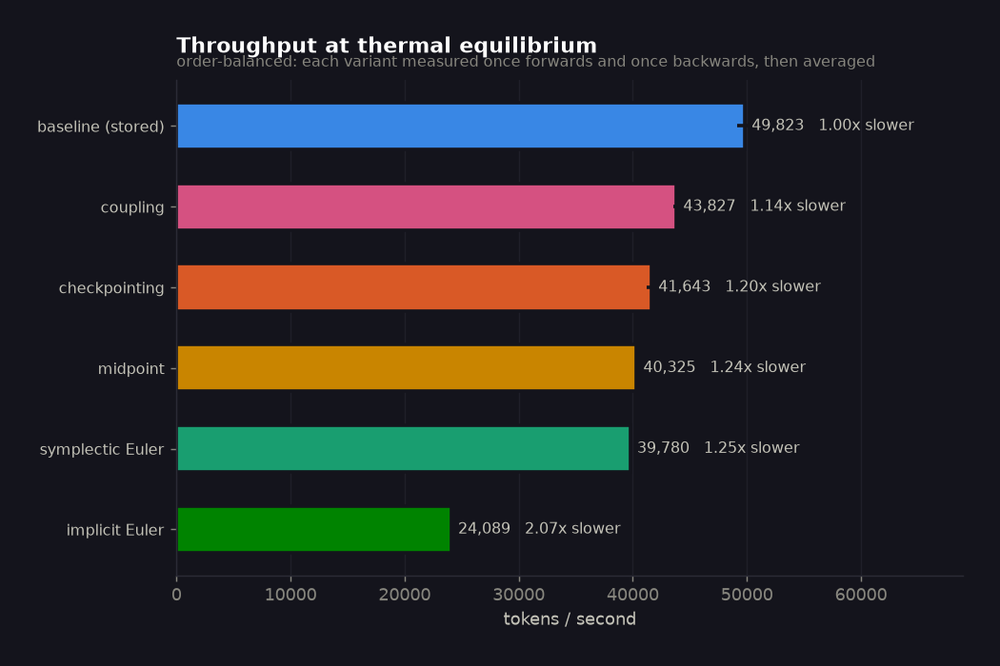
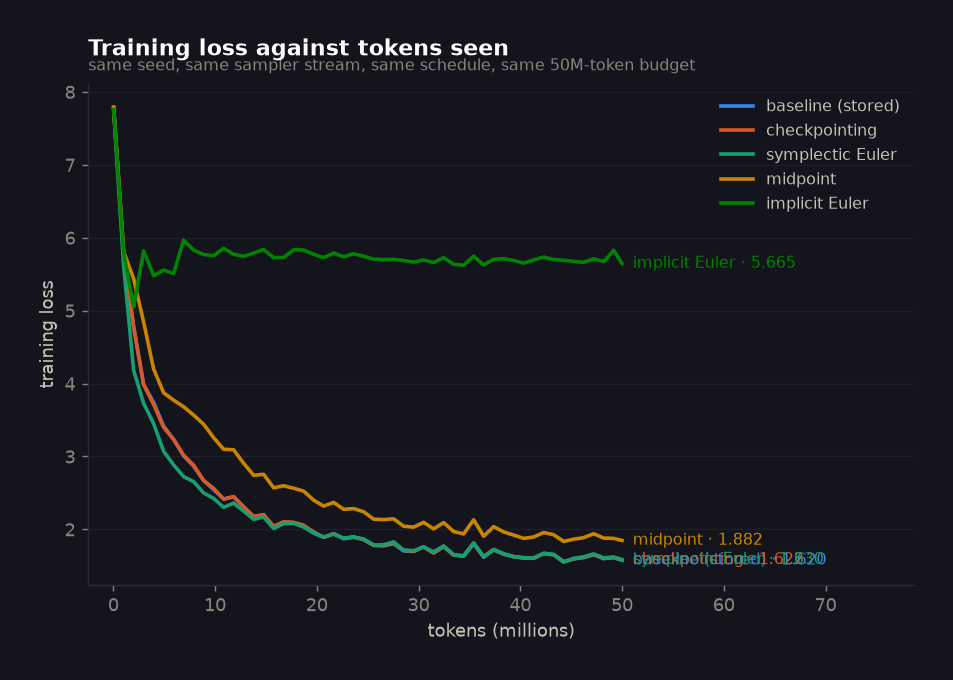
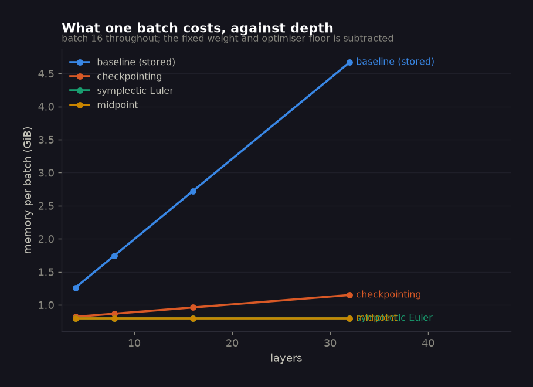
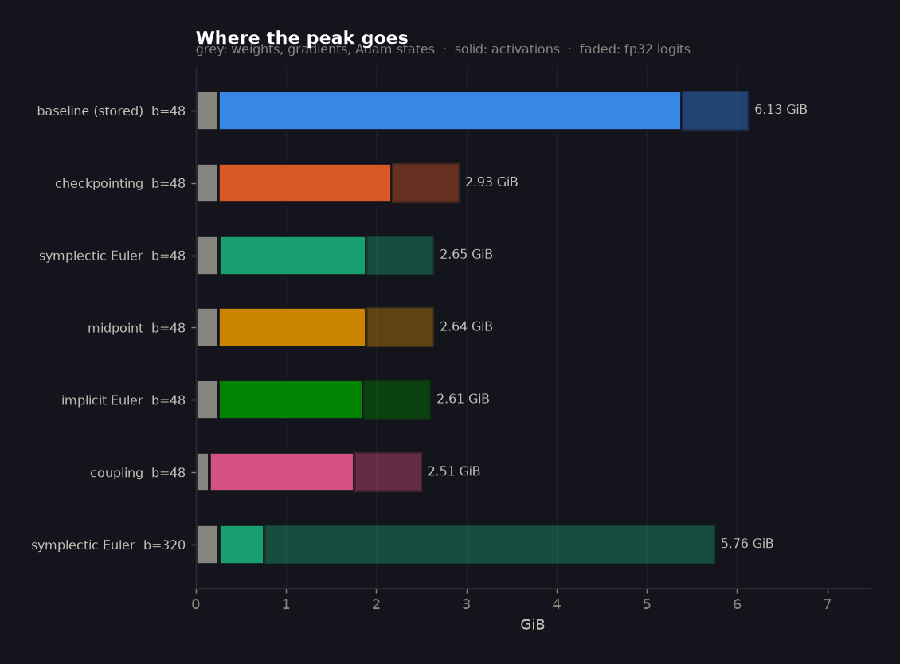
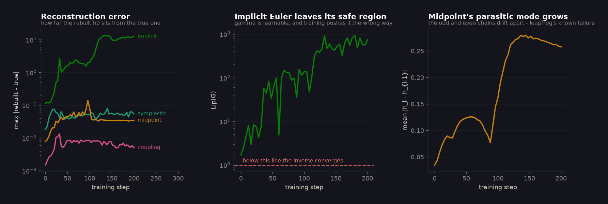
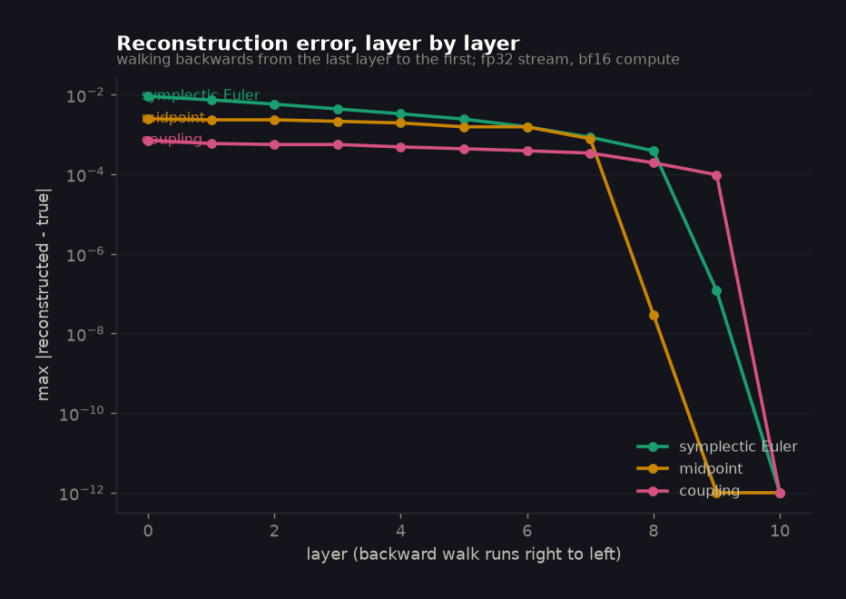
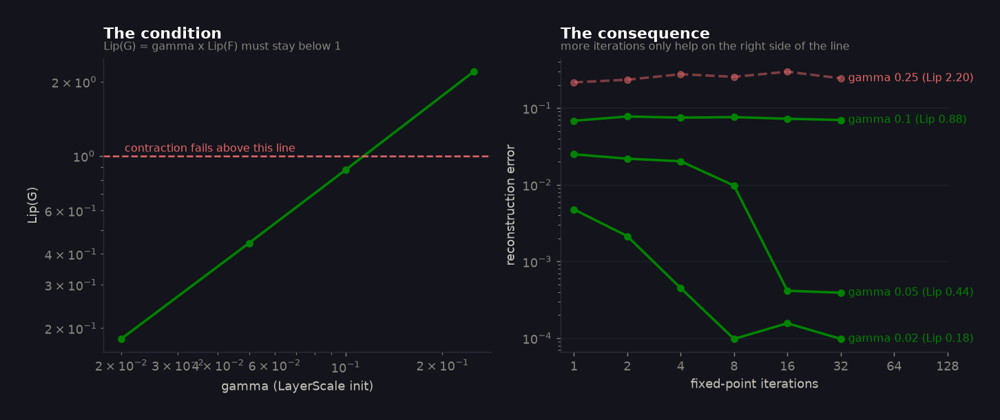
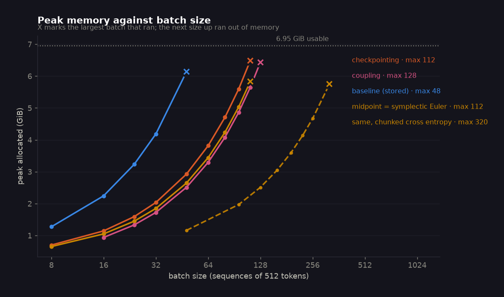
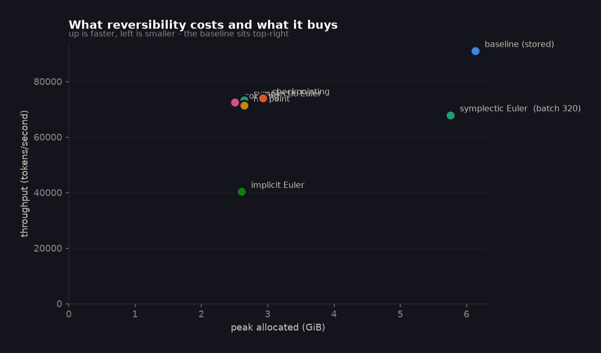

<!-- Generated by tools/build_readme.py from assets/results.json (RUN STAMP 2026-09-25 09:21:06).
     Do not edit by hand: edit the builder and re-run it. -->

<h1 align="center">Reversible LLM Training</h1>

<p align="center"><i>A 21M-parameter GPT trained on 50M tokens eight ways, to find out what a
transformer that throws its<br>activations away actually costs &mdash; and what the slogan
leaves out.</i></p>

<p align="center">
  <a href="https://colab.research.google.com/github/rahulni/Indic_LLM/blob/main/13_Distributed_Model_Pipeline_Parallel/01_reversibility_from_scratch.ipynb"></a>
  <a href="https://nbviewer.org/github/rahulni/Indic_LLM/blob/main/13_Distributed_Model_Pipeline_Parallel/01_reversibility_from_scratch.ipynb"></a>
  
  
  
</p>

## Open it

**[01 &middot; Reversibility from scratch](01_reversibility_from_scratch.ipynb) &middot; [02 &middot; The training runs](02_train_20M_on_50M_tokens.ipynb) &middot; [03 &middot; Results and cost](03_results_and_cost.ipynb)**

Start with notebook 01: it derives all four integrators and **proves the gradients are
exact** before anything trains. Notebook 02 runs the matrix, notebook 03 reads the
artefacts. All three default to a quick mode writing to `assets/quick/`, so opening one can
never overwrite the submitted numbers.

---

## TL;DR

- **Reversibility works, and the gradients are exact.** Three engines (symplectic Euler,
  midpoint, RevNet coupling) reproduce ordinary autograd to **~1e-15** relative error in
  fp64 on every parameter. Asserted in `tests/`, not plotted.
- **Memory stops scaling with depth.** From 4 to 32 layers the baseline's per-batch cost
  grows **3.7&times;**; the reversible stacks grow **1.00&times;**. At the fixed
  batch, 5.88 GiB becomes 2.39 GiB
  (2.5&times; less).
- **The batch you can fit goes from 48 to 112** &mdash; and to **320**
  once the loss head is chunked too, a **6.7&times;** increase on an
  8 GiB card.
- **The price is 25% of throughput**, not the 30&ndash;40% the session quotes:
  49,823 to 39,780 tokens/s.
- **Symplectic Euler beat midpoint**, clearly: **1.6301** against
  **1.8821** at equal tokens, equal batch and equal seed. This
  contradicts the session's recommendation, and the diagnostics say why: midpoint's
  parasitic odd/even mode grows **7.4&times;** during training.
- **The obvious reading of "Euler" fails outright.** Inverting the residual step by fixed
  point needs `Lip(G) < 1`; it starts at 1.71 and training drives it to
  **932**. Reconstruction error explodes from 0.11 to
  14, and the run lands at **5.67** validation loss
  against the baseline's 1.62.
- **Pushing the batch to the maximum made the loss worse, not better**
  (1.630 &rarr; 3.505). At a fixed 50M-token
  budget a 6&times; batch means 6&times; fewer optimiser
  steps, and this model is step-limited, not data-limited.
- **2 of 9 registered predictions held.** The misses are the
  informative part and are all still in the table below.

---

## Contents

1. [Where reversibility sits](#1-where-reversibility-sits)
2. [The four integrators](#2-the-four-integrators)
3. [Proving the gradients first](#3-proving-the-gradients-first)
4. [The runs](#4-the-runs)
5. [Why midpoint lost](#5-why-midpoint-lost)
6. [Why implicit Euler failed](#6-why-implicit-euler-failed)
7. [Pushing the batch, and the moving wall](#7-pushing-the-batch-and-the-moving-wall)
8. [Predictions, scored](#8-predictions-scored)
9. [Three ways this nearly measured the wrong thing](#9-three-ways-this-nearly-measured-the-wrong-thing)
10. [Cost](#10-cost)
11. [Reproducing this](#11-reproducing-this)
12. [Limitations](#12-limitations)

---

## 1. Where reversibility sits

Training memory goes on four things, and only one of them scales with your data:

```text
                                       scales with
  weights                 2 bytes/param      -
  gradients               2 bytes/param      -
  Adam moments + master  12 bytes/param      -
  activations            ~12 tensors/layer   batch x sequence x depth   <- the problem
```

The previous session's **ZeRO** splits the first three across GPUs and explicitly leaves
activations alone. **Tensor, sequence, pipeline and context parallelism** split the
computation, which divides activations across devices &mdash; the total bill is unchanged,
just shared out. **Reversibility deletes the term**, and needs no second GPU to do it.

That is why this sits at the end of a session about model and pipeline parallelism: every
other technique there divides the activation cost, and this one removes it.

---

## 2. The four integrators

A pre-LN transformer block **is** an explicit Euler step on the depth axis:

```text
h_{l+1} = h_l + G_l(h_l)          dh/dl = G(h), step size 1
```

where `G_l` is the residual branch (LN &rarr; attention &rarr; LN &rarr; MLP, times a
learnable scale `gamma_l`). Read depth as time and "make it reversible" becomes a question
about integrators: **which ones run backwards?**

| | forward | inverse | exact? | extra `G`/layer | states kept |
|---|---|---|---|---|---|
| baseline | `h + G(h)` | &mdash; stores everything | &mdash; | 0 | ~12 per layer |
| checkpointing | `h + G(h)` | recompute from a stored input | yes | 1 | 1 per layer |
| **implicit Euler** | `h + G(h)` | `h_l = h_{l+1} - G_l(h_l)`, by fixed point | **only if `Lip(G)<1`** | K+1 | 1 total |
| **symplectic Euler** | `v += G(h); h += v` | `h -= v; v -= G(h)` | yes | 1 | 2 total |
| **midpoint** | `h_{l+1} = h_{l-1} + 2G(h_l)` | `h_{l-1} = h_{l+1} - 2G(h_l)` | yes | 1 | 3 total |
| **coupling** | `y1 = x1+F(x2); y2 = x2+G(y1)` | `x2 = y2-G(y1); x1 = y1-F(x2)` | yes | 1 | 2 total |

The rule underneath: **one state cannot be inverted explicitly, two can.** Whether the
second state is a velocity, the previous layer, or the other half of the channels is a
design choice, not a difference in kind.

---

## 3. Proving the gradients first

A reversible backward pass that is subtly wrong still trains. The loss falls, the samples
improve, and the model converges somewhere slightly wrong. There is no symptom &mdash; so
nothing here was allowed to train until three gates passed.

| gate | what it asserts | result |
|---|---|---|
| **1 &middot; forward** | the baseline and implicit-Euler stacks are the *same function* | **bit-identical** (`== 0.0`, not `allclose`) |
| **2 &middot; gradients** | each engine reproduces autograd on its own recurrence, fp64 | worst relative error **~1e-15**, every parameter |
| **3 &middot; memory** | peak stops growing with depth | 4&rarr;32 layers: baseline 3.7&times;, reversible **1.00&times;** |

Gate 1 makes the comparison controlled: the baseline and implicit-Euler runs share a
forward pass exactly, so any divergence in their loss curves is the backward pass alone.

Gate 2 compares each engine against autograd **on the identical equations**. Comparing
midpoint's gradients to the baseline's &mdash; a different recurrence &mdash; is
meaningless, and is an easy mistake to make.

There is also a free self-check on every step: each backward walk ends on a reconstructed
`h_0` while the true `h_0` was kept, so `model.diag['recon_h0']` reports that step's
end-to-end reconstruction error at no cost. It is what sections 5 and 6 are built on.

---

## 4. The runs

NVIDIA GeForce RTX 3070 Laptop GPU (8.00 GiB), torch 2.11.0+cu128 + CUDA 12.8,
bf16 autocast with flash SDPA, **eager** &mdash; no triton wheel on Windows, so
`torch.compile` is off in every run.

**The model.** 21,057,024 parameters: `d_model=384, n_layer=10, n_head=6, seq=512,
vocab=8192`, tied embeddings, pre-LN, GELU MLP 4&times;. The vocabulary is 8192 rather than
GPT-2's 50257 deliberately &mdash; at 50257 the tied embedding table alone is 19.3M, and a
"20M model" would be a lookup table with a rounding error attached.

**The data.** TinyStories (`TinyStoriesV2-GPT4-train.txt`, first 350 MiB by HTTP range
request), an 8192-token BPE trained on it, packed to uint16:
89,865,082 training tokens, so 50M is **under one epoch** and no run
sees a token twice.

**Held fixed across every run:** the seed, the sampler stream, the schedule shape, the
token budget (not the step count), and **no dropout and no weight decay anywhere** &mdash;
the two restrictions the session names, applied to the baseline too so it is not quietly
given an advantage the reversible runs cannot have.

| run | integrator | batch | val loss | tokens/s | slower | peak GiB | min |
|---|---|---:|---:|---:|---:|---:|---:|
| `A_baseline` | baseline (stores activations) | 48 | **1.6196** | 49,823 | 1.00x | 6.13 | 9.2 |
| `E_checkpoint` | gradient checkpointing | 48 | **1.6219** | 41,643 | 1.20x | 2.93 | 11.3 |
| `B_euler` | symplectic Euler | 48 | **1.6301** | 39,780 | 1.25x | 2.65 | 11.4 |
| `C_midpoint` | midpoint (leapfrog) | 48 | **1.8821** | 40,325 | 1.24x | 2.64 | 11.7 |
| `G_euler_implicit` | implicit Euler | 48 | **5.6652** | 24,089 | 2.07x | 2.61 | 20.7 |
| `F_coupling` *(probe: 5M tokens)* | coupling (RevNet) | 48 | **3.6856** | 43,827 | 1.14x | 2.51 | 1.1 |
| `D_maxbatch` *(lr 2.58e-03, 305 steps)* | symplectic Euler | 320 | **3.5980** | 39,780 | 1.25x | 5.76 | 12.3 |
| `D2_maxbatch_same_lr` *(lr 1.00e-03, 305 steps)* | symplectic Euler | 320 | **3.5055** | 39,780 | 1.25x | 5.76 | 13.0 |

Throughput is measured separately from the runs, at thermal equilibrium and in a balanced
order &mdash; see [section 9](#9-three-ways-this-nearly-measured-the-wrong-thing) for why
the in-run figures could not be used.





**What to look for.** The baseline, checkpointing and symplectic Euler land within 0.7% of
each other (1.6196 / 1.6219 /
1.6301). Midpoint is 16%
behind. Implicit Euler never gets going at all.

### Memory does not grow with depth



The claim, measured. The baseline's per-batch cost rises roughly linearly in depth; the
reversible stacks are flat. Checkpointing sits in between: it keeps one tensor per layer
where reversibility keeps two or three *in total*, so the gap is about `(L-3)` stream
tensors &mdash; thin at `L=4`, decisive at `L=32`. At the ten layers used here,
checkpointing gets 2.67 GiB against reversibility's
2.39, which is a real but unspectacular win.



---

## 5. Why midpoint lost

The session recommends midpoint, and reports it working "much better". Here it did not:
**1.8821 against symplectic Euler's 1.6301** on
identical data, seed, schedule and batch.

It is not a reconstruction failure. Midpoint's rebuilt `h_0` stays close to the truth
throughout &mdash; comparable to symplectic Euler's. The mechanism is the one leapfrog is
known for in numerical analysis: the **parasitic mode**. The even- and odd-indexed states
are coupled only through `G`, so the two chains can drift apart, and over training they do,
by **7.4&times;**:



Nor is it arithmetic. Reconstructed against the true activations layer by layer, midpoint
is the *most* accurate of the three &mdash; the problem is the integrator, not its
floating point:



The standard fix (a Robert&ndash;Asselin filter) damps that mode by mixing neighbouring
states &mdash; which **destroys the exact reversibility that is the entire point**. So the
diagnostic is reported rather than filtered away.

This is one seed on one model size, so it is evidence rather than proof, and it is a
disagreement with the session's own result rather than a refutation of it.

---

## 6. Why implicit Euler failed

The most natural reading of "reversible Euler" is to invert the residual step directly:

```text
h_l = h_{l+1} - G_l(h_l)        <- G evaluated at the UNKNOWN
```

That is implicit, so you iterate `x <- h_{l+1} - G_l(x)`, which converges only while
`Lip(G_l) = gamma_l * Lip(F_l) < 1`. At initialisation this model sits at
**1.71** &mdash; just the wrong side of the line, where the iteration stalls rather
than converging. Shrink `gamma` and it converges; the threshold is sharp:



Then training makes it worse. `gamma` is a **learnable parameter** and nothing in AdamW
knows about the constraint, so the run walks steadily further out of the convergent region:
`Lip(G)` climbs to **932**, above 1 in **51 of
51** samples, and the reconstruction error goes from 0.11 to
**13.5**. The gradients being applied stop being the model's gradients, and the
loss stalls at **5.67**.

Two lessons generalise:

- **The safe region belongs to the model, not the method.** `Lip` scales with width and
  sequence length. At `d=16` it reads about 0.04 and everything looks fine, so a unit test
  on a toy model certifies a method that cannot train at real width. `tests/` runs that
  gate at `d=384` for exactly this reason.
- **Nothing warns you.** The loss curve of a reversible model with wrong gradients looks
  like a merely disappointing run. Monitoring `Lip(G)` and the free `recon_h0` check costs
  almost nothing and is the only way to tell the difference.

---

## 7. Pushing the batch, and the moving wall



Every probe runs in a **fresh subprocess** &mdash; once a CUDA allocation fails the caching
allocator is left fragmented, and a later probe in the same process fails at a size it
would otherwise have handled.

| | largest batch that ran | vs baseline | tokens in flight |
|---|---:|---:|---:|
| baseline | 48 | 1.0&times; | 24,576 |
| checkpointing | 112 | 2.3&times; | 57,344 |
| symplectic Euler / midpoint | 112 | 2.3&times; | 57,344 |
| coupling | 128 | 2.7&times; | 65,536 |
| **reversible + chunked loss** | **320** | **6.7&times;** | **163,840** |

That last row is the interesting one. "Reversible networks don't store activations" is true
and slightly misleading: peak memory is `O(1)` **in depth**, not `O(1)`. Four things
survive, and the last is the one the slogan omits:

```text
  weights + gradients + Adam states    fixed, 0.25 GiB
  boundary states                      2-3 tensors, O(batch x sequence)
  one live layer's graph               O(batch x sequence)   <- backward still needs it
  fp32 logits in the LM head           O(batch x sequence x vocab)
```

At batch 128 the logits alone are `128 x 512 x 8192 x 4 = 2.1 GiB` &mdash; larger than
everything reversibility just saved. Chunking the loss so only one chunk's logits are ever
live moves the ceiling from 112 to **320**, while the baseline stays pinned at
48, because for it the activations were never the smaller problem.

**Reversibility does not remove the memory wall. It moves it into the loss head.**

### And the batch you can fit is not the batch you want

| run | batch | learning rate | optimiser steps | val loss |
|---|---:|---:|---:|---:|
| `B_euler` | 48 | 1.00e-03 | 2,034 | **1.6301** |
| `D_maxbatch` | 320 | 2.58e-03 *(sqrt-scaled)* | 305 | 3.5980 |
| `D2_maxbatch_same_lr` | 320 | 1.00e-03 | 305 | 3.5055 |

Pushing to the largest batch that fits made the loss **substantially worse**. At a fixed
50M-token budget, a 6&times; batch buys 6&times; fewer
optimiser steps, and a 21M model on 50M tokens is step-limited rather than data-limited.
Scaling the learning rate by `sqrt(B_max/B*)` did not rescue it &mdash; it made things
slightly worse still (3.5980 against 3.5055), because
305 steps is too few to anneal a learning rate 2.6&times; larger.

The honest conclusion: **a bigger batch is headroom, not a free improvement.** What
reversibility actually buys is the *option* &mdash; a longer sequence, a deeper model, or a
bigger batch with a token budget raised to match. Spending it on batch alone, at a fixed
budget, is a regression.



---

## 8. Predictions, scored

Registered in `assets/predictions.json` before the runs that settle them, with provenance
recorded per item, and scored here whether they held or not.

| registered prediction | outcome | verdict |
|---|---|---|
| midpoint tokens/s vs the storing baseline<br><sub>predicted: 30-40% slower</sub> | 24% slower | **MISS** |
| implicit-Euler (K=4) tokens/s vs baseline<br><sub>predicted: 2.5-3x slower</sub> | 2.07x slower | **MISS** |
| implicit-Euler final loss vs baseline final loss<br><sub>predicted: within 1%</sub> | +250% from the baseline | **MISS** |
| midpoint final loss vs baseline final loss<br><sub>predicted: unknown sign - registered as genuinely open</sub> | +16.2% vs baseline | open |
| largest reversible batch / largest baseline batch<br><sub>predicted: 3-4x</sub> | 2.3x plain, 6.7x chunked | **MISS** |
| does plain gradient checkpointing beat reversibility on memory at L=10?<br><sub>predicted: likely yes</sub> | reversibility won at every depth measured | **MISS** |
| midpoint final validation loss vs symplectic-Euler final validation loss<br><sub>predicted: midpoint is lower (better), by a small margin</sub> | symplectic 1.6301 beat midpoint 1.8821 | **MISS** |
| implicit-Euler final loss, given its forward is identical to the baseline's<br><sub>predicted: measurably worse than the baseline despite the identical forward</sub> | +250% vs baseline (1.620 to 5.665) | **HIT** |
| what limits the maximum batch once activations are gone<br><sub>predicted: the fp32 logits in the LM head, not the residual stream; chunked cross-entropy should raise the maximum batch by a further 1.5x or more</sub> | chunking moved the ceiling 112 -> 320 (2.86x) | **HIT** |

**2 of 9 held.** Three misses are worth reading:

- **`checkpointing_wins_at_L10`** compared the wrong pair. Checkpointing keeps `L` stream
  tensors and reversibility keeps 3, so the crossover is at `L=3`, not somewhere past 10.
  Contradicted during the build, before any training run.
- **`midpoint_beats_symplectic`** followed the session's own recommendation and lost. See
  [section 5](#5-why-midpoint-lost).
- **`euler_implicit_loss_matches`** reasoned that an identical forward pass implies an
  identical loss. It does, *if the backward pass is right* &mdash; which is the whole
  assumption under test, and it failed.

---

## 9. Three ways this nearly measured the wrong thing

Each of these produced plausible, self-consistent, wrong numbers. They are recorded because
the measurement is most of the work.

**1. The GPU silently paged instead of running out of memory.** The first batch ladder
"fitted" batch 96 of the baseline at a reported peak of **11.98 GiB &mdash; on an 8.00 GiB
card**. On Windows (WDDM) the driver oversubscribes VRAM to host RAM rather than raising an
error, so every maximum it found was a fiction, and the only symptom was throughput
collapsing to 0.16&times;. Fix: cap the allocator at real free VRAM
(`torch.cuda.set_per_process_memory_fraction`) so paging becomes the `OutOfMemoryError` it
should have been, plus a throughput check as a second line of defence.

**2. The GPU throttled, and the run order became the result.** The identical probe measured
104,429 tokens/s early in a session and **51,948 tokens/s an hour later** &mdash; SM clock
1560 MHz against a 2100 MHz maximum. A 2&times; drift is larger than every effect here, and
it is *ordered*, so whichever variant runs first wins on speed. In the contaminated ladder
this produced the nonsense that coupling and midpoint were *faster* than the baseline they
are built on. Clock locking needed privileges this machine would not give, so the fix is
experimental design: warm to equilibrium, then measure every variant once forwards and once
backwards and average (`revlm/bench.py`). Residual spread across the two passes:
**2.8%** at worst.

**3. A finite-difference Lipschitz estimate under bf16 read 50&times; high.** Estimating
`Lip(G)` as `(G(x+eps*v) - G(x))/eps` returned **~80** where the true value is ~1. At
`eps = 1e-3` that subtraction cancels away every significant bf16 digit and the division
turns what remains into a number. It was entirely believable, and it would have condemned a
method that in fact sits right on the contraction boundary &mdash; changing the conclusion
of [section 6](#6-why-implicit-euler-failed) from "conditional, and training breaks the
condition" to "structurally impossible". `contraction_estimate()` uses exact autograd VJPs,
and `tests/` asserts the bf16 and fp32 estimates agree.

A fourth, smaller one: the diagnostics were originally sampled every `steps//20` while the
history was written every `steps//50`. Those coincide only where both divide the step,
which for 2034 steps meant step 0 and nowhere else &mdash; a whole run of "diagnostics"
that was one sample repeated. The trajectories in section 5 and 6 come from dedicated 5M-token
probes (`tools/diagnostics_probe.py`) and are labelled as such.

---

## 10. Cost

Asked during the session: what does reversibility cost on rented hardware?

| integrator | hours per 50M tokens | $ on A100 40GB | $ on A100 80GB | $ on H100 80GB |
|---|---:|---:|---:|---:|
| baseline (stores activations) | 0.28 | $0.36 | $0.50 | $0.83 |
| gradient checkpointing | 0.33 | $0.43 | $0.60 | $1.00 |
| symplectic Euler | 0.35 | $0.45 | $0.62 | $1.04 |
| midpoint (leapfrog) | 0.34 | $0.44 | $0.62 | $1.03 |
| implicit Euler | 0.58 | $0.74 | $1.03 | $1.72 |

September 2026 on-demand list prices (`references.md`); spot and reserved are far lower.
The absolute dollars are not the point &mdash; the **ratio** is, and the ratio is what the
measurement establishes.

The honest framing is not "reversibility costs 25% more". It is that
reversibility lets a given model train on **a smaller card, at a longer sequence, or at a
greater depth than it otherwise could**. Against renting a second GPU purely to hold
activations, 25% on one card is cheap. If you already fit comfortably, it is
simply 25% slower &mdash; which is exactly the session's own experience with a
2B model on an A100.

---

## 11. Reproducing this

```bash
pip install -r requirements.txt
python -m pytest tests/ -q          # the gates - nothing trains until these pass
python -m revlm.ladder              # batch + depth ladders    -> assets/ladder.json
python -m revlm.run_all --quick     # the whole matrix in minutes -> assets/quick/
python -m revlm.run_all             # the submitted numbers    -> assets/results.json
python -m revlm.bench               # throughput at equilibrium -> assets/throughput.json
python tools/diagnostics_probe.py   # the trajectories          -> assets/diagnostics.json
python -m revlm.plots               # every figure
python tools/build_readme.py        # this file (refuses to build from a stale run)
python tools/build_site.py          # site.html, the standalone explainer
```

`--resume` keeps whatever is already in `results.json` and runs only what is missing; the
matrix takes about two hours and a laptop will otherwise sleep through it. Data preparation
is idempotent and resumes a partial download rather than restarting.

---

## 12. Limitations

1. **One seed per run.** The baseline / checkpointing / symplectic-Euler spread is 0.7%,
   which is small enough that seed noise is a live concern. Treat sub-1% gaps as
   unresolved. The midpoint gap (16%) and
   the implicit-Euler failure are far outside that range.
2. **One GPU, one model size.** 21M parameters, 10 layers, 512 tokens, on an
   8 GiB laptop card. Reversibility's advantage *grows* with depth
   and sequence length, so this measures it near its weakest.
3. **Eager mode.** No triton on Windows, so nothing is compiled, and `torch.compile` would
   likely change the variants differently.
4. **Attention is already memory-free here.** Flash SDPA never materialises the `T x T`
   matrix, so what reversibility saves is the *residual stream*, not the attention map. The
   session's 131k-token example is dominated by exactly the term this setup does not pay.
5. **`coupling` is a probe**, at a tenth of the token budget, and is a narrower model at
   equal parameters. Reported as an indication only.
6. **The disagreement with the session on midpoint is one experiment.** Different scale,
   different data, one seed.

---

## What the model writes

Same prompt and sampling settings, after 50M tokens. A loss number is easy to read without
noticing what it means.

**baseline (stores activations)** &mdash; val 1.620

> Lily and Ben are twins. They like to play with their toys and read books. But sometimes they fight over the same toy car. One day, their mom is in the kitchen. She is making lunch and they get to the kitchen. Mom says they have to pack their things. "But it is so cold and I want to go to the fridge.&hellip;

**symplectic Euler** &mdash; val 1.630

> Once upon a time there was a very adventurous little girl. She loved to explore and explore and explore. One day, she went out to explore and saw a beautiful lake. She wanted to go closer and explore. Suddenly she saw something shiny and sparkly. She reached out to touch it, but it was a deep, deep &hellip;

**midpoint (leapfrog)** &mdash; val 1.882

> The two friends were friends who liked to play together. They wanted to find treasure and see one would grow bigger and bigger. One day, they found a big box. The box had a picture of a bird with many other. "Let's open the box," said the box. "Maybe we can find and find out there." "OK," said a lit&hellip;

**implicit Euler** &mdash; val 5.665

> a named a to with the the She Tim it day very saw to to day. there said, the and the bird. the, a was,, It to. it, the, the, the her. big the a. the. . was to Tim. The to and " to. I it to the to a. . the and there, The. Lily to,, named was said Tom Tom. she's she had was the and the the to She a th&hellip;


---

<p align="center"><sub>
Generated from <code>assets/results.json</code> &middot; RUN STAMP 2026-09-25 09:21:06 &middot;
NVIDIA GeForce RTX 3070 Laptop GPU &middot; torch 2.11.0+cu128
</sub></p>
