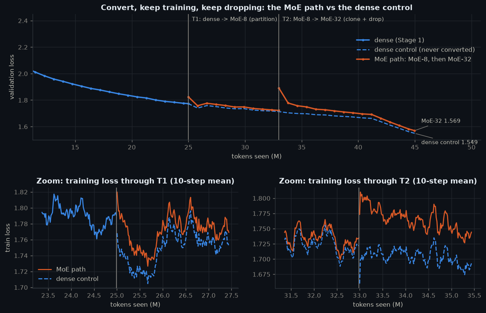

# Dense → Mixture-of-Experts

> **Goal.** Train a dense ("linear") model, convert it into a mixture-of-experts, and show that the converted model keeps training and its loss keeps falling, at a size that fits one laptop or Colab GPU.

A ~19M-parameter transformer is trained on TinyStories, converted into an MoE with 8 experts (partition upcycling), grown to 32 experts (clone + redraw half + Gumbel top-k), and compared against a dense control on identical batches. The notebook doubles as a refresher: every number it relies on is recomputed and asserted, and every mechanism has an exact gate and a lab.

## Results

| | dense (Stage 1) | MoE-8 (Stage 2) | MoE-32 (Stage 3) | dense control |
|---|---|---|---|---|
| total / active params | 18.9M / 18.9M | 26.0M / 18.9M | 68.5M / 19.0M | 18.9M / 18.9M |
| val loss at start of stage | - | 1.8250 (T1, 0 steps) | 1.8919 (T2, 0 steps) | 1.7737 (T1) |
| val loss at end of stage | 1.7737 (T1) | 1.7219 (T2) | **1.5693** (T3) | 1.5491 (T3) |

**MoE-32 minus the dense control at T3** (same batches, same compute per token): +0.0201 nats, 95% CI [+0.0191, +0.0212] over 64 paired validation batches, single seed (negative = MoE better). The MoE path kept training and kept improving after both conversions, as required, but it did **not** beat a dense model given the same tokens; Part K explains where the gap comes from.

**Post-hoc (Part K.2), from the same T2 checkpoint to T3:**

| T3 model | val loss | minus dense control | minus registered MoE-32 |
|---|---|---|---|
| MoE-32, plain-copy growth | 1.5579 | +0.0148 [+0.0135, +0.0160] | -0.0053 [-0.0065, -0.0042] |
| MoE-8, no growth | 1.5463 | +0.0031 [+0.0020, +0.0042] | -0.0170 [-0.0182, -0.0158] |

**Predictions registered before the run:** 8 of 12 held; post-hoc predictions: 3 of 3 held (scored in Part N).

- ✅ Trained a dense ('linear') model: val 4.71 -> 1.774 over 25M tokens
- ✅ Converted it into an MoE (and grew that MoE): 18.9M -> 26.0M -> 68.5M total
- ✅ It continued to train after conversion: MoE-8 1.825 -> 1.722; MoE-32 1.892 -> 1.569
- ✅ The loss dropped below where the dense model was: 1.774 at T1 -> 1.569 at T3
- ✅ Bigger model at the same compute per token: 3.6x the parameters, 1.005x the active parameters
- ✅ Fits a laptop / Colab GPU: peak 5.14 GiB allocated on NVIDIA GeForce RTX 3070 Laptop GPU

_Full run on NVIDIA GeForce RTX 3070 Laptop GPU (bf16, torch 2.11.0+cu128), finished 2026-10-05 17:49._

## Run it

| `MODE` | needs | time |
|---|---|---|
| `learn` | CPU | ~1 min: refresher, toy, gates, replays these results |
| `quick` | GPU | ~5 min: every code path at 1/20 scale, writes `assets-quick/` |
| `full` | GPU | ~30 min on an RTX 3070 Laptop (measured), ~1 h on a Colab T4 (estimate) |

The notebook is generated: edit `nb_parts/*.py`, then `python nb_source.py`.
