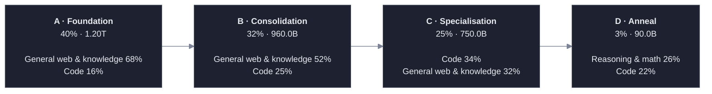

# Drishtikon-40B — V5 Mixture & Curriculum Specification

    

**Budget:** 3.00T pretraining tokens · 40.0B dense parameters · ~75 tokens/param. The budget is a **parameter**, not an assumption — §3.1 audits the same mixture across 2.4T / 3T / 4T / 14T and reports which survive. 3.00T is the midpoint of the range session 5 named.

> An interactive view of this document — searchable, cross-linked, with the figures drawn from the same audit data — is generated alongside it as [`site.html`](site.html) by [`plan/build_site.py`](plan/build_site.py).

<details open>
<summary><b>Contents</b></summary>

- [1. The claim](#1-the-claim)
- [2. Data-gating status](#2-data-gating-status)
- [3. Budget and phase schedule](#3-budget-and-phase-schedule)
  - [3.1 Budget sweep](#31-budget-sweep)
- [4. The mixture](#4-the-mixture)
- [5. Supply audit](#5-supply-audit)
  - [5.1 Everything is converted to one tokenizer first](#51-everything-is-converted-to-one-tokenizer-first)
  - [5.2 The selector doubles the requirement](#52-the-selector-doubles-the-requirement)
  - [5.3 Supply against demand](#53-supply-against-demand)
  - [5.4 Repetition is not free below the cap](#54-repetition-is-not-free-below-the-cap)
- [6. Manufacturing plan](#6-manufacturing-plan)
- [7. The Indic slot, split four ways](#7-the-indic-slot-split-four-ways)
- [8. Agentic, reasoning, long-context — named against the inventory](#8-agentic-reasoning-long-context-named-against-the-inventory)
  - [Agentic / tool-use — 2.00% (90.0B)](#agentic-tool-use-200-900b)
  - [Reasoning & math — 7.47% (418.2B)](#reasoning-math-747-4182b)
  - [Long-context native — 2.85% (126.0B)](#long-context-native-285-1260b)
- [9. Protected always-on floor](#9-protected-always-on-floor)
- [10. The anneal reserve and schedule mechanics](#10-the-anneal-reserve-and-schedule-mechanics)
  - [10.1 Can the reserve actually be stocked?](#101-can-the-reserve-actually-be-stocked)
  - [10.2 Learning-rate schedule](#102-learning-rate-schedule)
  - [10.3 Sequence-length ladder](#103-sequence-length-ladder)
  - [10.4 Band transitions](#104-band-transitions)
- [11. Difficulty and reasoning-length bands](#11-difficulty-and-reasoning-length-bands)
  - [11.1 Difficulty bands](#111-difficulty-bands)
  - [11.2 Reasoning-length bands](#112-reasoning-length-bands)
- [12. Loss-masking policy](#12-loss-masking-policy)
- [13. The proxy experiment](#13-the-proxy-experiment)
  - [13.1 The corpus is scaled, not just the model](#131-the-corpus-is-scaled-not-just-the-model)
  - [13.2 Arms](#132-arms)
  - [13.3 Metrics](#133-metrics)
  - [13.4 Pre-registered decision rules](#134-pre-registered-decision-rules)
  - [13.5 Decontamination](#135-decontamination)
  - [13.6 The first run of this measurement was wrong](#136-the-first-run-of-this-measurement-was-wrong)
  - [13.7 The micro-proxy: what was actually run](#137-the-micro-proxy-what-was-actually-run)
- [14. Sensitivity](#14-sensitivity)
- [15. Where this plan is weakest](#15-where-this-plan-is-weakest)
- [16. Where the cleaning goes next](#16-where-the-cleaning-goes-next)
  - [16.1 The quality filter has a length bias, and it costs 10% of the only anneal-eligible Indic tier](#161-the-quality-filter-has-a-length-bias-and-it-costs-10-of-the-only-anneal-eligible-indic-tier)
- [17. Provenance of every supply figure](#17-provenance-of-every-supply-figure)

</details>

Every number below is generated by [`plan/spec.py`](plan/spec.py) → [`plan/audit.py`](plan/audit.py) → [`plan/build_plan.py`](plan/build_plan.py). Nothing is hand-typed. The build refuses to emit this document if any invariant fails — phase weights that do not sum to 1, lane shares that do not sum to 100, a floor above its own lane's share, an Indic tier split that does not close, or a lane that needs manufactured tokens without a costed manufacturing plan.

## 1. The claim

Three findings drive every number in this plan, and all three are arithmetic rather than preference.

**One: the online selector doubles every supply requirement, and that is what settles the budget question.** With a 50% keep-fraction, discarded batches are thrown away and never re-offered, so the corpus must supply **candidate** tokens, not trained tokens. Lanes protected by the always-on floor bypass selection and are consumed 1:1; everything else is drawn at 2×. Applied honestly (§5.2), this is decisive: the mixture is comfortable across the 2.4–4T range the session named, and **infeasible at the 14T of session 3's design memo — where the *web* lane itself runs dry** (§3.1). Not the agentic lane, not Indic. The most abundant data on earth.

**Two: the specialist lanes still cannot be filled by finding data.** Even at 3.00T, giving the agentic lane 2.00% would take **23 epochs** of every agentic trajectory ever published — Nemotron-SWE, SWE-smith, SWE-Gym, ToolBench, AgentInstruct, xLAM and Glaive together are 4.0B of usable tokens against 90.0B of candidate demand. The lane is 82.4% manufactured and §6 prices it. Any plan assigning agentic a double-digit share without a rollout harness behind it is describing data that does not exist.

**Three: at this budget the Indic lane runs on verified text alone.** This reverses the previous draft. Sizing Indic at 5.03% of 3.00T means 211.8B of candidate demand, which Sangraha Verified covers at **88.9% of the lane** — leaving the entire 178.6B machine-translated tier **unused** and requiring **zero synthetic Indic**. Session 3's 20% share remains withdrawn, but the reason has changed: not that Indic data is unobtainable, but that at a defensible budget we can afford to be choosy about which tier we take (§7).

The plan is a hypothesis. §13 specifies 7 arms at 1B and a 3B confirmation, with pre-registered decision rules, for $6,320 — **0.417% of the $1,516,684 full run**. That screen has **not** been run; it needs GPUs we do not have.

What *has* been run is a much narrower experiment on the hardware available — an 11M-parameter byte-level model on the two corpora we actually hold, testing only the two claims here that are training-dynamics claims rather than capability claims (§13.7). It returns verdicts on both: **INCONCLUSIVE, leaning DROP - no stability benefit detectable at this scale, and the pre-registered metric was underpowered** and **INCONCLUSIVE - the -0.0143 bpb delta is within seed noise (0.0174); this experiment cannot separate them**. Two other measurements in this document are also real rather than asserted: the data gate (§2) and benchmark contamination (§13.5). Everything else is arithmetic over published supply figures, and is labelled as such.

## 2. Data-gating status

**93,019,466 cleaned tokens** across 30,032 documents, from 112,010,145 raw. Each corpus is deterministic across two runs in separate interpreters with different `PYTHONHASHSEED`. Source: `4_model_data/assignment/results.json (session 4) + 5_data_mixture_curriculum/cleaning/results_verified.json (session 5)`.

Session 4 stood at 53,781,200. This session added **39,238,266** by cleaning the tier §16 ranks first — a **1.73×** cumulative gate, and the added tokens are the only ones in this table the anneal will accept.

| Corpus | Session | Lane | Tier | Raw tokens | Raw docs | Docs surviving | Note |
|---|---:|---|---|---:|---:|---:|---|
| Sangraha unverified / Telugu | 4 | `indic` | unverified | 50,002,626 | 11,607 | 10,632 | Cleaned the tier this plan gives the SMALLEST weight to and bars from the anneal. |
| Reasoning / SFT distillation mix (4 sources) | 4 | `reasoning` | — | 12,006,709 | 9,553 | 7,846 | 3 of 4 sources failed the license gate (one undeclared, two AGPL-3.0). |
| Sangraha VERIFIED / Telugu | 5 | `indic` | verified | 50,000,810 | 14,596 | 11,554 | The priority-1 target from section 16, now actually cleaned. Training slice starts at row 300 of verified/tel because rows 0-299 are session 4's frozen held-out Golden Proxy; disjointness is asserted, not assumed. Adds 39.2M cleaned tokens in the only tier the anneal accepts. |

**The audit redirected this effort, and the redirection has been carried out.** Session 4 cleaned Sangraha *unverified*. At 3.00T that tier supplies only 11.1% of the Indic lane, leaves 34.9B of itself unused, and is barred from the anneal outright — while Sangraha *Verified* carries 88.9% of the lane and is the only tier the cooldown will accept. So the priority-1 job in §16 was run rather than just written down, and the row above is its output. What it turned up along the way — a length bias in the quality filter that silently discards ~10% of that tier — is in §16.1.

The reasoning corpus remains in a lane that is 35% manufactured with three of its four sources failing the licence gate; that is priority 2 and has not been done.

## 3. Budget and phase schedule

| Phase | Share | Tokens | Purpose |
|---|---:|---:|---|
| **A · Foundation** | 40% | 1.20T | Breadth. Model cannot yet use premium data, so premium data is not spent on it. |
| **B · Consolidation** | 32% | 960.0B | Code and reasoning ramp; long-context packing begins. |
| **C · Specialisation** | 25% | 750.0B | Scarce lanes concentrate; sequence length reaches 128k. |
| **D · Anneal** | 3% | 90.0B | The reserve. Verified tiers only, highest difficulty, highest reasoning bands. |



Scarce lanes are held small early and concentrated late: agentic runs 0.5% of Phase A and 16% of the anneal. The model cannot use premium data before it can use it, so premium data is not spent on it.

### 3.1 Budget sweep

Session 3's design memo locked 14T for a 40B dense model. Session 5, asked the question directly, answered *"between 2.4 to 4 trillion tokens"* for what V5 actually trains on. Those are different numbers for different things, so the budget is a **parameter** and the same mixture is audited across the whole range. A scenario that fails is not a broken build — it is the finding.

| Budget | Feasible | `GENERATE` lanes | At epoch ceiling | Manufacturing | Run cost | Run time | Worst lane |
|---:|---|---:|---:|---:|---:|---:|---|
| **2.40T** | ✅ | 2 | 0 | $13,100 | $1,213,347 | 4.1 d | agentic @ 78% |
| **3.00T** ⭐ | ✅ | 2 | 0 | $28,105 | $1,516,684 | 5.1 d | agentic @ 82% |
| **4.00T** | ✅ | 3 | 1 | $53,136 | $2,022,245 | 6.9 d | agentic @ 87% |
| **14.00T** | ❌ | — | — | — | — | — | *build refused* |

- **2.40T** — low end of the range named in session 5
- **3.00T** — PRIMARY - midpoint of the session-5 range
- **4.00T** — high end of the range named in session 5
- **14.00T** — session-3 design memo for a 40B dense model

> [!CAUTION]
> **Why 14.00T fails.** The build refuses it, and the invariant that fires is not the one anyone would predict:

> `lane web needs 6.478e+11 manufactured tokens but has no entry in MANUFACTURING - the plan would be wishing`

Not agentic. Not Indic. **Web.** At 14T the web lane needs more high-quality English tokens than exist, once its counts are converted to our tokenizer (§5.1) and doubled for the selector's discard rate (§5.2). There is no manufacturing plan for general web because manufacturing general web is not a coherent thing to do — synthetic web is just the model's own prior fed back to it. The 14T figure was sound for a corpus-unconstrained thought experiment and does not survive contact with the actual inventory.

Everything below is computed at **3.00T**, the midpoint of the range the session named. Re-run any scenario with `python -c "import audit,json; print(audit.run(4e12)['audited'])"`.

## 4. The mixture

Per-phase shares are the specification. **The whole-run share is derived as their token-weighted average — it is an output of the curriculum, not an independent input.** This is deliberate: it makes it impossible to declare a whole-run number the phase schedule does not actually deliver.

| Lane | A | B | C | D | **Whole-run** | Tokens | Loss-bearing | Benchmarks it must win |
|---|---:|---:|---:|---:|---:|---:|---|---|
| General web & knowledge | 68.0 | 52.0 | 32.0 | 13.0 | **52.23%** | 1.57T | 1.57T (100%) | MMLU-Pro (>=85.2, Gemma-4-31B parity); GPQA (>=84.3); SimpleQA |
| Code | 16.0 | 25.0 | 34.0 | 22.0 | **23.56%** | 706.8B | 706.8B (100%) | LiveCodeBench (>=80.0); SWE-bench Verified; HumanEval+/MBPP+ |
| Reasoning & math | 3.0 | 7.0 | 13.0 | 26.0 | **7.47%** | 224.1B | 190.5B (85%) | AIME 2026 (>=89.2); GPQA; FrontierMath |
| Indic (22 languages) | 4.0 | 5.0 | 6.0 | 11.0 | **5.03%** | 150.9B | 150.9B (100%) | MILU (>=75, beats GPT-4o's real 72); IndicGenBench; FLORES-200 (never averaged) |
| World multilingual | 5.0 | 4.0 | 2.0 | 0.0 | **3.78%** | 113.4B | 113.4B (100%) | FLORES-200 non-Indic; MGSM |
| Long-context native | 1.0 | 3.0 | 5.0 | 8.0 | **2.85%** | 85.5B | 85.5B (100%) | RULER @32k/128k; LongBench-v2; HELMET |
| India civic & legal | 1.5 | 2.0 | 3.0 | 4.0 | **2.11%** | 63.3B | 63.3B (100%) | MILU Law/Governance and Arts/Humanities sub-scores; Drishtikon-Bench (session-3 novel) |
| Agentic / tool-use | 0.5 | 1.0 | 4.0 | 16.0 | **2.00%** | 60.0B | 18.0B (30%) | tau-bench; BFCL v4; Terminal-Bench |
| Parallel / cross-lingual | 1.0 | 1.0 | 1.0 | 0.0 | **0.97%** | 29.1B | 29.1B (100%) | FLORES-200 en<->xx chrF++; IN22-Gen |
| **Total** | 100.0 | 100.0 | 100.0 | 100.0 | **100.00%** | 3.00T | | |

**On the loss-bearing column.** The budget is denominated in raw tokens because we pay compute for every token in the context window. But the agentic lane carries loss on only 30% of its tokens — the issue body, the user turn, the 4,000-line stack trace a tool returns are all read and none are trained on (§12). 2.00% of budget buys 18.0B of actual supervision. Reporting only the raw share would overstate this lane by more than 3×.

## 5. Supply audit

### 5.1 Everything is converted to one tokenizer first

An earlier draft of this document added FineWeb-Edu's GPT-2 tokens to DCLM's GPT-NeoX tokens to The Stack v2's StarCoder2 tokens to Sangraha's Indic-sentencepiece tokens, and then claimed a separate 1.33× credit for our Indic-efficient tokenizer on top. That is two errors compounding: the sum was not in any single unit, and the efficiency gain was counted twice. An epoch count is only meaningful when supply and demand share units, and the 14T budget is denominated in **our** tokens.

Words are the invariant. Each published count is divided by its own tokenizer's fertility to recover words, then multiplied by ours exactly once. The two measured rows come from our own session-4 pipeline.

| Tokenizer | Content | Tokens/word | Used | Provenance |
|---|---|---:|---|---|
| **`ours`** | english_prose | **1.300** | ✅ | DERIVED (o200k-parity claim in BrahmicTokenizer-131K, conservatively rounded) |
| **`ours`** | code | **2.200** | ✅ | ESTIMATED — standard fertility for this tokenizer class |
| **`ours`** | indic | **1.683** | ✅ | DERIVED (MuRIL's measured 2.296 x BrahmicTokenizer-131K's reported 26.7% reduction) |
| **`ours`** | multilingual | **1.450** | ✅ | ESTIMATED — standard fertility for this tokenizer class |
| **`ours`** | math_prose | **1.450** | ✅ | ESTIMATED — standard fertility for this tokenizer class |
| `cl100k` | english_prose | 1.563 | — | MEASURED (session 4, reasoning_sft: 1.563 tok/word over 4,867,426 words) |
| `cl100k` | indic | 13.268 | — | MEASURED (session 4, telugu_web: 13.268 tok/word over 3,480,047 words) |
| `cl100k` | code | 2.600 | ✅ | ESTIMATED — standard fertility for this tokenizer class |
| `cl100k` | multilingual | 2.400 | — | ESTIMATED — reference only, not used |
| `cl100k` | math_prose | 1.700 | — | ESTIMATED — reference only, not used |
| `muril` | indic | 2.296 | — | MEASURED (session 4, telugu_web: 2.296 tok/word, 5.78x better than cl100k) |
| `gpt2` | english_prose | 1.600 | ✅ | ESTIMATED — standard fertility for this tokenizer class |
| `gpt2` | code | 2.800 | — | ESTIMATED — reference only, not used |
| `gpt2` | math_prose | 1.750 | — | ESTIMATED — reference only, not used |
| `neox` | english_prose | 1.550 | ✅ | ESTIMATED — standard fertility for this tokenizer class |
| `neox` | code | 2.550 | — | ESTIMATED — reference only, not used |
| `neox` | math_prose | 1.700 | ✅ | ESTIMATED — standard fertility for this tokenizer class |
| `neox` | multilingual | 2.100 | — | ESTIMATED — reference only, not used |
| `neox` | indic | 7.500 | — | ESTIMATED — reference only, not used |
| `starcoder2` | code | 2.400 | ✅ | ESTIMATED — standard fertility for this tokenizer class |
| `starcoder2` | english_prose | 1.580 | — | ESTIMATED — reference only, not used |
| `indic_sp` | indic | 2.300 | ✅ | ESTIMATED - the single most load-bearing assumption in the conversion; see the sensitivity note in the plan |

The `cl100k` and `muril` rows are the empirical spine of this table: they are the same Telugu corpus measured twice by our own pipeline, and the 5.78× gap between them is why a token count means nothing without its tokenizer.

| Lane | Published (source units) | In our units | Factor |
|---|---:|---:|---|
| General web & knowledge | 11.60T | 9.69T | ×0.836 |
| Code | 908.0B | 833.0B | ×0.917 |
| Reasoning & math | 93.0B | 80.1B | ×0.861 |
| Indic (22 languages) | 272.2B | 199.2B | ×0.732 |
| World multilingual | 1.20T | 1.20T | ×1.000 |
| Long-context native | 142.0B | 133.6B | ×0.941 |
| India civic & legal | 42.0B | 42.0B | ×1.000 |
| Agentic / tool-use | 4.7B | 4.7B | ×0.997 |
| Parallel / cross-lingual | 22.4B | 22.4B | ×1.000 |

**This changed verdicts, not just decimals.** Every factor in the right column is below 1.0 for the lanes whose counts came from coarser tokenizers, so the conversion *shrinks* real supply across the board — Indic hardest, at ×0.732. When this plan was still written against a 14T budget the conversion moved web from `SUPPLY-OK` to `REPEAT` and pushed code onto its epoch cap. It is the direction an accounting fix should move a plan that was previously double-counting in its own favour, and it is a large part of why 14T does not survive §3.1.

> [!IMPORTANT]
> **The load-bearing assumption.** Sangraha publishes a token count without naming its tokenizer. We assume an Indic sentencepiece at 2.30 tok/word. If those 251.3B tokens were instead counted with a cl100k-class tokenizer — which our own measurement puts at 13.268 tok/word on Telugu, 5.78× worse than MuRIL — the real Indic supply would be roughly 0.17× what is assumed here and the Indic lane would be almost entirely manufactured. Confirming Sangraha's tokenizer is the single cheapest risk-reduction available to this plan.

### 5.2 The selector doubles the requirement

An earlier draft used `keep_fraction` only in prose. It belongs in the arithmetic. The selector retains 50% of 1,024 candidates per refresh and **discards the rest permanently** — session 5 is explicit that a rejected batch is thrown away rather than re-offered, and that "if you collect one token actually only half will be trained on". So the corpus must cover *candidate* tokens.

The multiplier is per-lane, not global. Data admitted under the protected floor bypasses the selector and is consumed 1:1; everything above the floor is drawn at 1/keep_fraction. A lane that is mostly floor barely notices — which is a second, previously unstated benefit of the floor.

| Lane | Whole-run share | Floor (bypasses selector) | Multiplier | Trained tokens | **Candidate tokens** |
|---|---:|---:|---|---:|---:|
| General web & knowledge | 52.23% | 0.00% | ×2.000 | 1.57T | **3.13T** |
| Code | 23.56% | 0.00% | ×2.000 | 706.8B | **1.41T** |
| Reasoning & math | 7.47% | 1.00% | ×1.866 | 224.1B | **418.2B** |
| Indic (22 languages) | 5.03% | 3.00% | ×1.404 | 150.9B | **211.8B** |
| World multilingual | 3.78% | 0.00% | ×2.000 | 113.4B | **226.8B** |
| Long-context native | 2.85% | 1.50% | ×1.474 | 85.5B | **126.0B** |
| India civic & legal | 2.11% | 0.50% | ×1.763 | 63.3B | **111.6B** |
| Agentic / tool-use | 2.00% | 1.00% | ×1.500 | 60.0B | **90.0B** |
| Parallel / cross-lingual | 0.97% | 0.00% | ×2.000 | 29.1B | **58.2B** |
| **Total** | 100.00% | 7.00% | **×1.930** | 3.00T | **5.79T** |

The plan trains 3.00T and must therefore hold 5.79T of cleaned, licensed, deduplicated corpus. Every epoch count in §5.3 is against the candidate column. Auditing against the trained column — which the previous draft did — understated every lane by up to 2×.

Against this cost, the selector's claimed benefit is 8x (the OPUS paper's claim, quoted in session 5: the loss reached at 20B tokens would otherwise have taken 160B). If that holds even partially it is worth paying 2× corpus for; if it does not, the honest move is to drop the selector and train on everything. That is not tested by the proxy in §13 and should be.

### 5.3 Supply against demand

Usable supply = converted tokens × cross-corpus dedup survival. Capped supply = usable × the per-source epoch cap. The 4.0-epoch default ceiling is from Muennighoff et al., *Scaling Data-Constrained Language Models* (NeurIPS 2023): repetition up to ~4 epochs is near-equivalent to fresh data, and decays sharply after.

| Lane | Demand | Usable supply | Epochs needed | Filled from real data<br>(incl. repeats) | Manufactured | Verdict |
|---|---:|---:|---:|---:|---|---|
| General web & knowledge | 3.13T | 6.30T | **0.50** | 3.13T | 0 (0.0%) | `SUPPLY-OK` |
| Code | 1.41T | 832.2B | **1.70** | 1.41T | 0 (0.0%) | `REPEAT` |
| Reasoning & math | 418.2B | 68.4B | **6.11** | 273.7B | 144.5B (34.6%) | `GENERATE` |
| Indic (22 languages) | 211.8B | 191.5B | **1.11** | 211.8B | 0 (0.0%) | `REPEAT` |
| World multilingual | 226.8B | 840.0B | **0.27** | 226.8B | 0 (0.0%) | `SUPPLY-OK` |
| Long-context native | 126.0B | 127.6B | **0.99** | 126.0B | 0 (0.0%) | `SUPPLY-OK` |
| India civic & legal | 111.6B | 38.4B | **2.91** | 111.6B | 0 (0.0%) | `REPEAT` |
| Agentic / tool-use | 90.0B | 4.0B | **22.73** | 15.8B | 74.2B (82.4%) | `GENERATE` |
| Parallel / cross-lingual | 58.2B | 18.2B | **3.20** | 58.2B | 0 (0.0%) | `REPEAT` |

- `SUPPLY-OK` — fits inside one pass of real data
- `REPEAT` — reachable only by repeating data, within the 4-epoch ceiling
- `GENERATE` — cannot be reached from existing data at any tolerable epoch count

### 5.4 Repetition is not free below the cap

An earlier draft treated everything under 4 epochs as equivalent to fresh data. That is the paper's headline, not its result. Muennighoff et al., Scaling Data-Constrained Language Models, NeurIPS 2023 (arXiv:2305.16264), eq. 6 fits a smooth decay:

```
D' = U + U · R* · (1 − exp(−R / R*)),    R = epochs − 1,    R* = 15.387
```

At the 4.0 cap this yields **3.726 effective epochs, not 4.0** — the fourth pass is worth about a quarter of a fresh one. Physical feasibility is unchanged; what changes is the value delivered, so it is reported as its own column rather than folded into the verdict.

| Lane | Epochs run on real data | Effective yield | Tokens found | Effective tokens | Value lost to repetition |
|---|---:|---|---:|---:|---:|
| General web & knowledge | 0.50 | ×0.50 | 3.13T | 3.13T | 0 |
| Code | 1.70 | ×1.68 | 1.41T | 1.40T | 13.0B |
| Reasoning & math | 4.00 | ×3.73 | 273.7B | 399.4B | 0 |
| Indic (22 languages) | 1.11 | ×1.11 | 211.8B | 211.7B | 69.4M |
| World multilingual | 0.27 | ×0.27 | 226.8B | 226.8B | 0 |
| Long-context native | 0.99 | ×0.99 | 126.0B | 126.0B | 0 |
| India civic & legal | 2.91 | ×2.79 | 111.6B | 107.2B | 4.4B |
| Agentic / tool-use | 4.00 | ×3.73 | 15.8B | 88.9B | 0 |
| Parallel / cross-lingual | 3.20 | ×3.05 | 58.2B | 55.5B | 2.7B |
| **Total** | | | | | **20.2B** |

20.2B of nominal budget buys nothing. That is 0.67% of the run — small enough not to change a lane decision, large enough that claiming otherwise would be a free lie. Manufactured tokens carry no discount because they are fresh by construction.

*Caveat, since this number is now load-bearing:* R_D* is quoted from the paper's fitted parameters. Corroborated by the paper's own prose gloss that R* is roughly the half-life of epochs, with repeated tokens retaining value out to ~15 repetitions. Worth re-checking against the published table before this number is used to justify raising any epoch cap.

Two entries deserve the reviewer's pressure before anything else:

- **Code at 23.56% is not a preference, it is a ceiling.** 1.70 epochs of The Stack v2 sits just under the 4.0 cap. We would take more code; the corpus does not exist. Arm A3 (§13) deliberately violates this ceiling so the constraint is falsifiable rather than assumed.
- **Reasoning is 35% manufactured.** Stated plainly rather than buried: arXiv, FineMath, OpenWebMath, AlgebraicStack, OpenThoughts2 and OpenR1 together supply 68.4B usable, and four epochs of that is 273.7B against 418.2B of demand. Synthesis is the established state of the art here (phi-4, Cosmopedia), it is cheap, and §6 prices it — but the reviewer should know it is 70% of the lane.

## 6. Manufacturing plan

Every shortfall from §5 is costed. `GENERATE` means the tokens do not exist and must be produced by inference (and, for agentic, by executing a real environment). `COLLECT` means they exist in the world but sit in no corpus — the cost is crawling, OCR and licensing, not GPU time.

| Lane | Need | Units | Kind | GPU-h | Cost | Wall-clock | Method |
|---|---|---:|---|---:|---:|---:|---|
| Reasoning & math | 144.5B (35%) | 72,262,000 | `GENERATE` | 8,118 | $24,355 | 0.66 d | Synthetic textbooks and graded exercise sets (Cosmopedia / phi-4 method) plus long-CoT distillation at the four length bands, every item gated on a checkable final answer. |
| Agentic / tool-use | 74.2B (82%) | 2,966,484 | `GENERATE` | 1,250 | $3,749 | 0.21 d | Verifier-gated rollouts in a live harness: real container, real shell, real test suite. Only trajectories whose verifier returns green are kept. |
| **Total** | | | | | **$28,105** | | 1.9% of the full-run cost |

Risks and fallbacks, because a manufacturing plan with no failure branch is the same wishful accounting in a different costume:

- **Reasoning & math** — *Risk:* Synthetic math inherits the generator's error modes. Mitigated by answer-checking every item and discarding the trace when the final answer is wrong. *Fallback:* If verified yield falls below 60%, cut the lane to 5.0% and raise web; a smaller honest reasoning lane beats a large unverified one.
- **Agentic / tool-use** — *Risk:* This is the single largest infrastructure commitment in the plan and the thing V4 did not have. If the harness lands late, the agentic lane cannot be filled by any amount of scraping. *Fallback:* If the harness delivers under 50% of planned rollouts, agentic drops to its 1.00% floor and the freed share goes to code, which has repetition headroom.

The agentic number is the one to interrogate: **2,966,484 verifier-green trajectories**. At 60 s of environment time each across 10,000 parallel containers that is 0.21 days of wall-clock and $3,749 of inference. The cost is not the obstacle — the harness is. Session 5 was explicit that V4 never built one, and without a live terminal there is no agentic lane at any price.

## 7. The Indic slot, split four ways

Lane total **211.8B** (5.03% of budget). Tier sizes are the same supply arithmetic as every other lane: each real tier is its published token count at its own epoch cap, and the synthetic tier is the **residual** — what is left once real supply is exhausted. That is the only honest way to size a tier that does not yet exist.

| Tier | Share of lane | Tokens used | Available at cap | **Unused** | Source | Published | Epoch cap | Anneal-eligible |
|---|---:|---:|---:|---:|---|---:|---:|---|
| **verified** | 88.9% | 188.2B | 188.2B | **0** | Sangraha Verified (22 langs) | 64.3B | 4.0× | yes |
| **unverified** | 11.1% | 23.6B | 58.5B | **34.9B** | Sangraha Unverified (14 langs) | 24.3B | 2.0× | no |
|  | | | |  | IndicCorp v2 | 20.9B | 3.0× | no |
| **translated** | 0.0% | 0 | 178.6B | **178.6B** | Sangraha Synthetic (MT + romanised, 14 langs) | 162.7B | 1.5× | no |
| **synthetic** | 0.0% | 0 | 0 | **0** | *manufactured — does not exist yet* | — | — | no |

**The `Unused` column is the argument.** 213.5B of real, downloadable Indic tokens are **available and deliberately declined** — unverified (34.9B), translated (178.6B). This is not a supply failure; it is a quality choice the budget can afford. A reviewer should push on it in the opposite direction to the usual one: not *why is this lane so small*, but *why leave that much real data on the floor*. The answer is the epoch-cap and tier-priority ordering in §5.3 — verified text at 4 epochs is preferred to machine-translated Wikipedia at 1.5, and at 3T we never have to make that trade.

**The correction a reviewer should check first.** AI4Bharat labels its 162.7B-token component *Synthetic*. It is not. It is WikiMedia English machine-translated into 14 languages and then transliterated — that is the **translated** tier. Taking the label at face value would let this plan claim a large synthetic tier it never built, while hiding the translationese risk that actually applies. The tiers here are named for what the data is, not what the card calls it. The epoch cap follows: 1.5× on translated, because translationese compounds under repetition, against 4.0× on verified.

Tier rules: the verified tier is the only one admitted to the anneal; unverified may never substitute for the verified half of the protected floor; synthetic Indic is generated **from verified seeds only**, never from the translated tier, to avoid amplifying translationese through a feedback loop.

**Why 5.03% is enough — and the credit this plan no longer claims.** An earlier draft argued that our Indic-efficient tokenizer made this share worth ~1.33× its face value. That credit is now spent inside the unit conversion in §5.1, where every Indic token is already restated in our tokenizer, so claiming it again here would be counting it twice. It is withdrawn. What defends the share is narrower and checkable: (i) the 3.0% protected floor guarantees presence in *every* window, which matters more for retention than bulk share; (ii) Indic rises to 11% of the anneal, verified-only, where retention is actually decided. Arm A2 tests the first claim and the plan commits in advance to dropping the floor if it fails.

## 8. Agentic, reasoning, long-context — named against the inventory

### Agentic / tool-use — 2.00% (90.0B)

Benchmarks: tau-bench, BFCL v4, Terminal-Bench, WebArena, GAIA, DPI-Gym (session-3 novel).

| Dataset | Samples | Tokens | Provenance | Dedup keep | Epoch cap |
|---|---:|---:|---|---:|---:|
| [Nemotron-SWE-v1 (OpenHands trajectories)](https://huggingface.co/datasets/nvidia/Nemotron-SWE-v1) | 59,000 | 1.8B | `DERIVED` | 0.80 | 4.0× |
| [AgentInstruct](https://arxiv.org/abs/2407.03502) | 1,100,000 | 1.6B | `DERIVED` | 0.85 | 4.0× |
| [SWE-smith](https://huggingface.co/datasets/SWE-bench/SWE-smith) | 50,137 | 1.0B | `DERIVED` | 0.90 | 4.0× |
| [Glaive function-calling v2](https://huggingface.co/datasets/glaiveai/glaive-function-calling-v2) | 113,000 | 113.0M | `DERIVED` | 0.85 | 4.0× |
| [ToolBench](https://github.com/OpenBMB/ToolBench) | 120,000 | 80.0M | `PUBLISHED` | 0.90 | 4.0× |
| [xLAM function-calling-60k](https://huggingface.co/datasets/Salesforce/xlam-function-calling-60k) | 60,000 | 60.0M | `DERIVED` | 0.90 | 4.0× |
| [SWE-Gym](https://huggingface.co/datasets/SWE-Gym/SWE-Gym) | 2,400 | 60.0M | `DERIVED` | 0.50 | 4.0× |
| **Usable total** | | **4.0B** | | | **15.8B at cap** |

- *Nemotron-SWE-v1 (OpenHands trajectories)* — DERIVED: 59k trajectories x 30,000 tok/trajectory assumed mean. Issues sourced from SWE-Gym and R2E-Gym, hence the 0.80 dedup keep.
- *AgentInstruct* — DERIVED: 1.1M pairs x 1,500 tok assumed mean. Short single-step samples, not long-horizon trajectories.
- *SWE-smith* — DERIVED: 50,137 task instances from 128 repos x 20,000 tok assumed mean.
- *Glaive function-calling v2* — DERIVED: 113k x 1,000 tok.
- *ToolBench* — 120k samples but only ~80M tokens - the session-5 inventory's own warning about sizing in samples instead of tokens.
- *xLAM function-calling-60k* — DERIVED: 60k x 1,000 tok.
- *SWE-Gym* — DERIVED: 2.4k tasks x 25,000 tok. Half discarded as a subset of Nemotron-SWE's issue pool.

### Reasoning & math — 7.47% (418.2B)

Benchmarks: AIME 2026 (>=89.2), GPQA, FrontierMath, GSM8K.

| Dataset | Samples | Tokens | Provenance | Dedup keep | Epoch cap |
|---|---|---:|---|---:|---:|
| [FineMath (3+)](https://huggingface.co/datasets/HuggingFaceTB/finemath) | — | 34.0B | `PUBLISHED` | 0.85 | 4.0× |
| [arXiv full-text](https://huggingface.co/datasets/EleutherAI/proof-pile-2) | — | 28.0B | `PUBLISHED` | 0.90 | 4.0× |
| [OpenWebMath](https://huggingface.co/datasets/open-web-math/open-web-math) | — | 14.7B | `PUBLISHED` | 0.70 | 4.0× |
| [AlgebraicStack](https://huggingface.co/datasets/EleutherAI/proof-pile-2) | — | 11.0B | `PUBLISHED` | 0.90 | 4.0× |
| [OpenThoughts2 (long CoT)](https://huggingface.co/datasets/open-thoughts/OpenThoughts2-1M) | 1,000,000 | 4.0B | `DERIVED` | 0.95 | 4.0× |
| [OpenR1-Math-220k](https://huggingface.co/datasets/open-r1/OpenR1-Math-220k) | 220,000 | 1.3B | `DERIVED` | 0.95 | 4.0× |
| **Usable total** | | **68.4B** | | | **273.7B at cap** |

- *OpenWebMath* — Overlaps FineMath and DCLM; heaviest dedup haircut in the lane.
- *OpenThoughts2 (long CoT)* — DERIVED: 1.0M samples x 4,000 tok/sample assumed mean.
- *OpenR1-Math-220k* — DERIVED: 220k samples x 6,000 tok/sample assumed mean.

### Long-context native — 2.85% (126.0B)

Benchmarks: RULER @32k/128k, LongBench-v2, HELMET.

| Dataset | Samples | Tokens | Provenance | Dedup keep | Epoch cap |
|---|---|---:|---|---:|---:|
| [Repo-level concatenated packs (from Stack v2)](https://huggingface.co/datasets/bigcode/the-stack-v2) | — | 90.0B | `ESTIMATED` | 1.00 | 3.0× |
| [ProLong long-context corpus](https://arxiv.org/abs/2410.02660) | — | 40.0B | `PUBLISHED` | 0.85 | 3.0× |
| [Books / PG-19 / public-domain long-form](https://huggingface.co/datasets/deepmind/pg19) | — | 12.0B | `PUBLISHED` | 0.90 | 4.0× |
| **Usable total** | | **127.6B** | | | **391.8B at cap** |

- *Repo-level concatenated packs (from Stack v2)* — ESTIMATED. Budget-neutral: these tokens are re-packed Stack v2 and are charged to THIS lane, not to code, so they are never double-counted.
- *ProLong long-context corpus* — ~40B tokens of curated long-dependency continued-pretraining data.

**Long-context is charged once, not twice.** The repo-level packs are re-concatenated Stack v2 files. Those tokens are billed to this lane and removed from the code lane's demand — they are not counted in both. Separately, a sequence-length schedule runs across *all* lanes (8k in Phase A → 32k in B → 128k in C → 128k in D); that schedule is a packing decision and consumes no additional budget. Only genuinely long-native documents hold share here.

## 9. Protected always-on floor

**7.0% of every 1000-step window is reserved before the online selector runs.** The selector (OPUS-style: a frozen ghost copy scores candidate samples by how much their gradient aligns with a benchmark-gradient proxy, keeping the top 50% of 1,024 candidates) operates only on the remaining 93.0%. The corpus cost of that discard rate is priced in §5.2.

| Lane | Floor | Whole-run share | Headroom | Restriction |
|---|---:|---:|---:|---|
| Indic (22 languages) | **3.00%** | 5.03% | 2.03% | of which Sangraha Verified >= 1.50 pct; unverified may never substitute for the verified half |
| Long-context native | **1.50%** | 2.85% | 1.35% | sequences >= 32k only; shorter packs do not count toward this floor |
| Reasoning & math | **1.00%** | 7.47% | 6.47% | long-CoT traces only, not the math corpus |
| Agentic / tool-use | **1.00%** | 2.00% | 1.00% | multi-step trajectories only; single-turn function-call pairs do not count |
| India civic & legal | **0.50%** | 2.11% | 1.61% | India-context legal/administrative |
| **Total protected** | **7.00%** | | | |

**The floor exists because of a specific, known selector pathology, not as a preference.** The selector scores a sample on its first 512 tokens. An agentic trajectory opens with a masked issue body and a tool log — text that looks like noise and scores near zero. An Indic document is scored against a benchmark proxy that is overwhelmingly English, so it registers as irrelevant however good it is. Both lanes would be discarded for reasons unrelated to their value. Every floor is strictly below its lane's whole-run share (the build asserts this), so the floor constrains the selector without dictating the mixture.

The floor is also the plan's most attackable number, which is why arm A2 (§13) removes it entirely and the decision rule commits in advance to dropping it if the Indic metrics do not move.

## 10. The anneal reserve and schedule mechanics

**90.0B — 3.0% of the budget — held back for the cooldown.** The reserve is not a separate set of numbers: it *is* Phase D of the mixture table, which is what stops it from drifting out of sync with the rest of the plan.

| Lane | Share of reserve | Tokens | Share of that lane's lifetime budget |
|---|---:|---:|---:|
| Reasoning & math | 26.0% | 23.4B | 10.4% |
| Code | 22.0% | 19.8B | 2.8% |
| Agentic / tool-use | 16.0% | 14.4B | 24.0% |
| General web & knowledge | 13.0% | 11.7B | 0.7% |
| Indic (22 languages) | 11.0% | 9.9B | 6.6% |
| Long-context native | 8.0% | 7.2B | 8.4% |
| India civic & legal | 4.0% | 3.6B | 5.7% |

**This reconciles the plan with the session-5 reference widget.** That widget put agentic near 16% in the late mixture; this plan gives agentic 2.00% of the whole run. Both are true. Agentic reaches **16% of the anneal** — 14.4B, which is 24% of everything agentic we will ever have — while staying small globally because the supply does not exist to make it large globally. Scarce lanes are made to count by *concentration*, not by share.

Eligibility — what may enter the reserve:

- Sangraha Verified only. Unverified and translated Indic tiers are barred from the reserve.
- Code samples must have passed execution in the harness (tests green), not merely parsed.
- Agentic trajectories must carry a positive verifier reward; failed-and-unrecovered trajectories are barred.
- Synthetic data of any kind must have passed a verifier (execution, proof-check, or citation-grounding). Unverified synthetic is barred.
- Every document must clear 12-gram decontamination against all evaluation suites, re-run at reserve-build time rather than inherited.

### 10.1 Can the reserve actually be stocked?

Declaring eligibility rules is not the same as checking that enough data passes them. An earlier draft did the former and not the latter — the reserve was the one place in the plan where the quality bar was highest and the supply audit was missing entirely. It is now a build-breaking invariant, and the reserve is held to **1 epoch**: repeating data during a cooldown defeats the purpose of a cooldown.

| Lane | Reserve demand | Eligible pool | Yield | Eligible supply | Verdict | What the filter is |
|---|---:|---:|---:|---:|---|---|
| Reasoning & math | 23.4B | 212.9B | 0.35 | 74.5B | ✅ | items with a checkable final answer that the generator got right |
| Code | 19.8B | 832.2B | 0.15 | 124.8B | ✅ | repos with a runnable test suite that goes green in the harness; most of Stack v2 has no executable tests |
| Agentic / tool-use | 14.4B | 78.1B | 0.60 | 46.9B | ✅ | trajectories with a positive verifier reward; manufactured rollouts are verifier-gated at generation so they clear at a higher rate than scraped ones |
| General web & knowledge | 11.7B | 6.30T | 0.10 | 630.2B | ✅ | top-decile FineWeb-Edu classifier score only |
| Indic (22 languages) | 9.9B | 47.1B | 1.00 | 47.1B | ✅ | Sangraha Verified only - the tier restriction IS the filter, so yield is 1.0 of that tier and 0.0 of every other |
| Long-context native | 7.2B | 127.6B | 0.25 | 31.9B | ✅ | documents with measured long-range dependency, not merely long |
| India civic & legal | 3.6B | 38.4B | 0.40 | 15.4B | ✅ | judgments and proceedings clearing the licence gate |

**This check failed on first run and changed the plan.** The reserve as originally written asked for 12% Indic and 10% long-context. Both exceeded what their own eligibility rules could supply at one epoch — a roughly 9.5B-token shortfall across the two, meaning the plan was promising a cooldown it could not stock. Indic dropped to 11%, long-context to 8%, and the freed 3% went to code and web, which have eligible headroom. The Phase D column in §4 is the corrected one.

Note what the yields imply: only ~15% of The Stack v2 has a runnable test suite that goes green, so 'execution-verified code' is a far smaller pool than 'code'. A reserve that assumed otherwise would have been the highest-stakes wishful accounting in the document, because the anneal is where capability is actually decided.

### 10.2 Learning-rate schedule

Without this the anneal is undefined. A cooldown's effect comes from the learning rate decaying to zero *while* the premium data is in front of the model — an earlier draft specified only the data half and called it an anneal.

| Segment | Shape | From → to |
|---|---|---|
| Warmup (0.5% of tokens) | linear | 0 → 3.0e-04 |
| Phases A–C | cosine-to-10pct | 3.0e-04 → 3.0e-05 |
| Phase D (the anneal) | linear-to-zero | 3.0e-05 → 0 |

- **Why not decay to zero before D:** Cosine from peak down to 10% of peak across phases A-C, NOT to zero. Decaying to zero before the anneal would spend the cooldown's only lever before the cooldown starts.
- **Why linear in D:** Linear decay from 10% of peak to 0 across the whole of phase D. Linear rather than cosine because the reserve is short and cosine spends most of a short window near its start value.
- **Re-warming:** none - phase D is a continuation of the phase C decay, not a restart. Re-warming into an anneal discards the stability the cooldown exists to produce.

The reserve is 3% of the budget. Decay-to-zero across exactly that window is what makes the final tokens disproportionately influential, which is the entire reason for holding premium data back.

Warmup is a **fraction**, not an absolute token count. Specifying it as 15B absolute — 0.5% of this run — would have made it 75% of a 20B proxy arm, and every arm would have been compared while still warming up. The proxy harness dry-run caught this.

### 10.3 Sequence-length ladder

Session 5 gave three hard constraints that an earlier draft waved at. **Every example in a batch has the same length** — mixed-length batches are not possible. **Nothing below 4,096 tokens**, because padding short samples burns compute for nothing. **Length doubles up the ladder**; V4 ran 4K→8K→16K→32K→64K.

| Phase | Sequence length | Examples/batch | Tokens/batch | Share of phase | Note |
|---|---:|---:|---:|---:|---|
| A | 4,096 | 512 | 2,097,152 | 100% | Everything starts here. 4,096 tokens is already a long document. |
| B | 8,192 | 256 | 2,097,152 | 70% | First doubling. Code repos and arXiv papers begin to fit whole. |
| B | 16,384 | 128 | 2,097,152 | 30% | Introduced inside phase B so the jump into C is not a cliff. |
| C | 32,768 | 64 | 2,097,152 | 55% | Repo-level packs and full court judgments. |
| C | 65,536 | 32 | 2,097,152 | 45% | Agentic trajectories at full length; a 100k-token session is truncated here rather than in the middle of a tool call. |
| D | 65,536 | 32 | 2,097,152 | 100% | The anneal does not introduce a new length. Changing sequence length and data quality at the same moment makes an unstable step impossible to attribute. |

**Tokens-per-batch is held constant** at 2,097,152 by halving the example count at each doubling — asserted by the build. Otherwise every length change is also a batch-size change, and a loss spike could not be attributed to either. Long context is a batch-construction decision as much as a data decision, which is why it lives in the curriculum spec rather than in an implementation note.

### 10.4 Band transitions

**V4 evidence, reported first-hand in session 5: sharp band changes produced visible loss and gradient-norm excursions that required manual intervention to recover from.** An earlier draft stepped hard at every phase edge — precisely the failure mode described.

- **Crossfade:** Each phase boundary is a linear crossfade over 15% of the OUTGOING phase's tokens. During the crossfade both mixtures are sampled, interpolated linearly, so no lane share ever steps discontinuously.
- **Gradient-norm target:** 0.2, trip at 0.5.
- **On trip:** If gradient norm exceeds the trip value for more than 100 consecutive steps during a crossfade, the crossfade is extended (its remaining fraction is doubled) rather than the LR being cut. Cutting LR treats the symptom; the cause is the mixture moving too fast.
- **Monitored:** gradient norm, per-lane loss, loss spike count per 1k steps.

Arm A6 (§13.2) removes the crossfade and measures loss-spike count and peak gradient norm rather than end-task accuracy, so the complexity is ablated rather than assumed. Compare `python run_proxy.py --dry-run --arm A0 --stage train` against `--arm A6` at frac 0.38 to see the interpolation.

## 11. Difficulty and reasoning-length bands

### 11.1 Difficulty bands

| Band | A | B | C | D | Concrete example | Why this band |
|---|---:|---:|---:|---:|---|---|
| **D1 Foundational** | 55 | 35 | 18 | 5 | *MBPP task 2:* Write a function to find the shared elements from two given lists. | Single concept, single function, no state. Present in bulk early and never removed entirely - it is what keeps the tokenizer and syntax priors sharp. |
| **D2 Standard** | 35 | 42 | 37 | 20 | *GSM8K train, item 1:* Natalia sold clips to 48 of her friends in April, and then she sold half as many clips in May. How many clips did Natalia sell altogether in April and May? | Two-to-four step chain, one arithmetic path, verifiable answer (72). This is the band that moves GSM8K and MBPP+. |
| **D3 Hard** | 9 | 20 | 33 | 45 | *SWE-bench Verified, django__django-11099:* ASCIIUsernameValidator and UnicodeUsernameValidator accept a username with a trailing newline, because r'^[\w.@+-]+$' lets $ match before a final newline. Locate both validators across the repo, change the anchor to \Z, keep the hidden tests green. (Django ticket #30257, PR #11099.) | Requires localisation across an unfamiliar repo before a one-line edit. This is the band SWE-bench Verified actually tests, and the band we have least of. |
| **D4 Frontier** | 1 | 3 | 12 | 30 | *Terminal-Bench / SWE-bench Live-Pro class:* On a bare container, install and configure a headless X server on display :99, bring up the GUI test suite, diagnose the failure the logs report, and make all 1,240 tests pass. | Multi-hour, multi-tool, requires recovery from a failed call. Almost none of this exists as public data - it is the lane we manufacture in the harness. |

Columns are the share of that phase's samples, and each sums to 100. D1 never drops to zero: the foundational band is what keeps syntax and tokenizer priors sharp, and removing it entirely is a known way to destabilise late training.

### 11.2 Reasoning-length bands

The band is supplied **in the prompt as a control token**, and the model is trained to answer within it. Session 5 asked why the model cannot choose its own depth: because if depth is rewarded only through final correctness, maximum depth always wins — you have paid an employee by the hour and asked them to decide the hours. Depth is an input.

| Band | Control token | Budget | Share of reasoning lane | Worked example | Answer |
|---|---|---|---:|---|---:|
| **low** | `<think:low>` | 0–128 tok | 40% | **Q:** What is 43 divided by 17?<br>**Trace:** 17x2=34, remainder 9; 9/17 is a bit over 0.5 -> ~2.53 | approximately 2.53 |
| **medium** | `<think:medium>` | 129–1,024 tok | 35% | **Q:** How many integers between 1 and 1000 are divisible by 3 or 5?<br>**Trace:** Inclusion-exclusion. floor(1000/3)=333, floor(1000/5)=200, floor(1000/15)=66. 333+200-66. | 467 |
| **high** | `<think:high>` | 1025–8,192 tok | 20% | **Q:** How many 4-digit positive integers have digits summing to exactly 20?<br>**Trace:** Stars and bars over d1 in 1..9 and d2,d3,d4 in 0..9 with sum 20, inclusion-exclusion on the upper bounds; enumerate the correction terms. | 597 |
| **ultra** | `<think:ultra>` | 8193–65,536 tok | 5% | **Q:** Migrate this 40k-line service from SQLAlchemy 1.4 to 2.0 across 63 modules, keeping all 1,240 tests green and the public API unchanged.<br>**Trace:** Plan the migration order from the dependency graph; convert Query to select(); run the suite; read failures; revise; repeat until green. | a merged patch series with a green suite |

Enforcement: `truncate-and-drop` with a 10% tolerance. A trace that overruns its band is truncated at the ceiling and the sample is **dropped**, not trained past the boundary — otherwise the band is a suggestion and the model learns the ceiling is negotiable. The `high` example's answer (597) is computed at build time by `audit.count_4digit_digitsum`, not asserted.

## 12. Loss-masking policy

| Segment | Policy | Why |
|---|---|---|
| User turn / issue body | `MASKED` | Predicting the user's question teaches nothing about answering it. |
| Assistant plan / reasoning trace | `TRAINED` | This is the behaviour being learned. |
| Assistant tool call | `TRAINED` | Choosing the right tool with the right arguments is the capability. |
| Tool result / stderr / stack trace | `MASKED` | Training here teaches the model to imitate a Python interpreter. It must READ the 4,000-line trace, never reproduce it. |
| Final assistant answer | `TRAINED` | The deliverable. |
| Verifier / test outcome | `REWARD` | Not cross-entropy. Enters at stage 4+, outside this plan's scope. |

This is why the agentic lane's budget share and its capability share differ by more than 3×, and why §4 reports both.

## 13. The proxy experiment

**7 arms at 1.0B params × 20.0B tokens, then a 3.0B × 60.0B confirmation of the baseline and the winner.** 8× H100-SXM at 40% MFU, $3/GPU-h.

| | Per arm | Arms | GPU-hours | Cost |
|---|---:|---:|---:|---:|
| 1B screen | 10.5 h | 7 | 590 | $1,769 |
| 3B confirm | 94.8 h | 2 | 1,517 | $4,550 |
| **Total** | | | | **$6,320** |
| Full 40B run | 5.1 days | 1 | 505,561 | $1,516,684 |

The screen costs **0.417%** of the run it is protecting.

### 13.1 The corpus is scaled, not just the model

An earlier draft ran 1B params on 20B tokens and left the candidate pools at full size. At that budget the code lane would have drawn 9.4B against ~832.2B of supply: **0.006 epochs**. Arm A3 exists to falsify the repetition ceiling and would never have repeated a single token — it would have silently degenerated into 'more code, less web at constant freshness' while appearing to test a data-constrained regime.

Every lane's pool is therefore subsampled by the same factor as the budget (**×6.667e-03**), so proxy epochs equal full-run epochs lane by lane. The build asserts this equality rather than trusting it.

| Lane | Proxy pool | Proxy demand | Proxy epochs | Full-run epochs |
|---|---:|---:|---:|---:|
| General web & knowledge | 42.0B | 20.9B | **0.50** | 0.50 |
| Code | 5.5B | 9.4B | **1.70** | 1.70 |
| Reasoning & math | 456.1M | 2.8B | **6.11** | 6.11 |
| Indic (22 languages) | 1.3B | 1.4B | **1.11** | 1.11 |
| World multilingual | 5.6B | 1.5B | **0.27** | 0.27 |
| Long-context native | 850.5M | 840.0M | **0.99** | 0.99 |
| India civic & legal | 256.0M | 744.0M | **2.91** | 2.91 |
| Agentic / tool-use | 26.4M | 600.0M | **22.73** | 22.73 |
| Parallel / cross-lingual | 121.1M | 388.0M | **3.20** | 3.20 |

**What this still does not fix, stated rather than buried.** The proxy runs at **20 tokens/param** against the full run's **75** — Chinchilla-optimal versus heavily over-trained. Corpus scaling makes the *data-constrained* regime match; it does not make the *over-trained* regime match, and the 3B confirmation does not close that gap either. Mixture conclusions that depend on being far past Chinchilla-optimal are not tested by this screen. The honest scope of the experiment is **relative mixture ranking under matched repetition pressure** — which is what the decision rules in §13.4 are written against, and nothing wider.

### 13.2 Arms

| Arm | Change from baseline | What it tests |
|---|---|---|
| **A0 Baseline** | The phase schedule in section 2, compressed proportionally into 20B tokens. | Nothing on its own. It is the reference every other arm is differenced against. |
| **A1 Agentic-starved** | Agentic lane set to 0.0% in every phase; the freed share goes to web. | Whether a 1.75% agentic lane buys measurable tool-use capability, or whether it is too thin to matter and should be deferred entirely to SFT. |
| **A2 Floor-off** | Protected floor removed. The selector may discard Indic, agentic, long-context and civic freely. | Whether the floor is load-bearing. If A2 matches A0 on Indic metrics, the floor is costing 7% of every batch for nothing and should be cut. |
| **A3 Code-heavy** | Code raised to 34% whole-run (4.76T, ~5.3 epochs of Stack v2); web drops to 42%. | Whether the 4-epoch repetition ceiling is real for code. This arm deliberately violates it, so the plan's central supply constraint is falsifiable rather than assumed. |
| **A4 Static-mix** | No phases. The whole-run average mixture applied uniformly from step 0, identical totals, no anneal. | Whether curriculum ordering is worth anything at all, or whether only the totals matter. This is the arm that could invalidate the entire document. |
| **A5 Selector-off** | OPUS-style selection disabled entirely. Same trained-token budget, same mixture, but every candidate batch is trained on rather than the top half. | The most expensive unexamined assumption in the plan. Selection costs 2x corpus (section 5.2) plus per-refresh compute, justified by a claimed 8x efficiency. No other arm touches it. If A0 does not beat A5 by a wide margin, the honest move is to delete the selector, halve the corpus requirement, and reclaim the throughput. |
| **A6 Sharp-transitions** | Band crossfades removed: phase boundaries and difficulty-band changes step discontinuously, as the first draft of this plan specified. | Whether the 15% crossfade in section 6d earns its complexity. V4 evidence says sharp changes spike the loss and gradient norm, but that was observed, not ablated. This arm measures loss-spike count and peak gradient norm rather than end-task accuracy. |

### 13.3 Metrics

| Lane | Metric | Note |
|---|---|---|
| `code` | HumanEval+ pass@1 | 1B models score in the teens; the delta is the signal, not the level. |
| `code` | MBPP+ pass@1 | — |
| `agentic` | BFCL v4 simple + multiple | Restricted to the non-live subsets a 1B model can register at all. |
| `reasoning` | GSM8K 8-shot | — |
| `web` | MMLU 5-shot | The common-sense guard rail. Any arm that wins its lane by regressing MMLU >1.0 pt is rejected. |
| `indic` | FLORES-200 en->{hi,te,ta,bn} chrF++ | Reported per language, never averaged. |
| `indic` | MILU 4-language subset | — |
| `longctx` | RULER @8k and @32k | — |
| `all` | Per-lane held-out loss | Uses the disjoint held-out slices already frozen by the session-4 pipeline (telugu_heldout.jsonl, reasoning_sft_heldout.jsonl). |

Indic results are reported per language and **never averaged** — an average across 22 languages hides exactly the collapse the floor exists to prevent.

### 13.4 Pre-registered decision rules

Written before the runs, so a result cannot be reinterpreted after the fact. Each rule names the number that would refute the corresponding choice in this document.

| Keep | If and only if | Otherwise |
|---|---|---|
| Keep agentic at 1.75% | A0 - A1 >= +2.0 pts BFCL simple+multiple AND MMLU regression <= 0.5 pts | Cut agentic to its 1.00% floor and move the difference to code; defer agentic capability to SFT and RL. |
| Keep the 7% protected floor | A2 shows >= 3.0 chrF++ drop on FLORES en->te OR >= 2.0 pts drop on the MILU subset | Drop the floor to Indic-only at 1.5% and return ~5% of every batch to the selector. |
| Hold code at 23.5% rather than 34% | A3 - A0 < +1.5 pts HumanEval+ OR A3 MMLU regression > 1.0 pt | Raise code toward 34% and accept ~5.3 epochs of Stack v2, revising the 4-epoch ceiling with our own evidence. |
| Keep the four-phase curriculum and the anneal reserve | A0 - A4 >= +1.0 pt on the mean of {HumanEval+, BFCL, GSM8K} with no single lane regressing more than 1.0 pt | Abandon phasing, ship the static mixture, and reallocate the 3% reserve into Phase C. |
| Keep the OPUS-style selector at all | A0 - A5 >= +1.5 pts on the mean of {HumanEval+, GSM8K, MMLU} at equal trained tokens | Delete the selector. That halves the corpus requirement from 5.79T to 3.00T, removes the per-refresh throughput tax, and makes the protected floor unnecessary - the single largest simplification available to this plan. |
| Keep the 15% band crossfade | A6 shows >= 2x the loss-spike count of A0, or peak gradient norm above 0.5 during any transition | Drop the crossfade and step the bands directly; the complexity is not buying stability. |
| Promote to the 3B confirmation run | the 1B ranking of A0 against the winning variant is stable across 3 seeds (sign of the delta unchanged) | Re-run at 1B with a wider token budget before spending 3B compute; a sign-unstable delta at 1B is noise, not a finding. |

**A4 is the arm that can invalidate this entire document.** If the static mixture matches the four-phase curriculum on every metric, then phasing, the anneal reserve and the difficulty schedule are all elaborate no-ops and only the totals in §4 matter. That outcome is stated here as an acceptable result, not a failure to be explained away.

### 13.5 Decontamination

- **Method:** 12-gram exact overlap plus MinHash near-duplicate at Jaccard 0.8, run per lane against the test split of every suite in section 8.
- **When:** At corpus build time AND again at reserve-build time. Inherited decontamination is not trusted, because the anneal draws from pools that were filtered under a different set of rules.
- **Action:** Strip the contaminated document, not just the matching span - a document containing a verbatim test item is evidence the whole document is downstream of the benchmark.
- **Reported:** Contamination rate per lane per suite, published with the run. A lane reporting exactly zero against a suite is treated as a detector failure to be investigated, not as a clean result.

Suites specified (16): SWE-bench Verified, SWE-bench Live-Pro, Terminal-Bench, tau-bench, BFCL v4, LiveCodeBench, AIME 2026, GPQA, FrontierMath, MMLU-Pro, MILU, FLORES-200, RULER, GSM8K, HumanEval+, MBPP+.

**Measured.** `decon/measure.py` fetches real test items through the HF datasets-server and scans the corpora we actually hold. Pure standard library — no tokenizer, so n-grams are over whitespace tokens and are comparable across scripts.

| Corpus | Docs | Words | 12-gram hits | Rate | Detection floor |
|---|---:|---:|---|---:|---:|
| Sangraha unverified / Telugu | 11,607 | 3,735,715 | none | **0.0000%** | 0.0258% |
| Reasoning / SFT distillation mix | 9,553 | 6,823,323 | mbpp: 2 | **0.0209%** | 0.0314% |

Index: **80,880 distinct 12-grams** across 6 suites (gsm8k, mmlu, humaneval, mbpp, belebele_tel, arc).

**What the two hits actually are.** Both are the same fragment — `while left <= right: mid = (left + right) // 2 if` — matching MBPP. That is a textbook binary search, not evidence of shared provenance. The plan's stated policy (strip the whole document) would remove them anyway, which is the right default, but calling this *contamination* would overstate what was found.

> [!NOTE]
> **The Telugu zero is reported as a bound, not a result**, per this section's own rule that an exact zero is a detector failure to investigate. The detector demonstrably works — it fires on the code corpus — so the honest statement is that contamination is below ~0.026% on an 11.6k-document sample, not that it is absent. Two further caveats: FLORES-200 is gated behind authentication, so **Belebele** (whose passages are drawn from FLORES) stands in for it; and MMLU and ARC contribute few 12-grams because many of their items are shorter than twelve words (139 and 83 items respectively are unindexable at n=12, and fall back to a 6-gram pass).

### 13.6 The first run of this measurement was wrong

Worth recording, because it is the failure mode this whole document is about. The first scan reported **0.560%** contamination on Telugu and **0.105%** on the reasoning corpus. Both were artefacts of the normaliser:

- The tokeniser stripped punctuation with `[^\w\s]`. Python's `\w` does not match Unicode combining marks (categories Mn/Mc), so Telugu vowel signs and viramas were treated as punctuation and replaced with spaces — **shattering every Telugu word into individual consonants**. A 12-gram of twelve bare consonants collides by chance. This is the same class of bug the session-4 pipeline guarded against with Brahmic joiner preservation, reintroduced by a one-line regex.
- On code, the same stripping turned `for i in range(i+1, n):` into `for i in range i 1 n`, discarding precisely the structure that makes a fragment distinctive. The matches were generic nested-loop idioms.

Keeping punctuation dropped the measured rates to 0.0000% and 0.0209%. A number produced by a broken detector looks exactly like a number produced by a working one, which is why the examples are printed and inspected rather than just the rate.

### 13.7 The micro-proxy: what was actually run

The screen in §13.1–13.4 has **not** been run — it needs GPUs we do not have. What *was* run is a deliberately narrower experiment on the hardware available (one RTX 3070 Laptop, 8GB), targeting only the two claims in this plan that are **training-dynamics** claims rather than capability claims. Those are the only ones an 11.0M-parameter model can speak to.

- **A0 vs A6** — does the 15% band crossfade (§10.4) actually suppress instability at a mixture transition?
- **A0 vs A2** — does an always-on floor (§9) retain a minority lane better than introducing it late **at matched total share**?

Setup: byte-level vocab (256), two lanes drawn from the corpora we actually hold — Telugu web and the English reasoning/SFT mix — with the disjoint held-out slices session 4 froze. Byte-level is deliberate: cl100k's fertility differs 5.78× between these two lanes (§5.1), so a subword tokenizer would make *share of tokens* mean something different per lane, which is the exact error §5.1 exists to prevent.

| Arm | Indic share by phase | Crossfade | Purpose |
|---|---:|---:|---|
| **A0** | 10/30/60/80 | 15% | Baseline (crossfade + floor) |
| **A2** | 0/37/68/86 | 15% | No floor (indic introduced late) |
| **A6** | 10/30/60/80 | 0% | Sharp transitions (no crossfade) |

A2's schedule is chosen so its **total** indic share matches A0's (33.3% vs 33.0%). The arms differ in *ordering*, not budget — otherwise it would be measuring the obvious.

| Arm | Seeds | Spike rate in transition | Spike rate outside | Peak grad-norm in transition | Final bpb indic | Final bpb reasoning |
|---|---:|---:|---:|---:|---:|---:|
| **A0** | 2 | 0.0028 | 0.0041 | 0.786 | 1.4245 | 3.1213 |
| **A2** | 2 | 0.0028 | 0.0027 | 1.038 | 1.4102 | 3.1564 |
| **A6** | 2 | 0.0046 | 0.0041 | 0.966 | 1.4355 | 3.1145 |

**Crossfade (A0 vs A6).** Pre-registered rule: *Keep the crossfade iff A6 shows >= 2x the loss-spike count of A0, or peak gradient norm above 0.5 during any transition.*

Measured: A6's spike rate in transition windows is 0.0046 against A0's 0.0028 — a ratio of **1.67×**. Peak gradient norm during transitions: A6 0.966 vs A0 0.786.

> **Verdict: INCONCLUSIVE, leaning DROP - no stability benefit detectable at this scale, and the pre-registered metric was underpowered**

**Floor (A0 vs A2).** Pre-registered rule: *The floor earns its 3% of every batch iff removing it costs measurable indic held-out bits-per-byte at matched total share.*

Measured: final held-out indic bits-per-byte is 1.4102 without the floor against 1.4245 with it — a delta of **-0.0143 bpb** at matched total share. Reasoning lane: 3.1564 vs 3.1213.

> **Verdict: INCONCLUSIVE - the -0.0143 bpb delta is within seed noise (0.0174); this experiment cannot separate them**

#### Both pre-registered rules turned out to be untestable at this scale

This is the most useful thing the run produced, and it is a finding about the *plan*, not about the mixture.

**The spike-count rule had no power.** Across both arms and both seeds the experiment recorded **8 spike events in total**. The 1.67× ratio above is a ratio of small integers — it cannot distinguish a real effect from a coin flip. The verdict therefore uses a *post-hoc* continuous metric (per-step excess loss in robust-sigma units, defined at every step rather than only at threshold crossings), which is stated as post-hoc rather than presented as the plan. A reviewer who rejects that substitution should read the pre-registered number as INCONCLUSIVE, not as DROP.

**The gradient-norm limb did not transfer at all.** The rule's 'peak grad-norm > 0.5' limb does not transfer to this scale: A0's peak grad norm OUTSIDE any transition is already 2.131. Verdict uses the relative limb only. A threshold written against the full run's 0.2 target fires unconditionally on an 11M model, so applying it here would have manufactured a KEEP verdict out of nothing.

**The bpb rule was swamped by seed noise.** Within-arm seed spread on indic bpb is 0.0174. The measured between-arm delta is 0.0143, i.e. 0.8x the noise. Running the *same arm* under a different seed moves indic bpb by more than the between-arm effect does. Both seeds do agree on the sign — A2 finished ahead on indic in both — but 2-of-2 sign agreement is p=0.5 under a random-sign null, which is suggestive and nothing more.

The rules were not badly written; they were calibrated for 1B parameters on 20B tokens and neither survives the drop to 11M. **A plan that specifies decision rules without specifying the statistical power to resolve them has specified less than it appears to.** §13.4 should carry a required-events or minimum-detectable-effect column before those rules are trusted at 1B either — the same failure could recur there at a cost of $6,320 rather than an afternoon.

**What this does not establish.** The model is 11.0M parameters trained on 25M byte-tokens — roughly 2 tokens per parameter, far below Chinchilla and further below the plan's 75. It says nothing about HumanEval, MMLU, GSM8K, BFCL, or any capability metric, and nothing about the seven lanes with no corpus. Two lanes is also the *easiest* possible transition test: a Telugu→English shift is far sharper than any boundary in the real schedule, so a crossfade effect that fails to appear here could still appear with nine lanes and gentler, more frequent transitions. The result bounds a claim; it does not settle it.

## 14. Sensitivity

Which assumptions, if wrong, change a conclusion. Each parameter is swung to its plausible bounds and **the entire plan is re-audited at each** — this is a computation, not a paragraph of reassurance.

| Assumption | Low | Base | High | Conclusion |
|---|---|---|---|---|
| Sangraha's tokenizer (unstated by AI4Bharat) | 0.87 ep, 0% mfd, `SUPPLY-OK` | 1.11 ep, 0% mfd, `REPEAT` | **INFEASIBLE** | ⚠️ **swings** |
| Cross-corpus dedup survival for web | 0.81 ep, 0% mfd, `SUPPLY-OK` | 0.50 ep, 0% mfd, `SUPPLY-OK` | 0.38 ep, 0% mfd, `SUPPLY-OK` | ✅ holds |
| Mean tokens per agentic trajectory | 29.85 ep, 87% mfd, `GENERATE` | 22.73 ep, 82% mfd, `GENERATE` | 13.25 ep, 70% mfd, `GENERATE` | ✅ holds |
| Mean tokens per Indian court judgment | 5.47 ep, 27% mfd, `GENERATE` | 2.91 ep, 0% mfd, `REPEAT` | 1.71 ep, 0% mfd, `REPEAT` | ⚠️ **swings** |

- **Sangraha's tokenizer (unstated by AI4Bharat)** (1.8 / 2.3 / 13.268) — AI4Bharat publishes 251.3B tokens and documents no tokenizer. Checked: the HF dataset card, arXiv:2403.06350 abstract and full PDF, and the IndicLLMSuite GitHub README - none state it. The high bound is our own MEASURED cl100k fertility on Telugu; the low bound is an aggressive Indic sentencepiece. *At the high bound the Indic lane loses ~83% of its apparent supply and flips from verified-only to mostly manufactured.*
- **Cross-corpus dedup survival for web** (0.4 / 0.65 / 0.85) — A single estimate covering the shared Common Crawl lineage of Nemotron-CC, DCLM and FineWeb-Edu. Never measured. *At the low bound the largest lane in the plan needs repetition even at 3T.*
- **Mean tokens per agentic trajectory** (5.9e+08 / 1.77e+09 / 5.31e+09) — DERIVED from 59k trajectories x an assumed 30,000 tok/trajectory. Bounds are 10k and 90k tok/trajectory. *Nothing. Even at 3x the assumed length the lane stays overwhelmingly manufactured, which is why the agentic conclusion is robust to an assumption that is itself weak.*
- **Mean tokens per Indian court judgment** (1e+10 / 3e+10 / 6e+10) — DERIVED from ~10M judgments x an assumed 3,000 tok each. The corpus has never been built, so both factors are estimates. *At the low bound the civic lane becomes substantially manufactured and needs a COLLECT plan it does not have.*

**2 of 4 assumptions swing a conclusion.** The Sangraha tokenizer is the severe one: at our own measured cl100k fertility the plan becomes *infeasible* — the anneal cannot be stocked, because the verified tier collapses to a fraction of its assumed size. Four sources were checked for the tokenizer AI4Bharat used (the HF dataset card, the arXiv abstract, the full paper PDF, and the IndicLLMSuite GitHub README) and **none state it**. Until it is resolved, the Indic conclusion in §7 should be read as conditional.

The two that hold are worth as much as the two that swing: the web dedup haircut can be as bad as 0.40 without the lane needing repetition at this budget, and the agentic lane stays overwhelmingly manufactured across a 9× swing in assumed trajectory length — so that conclusion is robust even though the number behind it is a guess.

## 15. Where this plan is weakest

1. **The agentic lane is 82% data that does not exist yet.** Priced at $3,749 and 0.21 days of wall-clock (§6), but entirely contingent on a rollout harness V4 never built. If the harness slips, the fallback in §6 fires and the lane drops to its 1.0% floor.
2. **Reasoning is 35% synthetic.** Defensible by precedent (phi-4, Cosmopedia) and gated on answer-checking, but it is the largest block of generated tokens in the plan and it is generated by a model whose own reasoning we are trying to build.
3. **Six inventory figures are `DERIVED` from an assumed mean tokens-per-sample, and three are `ESTIMATED`.** Every one is tagged in §8 and in `spec.py`. The agentic lane's verdict rests on a 30,000 tokens/trajectory assumption for Nemotron-SWE; if the true mean were 3× larger the lane would still be ~83% manufactured, so the conclusion is robust to that assumption even though the number is not.
4. **Sangraha's tokenizer is unstated, and §14 shows it is the one assumption that can break the plan.** Four sources checked, none state it. At our own measured cl100k fertility (13.268 tok/word on Telugu versus 2.296 under MuRIL) the whole document becomes infeasible. Cheapest open item in the plan; until it is closed, §7 is conditional.
5. **The 7.0% floor is asserted from a mechanism, not measured.** The selector pathology is real and documented; the specific value is not. Arm A2 is designed to kill it, and A2 only tests on/off — not the level.
6. **The selector's own value is unmeasured.** It costs 2× corpus (§5.2) plus per-refresh compute, justified by a claimed 8× efficiency we have not reproduced. Arm A5 now tests it; before this revision nothing did.
7. **The proxy remains at 20 tokens/param against the run's 75.** Corpus scaling matches the data-constrained regime, not the over-trained one. Narrower than it was at 14T, but not closed.
8. **The decontamination measurement covers 2 of 9 lanes and 6 of the 16 suites listed above. The other seven lanes have no cleaned corpus yet, and the remaining suites are either gated (FLORES-200), not on the HF datasets-server in a scannable form (SWE-bench family, Terminal-Bench, tau-bench, BFCL), or not yet released in a test split we can pull (AIME 2026, FrontierMath). The measurement is real within that scope and claims nothing outside it.** It is real within that scope and claims nothing outside it — but a 0.02% rate on two corpora is not evidence about the seven lanes that have no corpus yet, and the suites that matter most for our targets (the SWE-bench family, Terminal-Bench, τ-bench) are exactly the ones not scannable this way.

## 16. Where the cleaning goes next

Priority here is **declared, not derived from manufactured share**. An earlier draft ranked purely by manufactured percentage, which at this budget dropped Indic off the table entirely — because Indic is 0% manufactured at 3T — while §2 was simultaneously arguing that the cleaning must switch to the Verified tier. The document told the reader to do something and then omitted it from the table saying what to do. **Starved is not the same as needs-manufacturing:** a lane can be well supplied in aggregate and still be cleaning the wrong tier of it.

| Priority | Lane | Verdict | Manufactured | Why it ranks here | What to do |
|---:|---|---|---:|---|---|
| **1** | Indic (22 languages) | `REPEAT` | 0% | Highest value per hour of work. Not manufactured at this budget, but the tier we have actually cleaned is the wrong one: unverified supplies 11.1% of the lane and is barred from the anneal, while Verified supplies 88.9% and is the only tier the cooldown accepts. The data exists, is licensed CC-BY-4.0, and needs no generation. | **Switch tiers.** Session 4 cleaned Sangraha *unverified*; move to Sangraha *Verified*. The training slice must start at row >= 300 of verified/tel, because rows 0-299 are already the frozen held-out Golden Proxy. |
| **2** | Reasoning & math | `GENERATE` | 35% | 35% manufactured, but the binding constraint is legal rather than volumetric. | Fix the licence gate before scaling: 3 of the 4 sampled sources failed it (one undeclared, two AGPL-3.0). Replace them or the lane is unusable regardless of how clean it is. |
| **3** | Agentic / tool-use | `GENERATE` | 82% | 82% manufactured - the most starved lane in the plan - but cleaning is not the bottleneck. | Not a cleaning task. Build the container/shell/verifier harness first; there is nothing to clean until it produces trajectories. |
| **4** | India civic & legal | `REPEAT` | 0% | Supply exists in the world but sits in no corpus. | COLLECT, not clean: court judgments and assembly proceedings. Highest raw token yield per hour, gated on licence clearance. |
| **5** | Parallel / cross-lingual | `REPEAT` | 0% | 0.97% of budget. | Lowest priority - the plan absorbs total failure of this lane without renegotiation. |

Note that priority 1 carries a `REPEAT` verdict and 0% manufactured — it ranks first precisely because the constraint is *which tier*, not *how much*. Ranking by scarcity alone would have buried it.

### 16.1 The quality filter has a length bias, and it costs 10% of the only anneal-eligible Indic tier

Sangraha Verified loses 16.58% at the quality filter against the unverified tier's 8.01% - twice the cull rate on what is supposed to be the better tier. The dominant reason in both corpora is the layer-1 `too_few_stopwords` heuristic (roughly 60% of all removals in each), not the trained classifier. A direct scan explains it: verified documents are ~18% shorter (257 vs 313 mean words), and the rule counts stopword hits in a FIXED 250-word window with a FIXED threshold of 2. A short document has fewer chances to clear a fixed bar. The predicted rejection rate from that scan (10.28%) matches the observed one (9.90%).

| | Unverified (session 4) | Verified (this run) |
|---|---:|---:|
| Median stopword hits, first 250 words | 10.0 | **8.0** |
| Mean document length (words) | 313 | **257** |
| Share of documents below the threshold | 4.58% | **10.28%** |

Rule: `stopword_hits_first_250 < 2 rejects the document`, against a 41-word Telugu stopword list. Predicted rejection 10.28% vs observed 9.9% — the scan explains the funnel.

**What this does not establish.** WHY verified documents are shorter cannot be established from the data we hold. Sangraha's verified/tel parquet carries no sub-source labels, so OCR fragments and concise curated articles are indistinguishable in these records. An earlier draft of this note asserted an OCR/ASR explanation; that was speculation and is withdrawn. The length bias is measured; its cause is not.

**Action.** Normalise the rule by length - hits per 100 words rather than hits in the first 250 - before this tier is cleaned at scale. On the current threshold, ~10% of the only tier the anneal will accept is discarded for being concise.

## 17. Provenance of every supply figure

| Tag | Meaning | Count |
|---|---|---:|
| `PUBLISHED` | stated on a dataset card or in a paper, cited by URL | 15 |
| `DERIVED` | published sample count × a stated mean-tokens-per-sample assumption | 11 |
| `ESTIMATED` | our own estimate, flagged, never load-bearing alone | 4 |

Reproduce: `cd plan && python build_plan.py`

