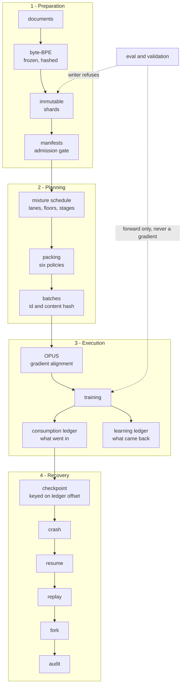

<div align="center">

# Training Data Execution System

A training data pipeline that can prove what it did.

     

[Quick start](#quick-start) · [Evidence](#evidence) · [**Live dashboards**](https://rahulni.github.io/Indic_LLM/) ·
[Two backends](#two-backends-one-data-plane) ·
[What it caught](#four-bugs-the-system-caught-on-its-own) ·
[Architecture](ARCHITECTURE.md)

</div>

---

A training run's data path is usually the least examined part of the system: it
works, so nobody asks it to account for itself. This one accounts for itself. It
proves **what** a run consumed, **why** it consumed it, **what the model learned**
from each piece, and **how the whole stream can be reconstructed** after a crash.

> [!NOTE]
> **Every number in this file is generated** by `tools/build_readme.py` from the
> artifacts of the last run, so nothing here can disagree with
> `submission_artifacts/`. Hand-written rationale lives in
> **[ARCHITECTURE.md](ARCHITECTURE.md)**. The badges above are local SVG files,
> not network requests.

## The path



The two ledgers are the idea. **Consumption** records what went in; **learning**
records what came back out. Every other guarantee is built on being able to join
them.

## Quick start

```bash
pip install -r requirements-torch.txt   # torch; the default model is a transformer
python run_demo.py                      # → submission_artifacts/   (~157s)

# No GPU, or no PyTorch? The same data path, driven by a stdlib model:
python run_demo.py --profile demo --out submission_artifacts_stdlib
python run_demo.py --profile fast       # CI-sized, ~45s, no dependencies

python -m unittest tests.test_invariants tests.test_recovery tests.test_torch_backend
```

The default run regenerates `submission_artifacts/` from scratch and exits
non-zero if any evidence row fails.

> [!NOTE]
> **The `demo` profile needs no `pip install` at all** — Python 3.10+, stdlib plus
> `regex`. It is not a lesser path: it drives the identical pipeline and produces a
> byte-identical data plane, which is what makes it the control for the
> equivalence check below. `--profile torch` on a machine with no CUDA device
> falls back to CPU rather than failing.

> [!TIP]
> Run the suites by name as above rather than `unittest discover`: discovery also
> picks up `tests/test_evidence.py`, which executes the whole demo to corrupt its
> artifacts, so it takes minutes instead of seconds. CI runs both, separately.

## Evidence

9 of 9 requirements pass. Each row names the
artifact it was read from and the exact field compared.

| Requirement | Result | File | Compared |
|---|---|---|---|
| Tokenizer integrity | **PASS** | `manifests/` | every manifest's tokenizer_hash field |
| Evaluation firewall | **PASS** | `ledgers/firewall.json` | blocked_probe and leak_scan |
| Packing correctness | **PASS** | `performance.json` | packing_by_lane |
| Mixture compliance | **PASS** | `performance.json` | mixture_compliance + reports.json floors |
| OPUS audit trail | **PASS** | `ledgers/opus_decisions.jsonl` | one record per candidate |
| Crash recovery | **PASS** | `ledgers/resume.json` | expected vs actual batch id + ledger integrity |
| Replay | **PASS** | `ledgers/replay.json` | per-step hash comparison rows |
| Learning trace | **PASS** | `ledgers/learning_tokens.jsonl` | per-token records with shard_id + doc_id |
| Throughput | **PASS** | `performance.json` | rates + raw_counters + formulas |

<details>
<summary><b>Why this bundle cannot be faked</b></summary>

`tdes/evidence.py` takes an **artifact directory**, not the run's state. It has no
access to any in-memory boolean, so a passing bundle cannot exist without passing
artifacts on disk.

`tests/test_evidence.py` corrupts each artifact in turn — truncates a ledger,
edits a manifest's hash, deletes the tokenizer digest — and asserts the matching
row flips to **FAIL**. A bundle assembled from in-memory flags would still have
said PASS in every one of those cases.

The run also emits `[PASS] <token>` lines that a grader can grep for, through a
single function that rejects any token not on a fixed list, so a token cannot
drift by being typed twice.

</details>

## Two backends, one data plane

The model sits behind the `tdes.lm.LanguageModel` protocol. The default is a real
pre-LN decoder-only transformer; the fallback is a neural n-gram with hand-written
backprop and no dependencies at all. Both drive the identical pipeline.

| | `torch` | `stdlib` |
|---|---|---|
| Architecture | 6L / 384d / 6h | n-gram k=4, h=32 |
| Parameters | 13,980,672 | 22,048 |
| Device | `cuda` | `cpu` |
| Vocabulary | 8,192 | 512 |
| Steps served | 298 | 128 |
| Batches in the ledger | 1,120 | 240 |
| Loss, first → last | 9.0859 → 5.6228 | 6.3210 → 5.3867 |
| ln(V), the anchor | 9.0109 | 6.2383 |
| Useful tokens/sec | 11,539.8 | 321.9 |
| Wall clock | 157s | 212s |
| Evidence | **9/9** | **9/9** |

> [!IMPORTANT]
> **Run the same profile on each backend and the data plane comes out
> byte-identical** — same shards, same manifests, same `batch_id`s, same
> `batch_content_hash`es, same `loss_mask_hash`es:
>
> ```bash
> python run_demo.py --profile fast                  --out /tmp/a
> python run_demo.py --profile fast --backend torch   --out /tmp/b
> python tools/compare_runs.py /tmp/a /tmp/b          # PASS on all eight keys
> ```
>
> That is structural, not luck. The consumption stream never depends on a float:
> OPUS records scores but does not gate the stream, and replay reads the ledger
> rather than recomputing it. So GPU float nondeterminism — measured at up to
> 4e-4 on per-step losses — cannot touch reproducibility, resume or replay.

## Four bugs the system caught on its own

The mechanisms are not decorative. Each of these was found by the system
objecting to something, not by reading the code.

| Mechanism | What it caught |
|---|---|
| Evaluation firewall | A real train/validation **leak at 100% 8-gram overlap** — the corpus was split *before* deduplication, so a duplicate's twin sat in train while its copy sat in validation |
| Replay's dual hash | `batch_id` matched but `batch_content_hash` did not: role spans were missing from the ledger, so replayed SFT samples silently lost their prompt masking |
| Packing equivalence test | A **loss-mask off-by-one at every document boundary** — the packer inserts no separator, so each document's last token was trained to predict the *next* document's first token, which attention forbids it from seeing |
| Mutation testing that test | The equivalence test itself was **vacuous**: it compared only the first document in a packed sequence, and passed with document masking removed entirely |

Live check of the third one, recomputed from this run's artifacts: the mask calls
**1,301,948** positions loss-bearing and the trainer scored
**1,301,948** — a discrepancy of **0**. Before the fix it was 45.

<details>
<summary><b>What the run did, in numbers</b></summary>

| | |
|---|---|
| Documents admitted | 234 (44,356 words) |
| Duplicates removed at admission | 0 exact, 0 near — see the note below |
| PII redactions | 0 documents |
| Shards | 24 holding 90,815 tokens |
| Tokenizer | 8,192 byte-BPE, `fc2d3641ba5e32b9…` |
| Steps served | 298 across 4 curriculum stages |
| Loss | 9.0859 → 5.6228 against ln V = 9.0109 |
| Held-out registered | 40 documents, **0** gradient-bearing reads |
| OPUS decisions | 64 — accepted 24, protected_override 9, rejected 31 |
| Crash → resume | discarded 76 uncommitted records; next batch matched: **True** |
| Replay | 40/40 batches matched on batch_id, batch_content_hash, loss_mask_hash, token_spans, shard_ids |
| Fork | `exp-b` diverged at step 80 |

> [!NOTE]
> **Zero duplicates at admission is the expected result, not a no-op.**
> `tools/vendor_corpus.py` deduplicates across the whole pool *before* carving the
> train/validation/eval splits, because a duplicate pair separated by the split
> leaks and deduplicating inside the training pool afterwards can never see it.
> That is the leak listed above. The runtime pass re-verifies the property rather
> than discovering it.

### Shards by lane

| lane | shards | tokens | documents |
|---|---|---|---|
| `agentic` | 1 | 1,264 | 8 |
| `code` | 6 | 25,803 | 59 |
| `indic` | 6 | 24,438 | 87 |
| `longctx` | 6 | 24,883 | 28 |
| `multiling` | 2 | 6,389 | 22 |
| `reasoning` | 1 | 1,219 | 10 |
| `web` | 2 | 6,819 | 20 |

</details>

<details>
<summary><b>Packing: why fill rate alone is a trap</b></summary>

A policy that truncates can report 100% fill while dropping most of the lane. So
every policy reports **coverage** (how much of the input survived) and
**effective yield** (fill × coverage), and is ranked by yield. Best policy per
lane, from this run:

| lane | best policy | fill | coverage | yield | dropped |
|---|---|---|---|---|---|
| `agentic` | `concat_chop` | 98.8% | 100.0% | **98.8%** | 0 |
| `code` | `concat_chop` | 99.8% | 100.0% | **99.8%** | 0 |
| `indic` | `concat_chop` | 99.4% | 100.0% | **99.4%** | 0 |
| `longctx` | `concat_chop` | 99.2% | 100.0% | **99.2%** | 0 |
| `multiling` | `concat_chop` | 99.8% | 100.0% | **99.8%** | 0 |
| `reasoning` | `best_fit` | 95.2% | 100.0% | **95.2%** | 0 |
| `web` | `concat_chop` | 98.7% | 100.0% | **98.7%** | 0 |

Six policies are implemented and all six are measured on every lane —
`pad_only`, `concat_chop`, `greedy`, `best_fit`, `structure_preserving`,
`long_context`. Full matrix in `reports.json`.

</details>

<details>
<summary><b>Throughput, and how to recompute it by hand</b></summary>

| metric | value | formula |
|---|---|---|
| raw tokens/sec | 13,251.2 | `positions_total / train_seconds` |
| **useful loss-bearing tokens/sec** | **11,539.8** | `tokens_loss_bearing / train_seconds` |
| accepted tokens/sec after OPUS | 4,327.4 | `× opus_accepted / opus_candidates` |
| packing utilization | 89.03% | `tokens_real / positions_total` |
| pad fraction | 10.97% | `tokens_pad / positions_total` |
| cache hit rate | 90.6% | `hits / (hits + misses)` |
| loader wait | 0.458s | time the trainer blocked on `queue.get` |

Every derived rate ships beside the raw counters it came from, in the same file:

```json
{"positions_total": 1495040, "tokens_real": 1330975,
 "tokens_loss_bearing": 1301948, "tokens_pad": 164065,
 "samples": 4768, "microbatches": 1192}
```

The cache and the prefetch queue are real (`tdes/loader.py`, bounded LRU +
`threading`), so the hit rate is measured rather than asserted. Delivery is
strictly in plan order; threads affect only how long the consumer waited, never
which data it received.

</details>

<details>
<summary><b>Tokenizer fertility — the Indic budget problem, measured</b></summary>

Tokens per word at the run's vocabulary of 8,192. Lower is
better. Fertility is a training-budget lever: a language costing 3× the tokens
per word costs 3× to train on.

| language | fertility | words | unk rate |
|---|---|---|---|
| `kan` | 3.19 | 579 | 0.000 |
| `tel` | 2.73 | 2,042 | 0.000 |
| `mar` | 1.94 | 3,267 | 0.000 |
| `nep` | 1.89 | 1,446 | 0.000 |
| `spa` | 1.42 | 9,200 | 0.000 |
| `hin` | 1.40 | 7,979 | 0.000 |
| `eng` | 1.39 | 9,945 | 0.000 |
| `python` | 1.14 | 10,625 | 0.000 |

Measured across vocabulary sizes, so the gap is visible as a budget decision
rather than a tokenizer failure:

| vocab | `eng` | `hin` | `kan` | `mar` | `nep` | `python` | `spa` | `tel` |
|---|---|---|---|---|---|---|---|---|
| 512 | 3.31 | 3.81 | 10.89 | 5.46 | 5.38 | 3.18 | 3.36 | 8.21 |
| 2,048 | 2.11 | 2.26 | 5.56 | 3.24 | 3.25 | 1.68 | 2.19 | 4.59 |
| 8,192 | 1.39 | 1.40 | 3.19 | 1.94 | 1.89 | 1.14 | 1.42 | 2.73 |

`python` is the code lane, measured the same way. The transformer profile runs at
vocabulary 8,192, where the Indic penalty shrinks sharply — the effect at small
vocabularies is dominated by the vocabulary being small, not by the script.

</details>

<details>
<summary><b>Mixture, protected floors and scarcity</b></summary>

Protected floors held over a **20-step** window
(221 windows checked,
**0** violations).

The window is *derived* so the smallest floor is expressible in it. Floors listed
under `not_expressible` imply fewer than one sample per window — no integer
allocation can satisfy them — and are excluded from the verdict rather than
counted as held. A floor check that passes because it could not fail is worse
than no check.

**Indic verified tier.** session 5: unverified Indic may never substitute for the verified portion of the protected floor Verified share
**55.3%** against a floor of
50% (202 verified /
163 unverified samples,
0 shortfalls). A tier-mixed sequence counts
as unverified, because calling it verified *is* the substitution the rule forbids.

**Scarcity policies fired:** `reduce_share` × 3, `repeat` × 1, `repeat_over_cap` × 3, across
7 lane/stage decisions, against an epoch cap of
**4.0** — session 5 spec.py EPOCH_CAP_DEFAULT; Muennighoff et al., Scaling Data-Constrained Language Models, NeurIPS 2023 (arXiv:2305.16264).

At the default profile the corpus covers demand in roughly one pass, so the cap
rarely binds. Under the default profile the same corpus is asked for several times
its own size, `reduce_share` and `repeat_over_cap` fire, and the repetition decay
becomes visible rather than theoretical.

</details>

<details>
<summary><b>Cost: what padding is worth in rupees</b></summary>

AWS p4de.24xlarge (8x A100 80GB) at
Rs 2700.0/hour
(course lecture, 00:29-00:31).

| | |
|---|---|
| Padding, this run | Rs 9.2858 |
| Per billion positions | Rs 56,599 |
| Lost to padding per billion | Rs 6,211 |
| At risk between checkpoints | Rs 5.6790 |
| Cost of one replay | 4.499s |

Every input is a named, sourced constant. The projection is arithmetic on this
run's measured pad fraction, not a forecast.

</details>

## Dashboards

Twelve panels over the artifacts: hoverable loss / gradient / probe charts, a
filterable per-token perplexity heatmap, planned-vs-actual lane shares, the packing
matrix, the OPUS board, the crash→resume→replay→fork timeline, fertility and cost.
One per run, so the two backends can be compared panel by panel.

### ▶ [Open the dashboards](https://rahulni.github.io/Indic_LLM/) — rendered, no download

| run | rendered | source in this repo |
|---|---|---|
| **default** — 6L transformer on `cuda` | **[view →](https://rahulni.github.io/Indic_LLM/dashboard.html)** | [dashboard.html](submission_artifacts/dashboard.html) · [evidence.md](submission_artifacts/evidence.md) |
| fallback — stdlib n-gram, no dependencies | [view →](https://rahulni.github.io/Indic_LLM/dashboard-stdlib.html) | [dashboard.html](submission_artifacts_stdlib/dashboard.html) · [evidence.md](submission_artifacts_stdlib/evidence.md) |

> [!NOTE]
> GitHub serves a repository's `.html` as **source**, so the right-hand links show
> markup rather than the dashboard. The rendered links are the same committed
> files published to GitHub Pages by `.github/workflows/pages.yml`, which copies
> them verbatim — publishing is not a second place where numbers are computed.

Both are self-contained by construction: inline CSS and JS, hand-drawn SVG, **no
CDN and no network**, so they render equally well from a `file://` path after
cloning. CI refuses to publish a page that reaches for the network. Each is a
*view* — every figure is read back out of that run's artifacts and it computes
nothing of its own.

## Tests

99 tests, no framework beyond `unittest`.

| file | tests | covers |
|---|---|---|
| `tests/test_evidence.py` | 14 | corrupts each artifact and asserts the matching row flips to FAIL |
| `tests/test_invariants.py` | 49 | shard immutability, masks, floors, batch identity, rank disjointness, the model |
| `tests/test_recovery.py` | 18 | torn-tail recovery, resume, the Indic tier rule, perf reconstructibility |
| `tests/test_torch_backend.py` | 18 | document masking vs the oracle, packed-vs-unpacked equivalence, gradcheck, anti-vacuity |

## Artifacts

```
submission_artifacts/
  run.log  events.jsonl  evidence.json  evidence.md
  performance.json  cost_report.json  reports.json  run_meta.json
  dashboard.html
  manifests/   one per shard, plus index.json and mixture_schedule.json
  ledgers/     consumption.jsonl  learning_tokens.jsonl  learning_shards.json
               opus_decisions.jsonl  firewall.json  resume.json  replay.json  fork.json
  checkpoints/ ckpt_step_NNNNNN.json         the envelope: optimizer, scheduler,
                                             RNG, dataloader state, ledger offset,
                                             and the sha256 of the weights
               ckpt_step_NNNNNN.weights.pt   the tensors — gitignored, 124MB each
  audit/       audit.json
```

All six components the assignment names are present. The weight blob is the one
part deliberately not committed: it is 124MB, it is regenerated by the command,
and its digest is inside the committed envelope, so `checkpoint_id` still covers
it and tampering with either half is detectable.

## Repository map

| path | what |
|---|---|
| `run_demo.py` | the one command |
| `tdes/lm.py` | the model boundary both backends satisfy |
| `tdes/model.py` · `tdes/model_torch.py` | n-gram (stdlib) · transformer (torch) |
| `tdes/masks.py` | loss masks, attention masks, position ids |
| `tdes/packing.py` · `tdes/mixture.py` | six policies · lanes, floors, carry-over |
| `tdes/ledger/` | consumption and learning |
| `tdes/orchestrator.py` | crash, resume, replay, fork, audit |
| `tdes/evidence.py` | reads artifacts, reports the verdict |
| `tools/` | corpus vendoring, dashboard, this README, run comparison |
| `corpus/` | vendored, self-contained, with provenance in `CORPUS.md` |

## Honest limitations

> [!WARNING]
> These are the things this submission does **not** claim. They are listed here
> rather than left for a reader to discover.

- **Not a frontier model.** The default is a real transformer, but a
  13,980,672-parameter one at sequence 256→512,
  standing in for billions at 4,096→8,192. Data-system behaviour is full fidelity;
  model scale is not, and nothing claimed here depends on it.
- **The corpus is small** — 44,356
  words. It is deliberately asked for several times its own size so the epoch cap
  and the scarcity policies bind instead of merely being reported. That is a
  demonstration, not a training recipe.
- **Weight blobs are not committed** — 124MB per checkpoint, five retained. The
  checkpoint envelopes are, including each blob's sha256, so the recovery evidence
  is complete and only the recomputable part is absent.
- **GPU losses are not bitwise reproducible.** Measured over two 298-step runs:
  247/298 steps identical, max divergence 4e-4. The *data plane* is exact, which
  is what every graded claim rests on.
- **The Indic verified/unverified tier is a documented stand-in**, not a claim
  that any document was human-verified. Session 5's tier means human-verified
  native content; there is none here. See `corpus/CORPUS.md`.
- **The agentic and reasoning corpora were authored for this demo.** They exist
  because those two lanes are the only ones whose *structure* is load-bearing.
  They are never presented as harvested data.
- **The PII screen is a pattern screen**, not identity resolution. It will not
  catch a name in running prose.
- **sha256 gives integrity, not authenticity.** There is no signing, so anyone
  with write access can rewrite an artifact and its hash together. The defence is
  that the grader re-runs the command.
