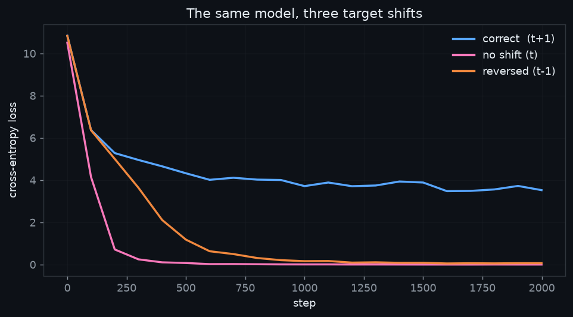
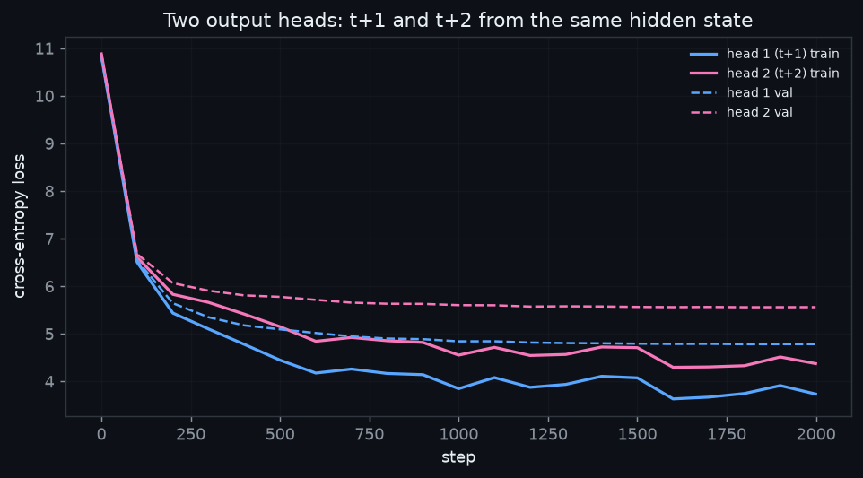

# Loss Functions and Output Heads

**ERA V5 — Session 9.** One notebook that makes the four lines between a model's output
and its scalar loss *correct and observable*, plus a second output head that predicts two
tokens ahead.

**→ [`loss_and_heads.ipynb`](loss_and_heads.ipynb)** — runs top to bottom, outputs included.

Every bug that lives in those four lines shares one property: **it does not raise an
exception**. This notebook's job is to make each of them visible anyway.

---

## The headline

Three models. Same data, same seed, same initialisation. The only difference is which
slice of the sequence is used as the target.



| variant | slicing | what it asks for | final loss |
|---|---|---|---|
| correct | `logits[:, :-1]` vs `tokens[:, 1:]` | the next token | **3.5257** |
| no shift | `logits` vs `tokens` | the token it is looking at | 0.0019 |
| reversed | `logits[:, 1:]` vs `tokens[:, :-1]` | the token it just saw | 0.0663 |

The two runs that reach a *lower* loss are the two that are **wrong**. Forgetting to shift
the target, or shifting it the wrong way, produces a beautiful curve from a model that has
learned nothing about language. A loss of 0.0019 is a perplexity of about
1.002 — the model is choosing between essentially one option,
because it has been asked to copy something it was already given.

Neither variant raises an error. Neither is visible on a loss plot. The only artefact in
the whole notebook that catches it in one glance is a table of strings:

```
no shift (t)   final loss 0.0019
  input             target            
  ----------------------------------
  b' gr'            b' gr'               <-- identical
  b'ac'             b'ac'                <-- identical
  b'eless'          b'eless'             <-- identical
  b' be'            b' be'               <-- identical
  b' to'            b' to'               <-- identical
  b' be'            b' be'               <-- identical
```

That is why the instruction is *print the strings*, not *check that the loss looks
sensible*.

---

## Part 1 — the seven numbers

Run: **full**, 2000 steps, `cuda`, torch `2.11.0+cu128`.

| # | measurement | value |
|---|---|---|
| 1 | flattened loss matrix | `(1020, 50257)` vs `(1020,)` |
| 2 | shift positions verified | 255/255 |
| 3 | contributing tokens, pad counted -> masked | 1,020 -> 629 tokens; loss 10.6149 -> 10.8571 |
| 4 | loss, boundary kept -> masked | 4.0239 -> 4.0081 (boundary positions average 8.0422, 2.01x the rest) |
| 5 | init loss / perplexity | 10.8508 / 51,578  (`ln(50257)` = 10.8249, V = 50,257) |
| 6 | tied vs untied parameters | 17,656,576 vs 30,522,368  (difference 12,865,792 = V x D) |
| 7 | peak memory, ordinary -> chunked | 3,100 MB -> 401 MB attributable to the loss (**7.72x** less, 1.13x the time) |
| 8 | Part 2 - two heads (val) | head1 4.7829, head2 5.5608, sum 10.3437  (gap 0.7779) |
| 9 | Part 3 - final loss by shift | correct 3.5257; no 0.0019; reversed 0.0663 |

Rows 1–7 are Part 1, row 8 is Part 2, row 9 is Part 3. Each is produced by the notebook
cell above it and written into a `RESULTS` dict, which the final cell renders as this
exact table — so the write-up cannot drift from the run.

### Verifying the shift, in strings

```
 pos  input token           target token        
--------------------------------------------------
   0  b' gr'                b'ac'               
   1  b'ac'                 b'eless'            
   2  b'eless'              b' be'              
   3  b' be'                b' to'              
   4  b' to'                b' be'
```

Rendered with `enc.decode_single_token_bytes(i)`, **not** `enc.decode([i])`. GPT-2 uses
byte-level BPE, so many token ids are fragments of a UTF-8 sequence and decode to the
replacement character. On an exercise whose entire thesis is *print the strings*, having
them render as boxes would defeat the point.

### Notes on four of the numbers

**Padding (row 3).** Masking pad *raises* the loss here, from 10.61 to 10.86, on a model
that has not been trained. The reason is correlation: every pad target is the same token
id, so if that one id happens to draw a slightly above-average logit out of a random head,
all 391 positions collect the same discount at once. Real tokens get no such shared luck.
Under training that stops being luck and becomes a strategy — the loss falls, and
inference emits pad forever.

**Document packing (row 4).** Measured on a trained model and averaged over 32 independent
document pairs, because one join is an anecdote. The boundary position — where document
A's last token is asked to predict document B's first — costs **2.01×** the average
position in the same sequence. At initialisation this effect is invisible, since every
position costs about `ln(V)`; it only appears once everything else has got easier.

**Perplexity at init (row 5).** An untrained model spreads probability evenly over the
vocabulary, so `loss = ln(V)` and `perplexity ≈ V`. The expected value sits slightly
*above* `ln(V)`: cross-entropy is `logsumexp(z) - z_target`, and for `z ~ N(0, σ²)` the
target term averages to zero while `E[logsumexp(z)] ≈ ln(V) + σ²/2`. With std-0.02 init
and `D = 256`, `σ ≈ 0.32`, predicting `10.825 + 0.051 = 10.876`. The measured 10.8508 lands
just under that, which is Jensen's inequality. The notebook asserts on this — a fresh model
that starts anywhere else is leaking the answer, and there is no point training it.

**Chunked cross-entropy (row 7).** The trap is that chunking only the *forward* pass saves
nothing: every chunk's logits stay alive in the autograd graph until `backward()` runs. The
chunked version calls `backward()` inside the loop so each chunk is freed as it goes, then
pushes the accumulated gradient into the trunk in one step.

```python
h_det = hidden.detach().requires_grad_(True)   # cut the graph
for sl in chunks:
    loss_c = F.cross_entropy(head(h_det[sl]), y[sl], reduction="sum")
    (loss_c / n_valid).backward()              # this chunk's logits freed here
hidden.backward(h_det.grad)                    # reattach, one shot
```

The notebook asserts that the chunked loss **and** both sets of gradients match the naive
path to `1e-4`. A memory win that changes the answer is not a win.

Two measurement details that matter. Memory is reported as the delta over what was already
resident, because `max_memory_allocated()` is process-wide and would otherwise be diluted
by the model already sitting in VRAM. And the batch is sized so the ordinary path fits:
pushed to `B = 8` on an 8 GB card the naive path spills into shared system memory over
PCIe, and the resulting "chunking is 20× faster" measures Windows' memory manager rather
than cross-entropy.

---

## Part 2 — a second output head

One trunk, two heads. Head 1 predicts `t+1`; head 2 reads the *same* hidden state and
predicts `t+2`.



**head1 4.7829, head2 5.5608, sum 10.3437  (gap 0.7779)**

Head 2's loss sits above head 1's and **the gap does not close** — it widens early and then
holds. Both curves descend together, so head 2 is learning perfectly well. It is solving a
strictly harder problem, and training does not make it easier.

The reason is information, not capacity. Predicting `t+2` means marginalising over the
token at `t+1` you have not seen:

```
H(t+2 | context)  >  H(t+1 | context)
```

That inequality is a property of the data. A second head with its own 12.9M parameters
cannot repeal it; the measured gap is the price of one step of uncertainty.

Training feeds one token at a time either way — the extra head changes the loss, never the
input. The payoff is at inference: if head 2 is often right you can accept two tokens per
forward pass, checking the speculation against the next step and discarding it on a miss.
That is multi-token prediction, and it is what makes speculative decoding work.

---

## Part 3 — the wrong shift

The assignment references a "Part 3" in its submission list but never defines it. Read in
context the warning paragraph is the brief — *a target shift in the incorrect direction can
produce a beautiful loss curve* — so Part 3 demonstrates exactly that. Numbers and chart
are at the top of this page.

**correct 3.5257; no 0.0019; reversed 0.0663**

- **No shift** asks the model to output the token it already holds. The residual stream
  carries the embedding straight to the head, so this is the identity function with extra
  steps — and at 0.0019 it has learned it essentially perfectly.
- **Reversed** asks for the token one step back. Attention only has to look at position
  `t-1`, which a single head can do.

Both are one character away from correct. Both train to a flattering number. Both are
worthless.

---

## What is in here

```
loss_and_heads.ipynb      the assignment, top to bottom, outputs included
nb_source.py              the same code as a runnable script; the notebook is built from it
tools/build_notebook.py   nb_source.py           ->  .ipynb
tools/build_readme.py     assets/results.json    ->  this file
assets/                   results.json and the two figures
```

The notebook is written to be read as well as graded. Every section has the same four
beats: **why this check exists** and the failure it catches, the code, the printed
evidence, then **what you should be seeing** so a reader can tell a pass from a fail.

Section 11 rebuilds the block the way the session described it — **RMSNorm, pre-norm,
SwiGLU** — and puts it through the same gate, showing that swapping the block internals
changes nothing the loss harness cares about. It comes last on purpose: you do not debug a
loss harness and a new architecture at the same time.

One thing worth stating plainly: with `n_embd = 256` against `V = 50257`, only about 4.7M
of this model's ~17.7M parameters are actual transformer — the rest is two large lookup
tables. That is deliberate, because it is what makes rows 6 and 7 worth measuring, but it
is not a well-proportioned language model and the loss curves should be read with that in
mind. TinyShakespeare is ~338k tokens against 17.7M parameters, so validation loss is
tracked and plotted alongside training loss throughout.

## Reproducing

```bash
pip install -r requirements.txt
jupyter notebook loss_and_heads.ipynb
```

`QUICK_RUN = True` (the default) runs 300 steps — enough to read the whole notebook in a
couple of minutes. Set it to `False` for the 2000-step numbers above. The notebook
installs its own dependencies and downloads its own data, so it runs unedited on a free
Colab T4 as well.

Numbers here were produced on an RTX 3070 Laptop (8 GB), torch `2.11.0+cu128`.
